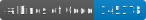

[](https://app.codacy.com/gh/mihakralj/QuanTAlib/dashboard?utm_source=gh&utm_medium=referral&utm_content=&utm_campaign=Badge_grade)
[](https://codecov.io/gh/mihakralj/QuanTAlib)
[](https://sonarcloud.io/summary/new_code?id=mihakralj_QuanTAlib)
[](https://www.codefactor.io/repository/github/mihakralj/quantalib/overview/main)
[](https://www.nuget.org/packages/QuanTAlib/)

[](https://www.nuget.org/packages/QuanTAlib/)
[](https://dotnet.microsoft.com/en-us/download/dotnet)

[](lib/_index.md)
[](docs/ndepend.md)
[](docs/ndepend.md)
[](docs/ndepend.md)
[](docs/ndepend.md)
[](docs/ndepend.md)
[](docs/ndepend.md)

# QuanTAlib

**393 technical indicators. One library. Brutal architectural trade-offs for absolute speed.**

QuanTAlib grinds through half a million bars of SMA in 328 microseconds. Faster than an L1 cache miss. The same indicators run in C#, Python, and PineScript. Cross-validated against TA-Lib, Tulip, Skender, and every other implementation worth testing. 

We achieve this by trading object allocation for contiguous memory spans and forcing SIMD vectorization. You want speed? We dictate the heap.

Pick your weapon:

| Platform | Install | Guide |
| :--- | :--- | :--- |
| **C# / .NET 10** | `dotnet add package QuanTAlib` | [Architecture](docs/architecture.md) . [API Reference](docs/api.md) |
| **Python** | `pip install quantalib` | [**Python Guide**](docs/python.md) |
| **PineScript v6** | Copy-paste from `lib/` | [**PineScript Guide**](docs/pinescript.md) |

## Quick Start

### C# Streaming (Real-time incoming data)

```csharp
using QuanTAlib;

// No allocations in the update loop. State is maintained internally.
var sma = new Sma(period: 14);
var result = sma.Update(110.4);

if (result.IsHot)
    Console.WriteLine($"SMA: {result.Value}");
```

### C# — batch (500K bars in microseconds)

```csharp
// We evaluate code, not promises.
// This processes as contiguous memory using AVX-512 vectorization.
// Zero allocations. The Garbage Collector sleeps.
double[] prices = LoadHistoricalData();
double[] results = new double[prices.Length];

Sma.Batch(prices.AsSpan(), results.AsSpan(), period: 14);
```

### Python

```python
import quantalib as qtl
import numpy as np

prices = np.random.default_rng(42).normal(100, 2, size=500_000)
sma = qtl.sma(prices, period=14)       # 393 indicators, similar syntax
```

Works with NumPy, pandas, polars, and PyArrow. [Full Python guide →](docs/python.md)

### PineScript

Every indicator ships as a standalone .pine file. Open it. Copy it. Paste it into TradingView. No magic, just math. [Full PineScript guide →](docs/pinescript.md)

---

## 393 Indicators

| Category | Count | What It Measures | Examples |
| :--- | :---: | :--- | :--- |
| [**Core**](lib/core/_index.md) | 8 | Price transforms, building blocks | AVGPRICE, MEDPRICE, TYPPRICE, HA |
| [**Trends (FIR)**](lib/trends_FIR/_index.md) | 33 | Finite impulse response averages | SMA, WMA, HMA, ALMA, TRIMA, LSMA |
| [**Trends (IIR)**](lib/trends_IIR/_index.md) | 36 | Infinite impulse response averages | EMA, DEMA, TEMA, T3, JMA, KAMA, VIDYA |
| [**Filters**](lib/filters/_index.md) | 37 | Signal processing, noise reduction | Kalman, Butterworth, Gaussian, Savitzky-Golay |
| [**Oscillators**](lib/oscillators/_index.md) | 48 | Bounded/centered oscillators | RSI, MACD, Stochastic, CCI, Fisher, Williams %R |
| [**Dynamics**](lib/dynamics/_index.md) | 21 | Trend strength and direction | ADX, Aroon, SuperTrend, Ichimoku, Vortex |
| [**Momentum**](lib/momentum/_index.md) | 19 | Speed of price changes | ROC, Momentum, Velocity, TSI, Qstick |
| [**Volatility**](lib/volatility/_index.md) | 26 | Price variability | ATR, Bollinger Width, Historical Vol, True Range |
| [**Volume**](lib/volume/_index.md) | 27 | Trading activity | OBV, VWAP, MFI, CMF, ADL, Force Index |
| [**Statistics**](lib/statistics/_index.md) | 35 | Statistical measures | Correlation, Variance, Skewness, Z-Score |
| [**Channels**](lib/channels/_index.md) | 23 | Price boundaries | Bollinger Bands, Keltner, Donchian |
| [**Cycles**](lib/cycles/_index.md) | 14 | Cycle analysis | Hilbert Transform, Homodyne, Ehlers Sine Wave |
| [**Reversals**](lib/reversals/_index.md) | 12 | Pattern detection | Pivot Points, Fractals, Swings |
| [**Forecasts**](lib/forecasts/_index.md) | 1 | Predictive indicators | Time Series Forecast |
| [**Errors**](lib/errors/_index.md) | 26 | Error metrics, loss functions | RMSE, MAE, MAPE, SMAPE, R² |
| [**Numerics**](lib/numerics/_index.md) | 27 | Mathematical transforms | Log, Exp, Sigmoid, Normalize, FFT |

**[Browse all 393 indicators →](lib/_index.md)**

---

## Performance

500,000 bars. Period 220. .NET 10.0, AVX-512. Zero allocations.

| Library | SMA Time | Allocations | vs QuanTAlib |
| :--- | ---: | ---: | :--- |
| **QuanTAlib** | **328 μs** | **0 B** | — |
| TA-Lib | 365 μs | 32 B | 1.1× slower |
| Tulip | 370 μs | 0 B | 1.1× slower |
| Skender | 68,436 μs | 42 MB | **209× slower** |
| Ooples | 347,453 μs | 151 MB | **1,060× slower** |

That is 0.66 nanoseconds per value — faster than a single L1 cache miss. [Full benchmarks →](docs/benchmarks.md)

---

## Documentation

### Architecture & API

- [**Architecture**](docs/architecture.md) — SoA memory layout, SIMD vectorization, O(1) streaming, [design philosophy](docs/architecture.md#design-philosophy)
- [**API Reference**](docs/api.md) — Batch, Streaming, and Priming modes
- [**Usage Patterns**](docs/usage.md) — Span, Streaming, Batch, Eventing examples
- [**Integration**](docs/integration.md) — Quantower, NinjaTrader, QuantConnect

### Analysis & Validation

- [**Benchmarks**](docs/benchmarks.md) — SMA, EMA, RSI, MACD, Bollinger, Chaikin results
- [**Validation**](docs/validation.md) — Cross-library verification matrices
- [**Error Metrics**](docs/errors.md) — 26 error and loss functions
- [**Trend Comparison**](docs/trendcomparison.md) — Lag, smoothness, accuracy across MAs
- [**MA Qualities**](docs/ma-qualities.md) — Theoretical framework for MA evaluation
- [**Glossary**](docs/glossary.md) — Core concepts and terminology

### Code Quality

Static analysis: [NDepend](https://www.ndepend.com/) · [Codacy](https://app.codacy.com/gh/mihakralj/QuanTAlib/dashboard) · [SonarCloud](https://sonarcloud.io/summary/new_code?id=mihakralj_QuanTAlib) · [CodeFactor](https://www.codefactor.io/repository/github/mihakralj/quantalib/overview/main)

## ⚠️ Fair Warning

This library is **not yet 1.0.0**. There is exactly **one** grumpy engineer behind it, fueled by mass amounts of caffeine and an irrational belief that all technical indicators should be correct down to the 10th decimal place.

Implemented indicators are not yet complete. Things **will** break. APIs **will** change. Some indicators might produce values that make your quantitative models question the meaning of life. If you find something broken and don't [open an issue](https://github.com/mihakralj/QuanTAlib/issues), the grumpy dev will have absolutely no idea what needs fixing — and the backlog of things to fix, improve, and add is already longer than a Bollinger Band on a meme stock.

Your bug reports make this library better. Your silence makes the dev mass more coffee.

## License

Licensed under [Apache 2.0](LICENSE). Not MIT. Not BSD. Deliberately.

Apache 2.0 includes an explicit patent grant and a retaliation clause — if someone patents a technique derived from this library and sues a contributor, their license terminates immediately. For a library optimizing financial math with SIMD-aligned memory patterns and incremental algorithms, patent protection is structural defense, not legal decoration.

Commercial use, modification, and distribution are all permitted. Keep the license file, note your changes, and don't weaponize the legal system against the people who wrote the code you're profiting from.

**[Full rationale →](docs/license.md)**
