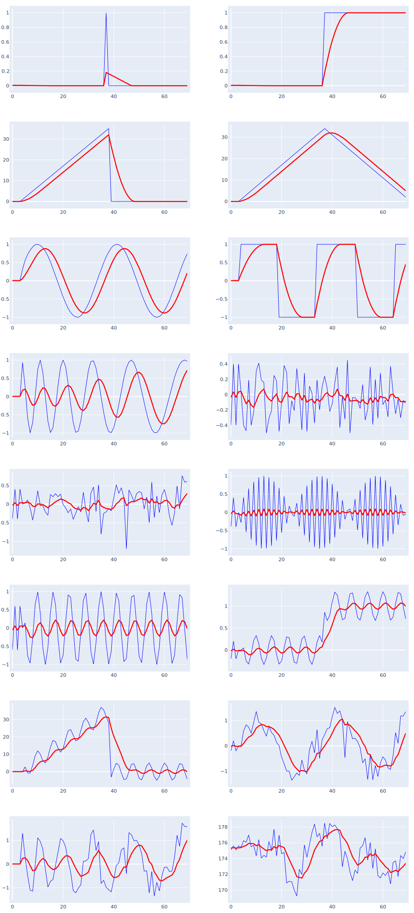

# WMA: Weighted Moving Average
period = 10



WMA is linearly weighted moving Average where the weights are linearly decreasing over the _period_ and the most recent data has the heaviest weight.

## Calculation

WMA is a rolling calculation that is looking backwards from the position ${n}$ and is denoted as ${WMA}_{p}{(data)}$ where $p$ represents the period, $w$ represents the assigned weight and $data$ represents the list of data points:
$$
WMA_p{(data)} = \frac{1}{\sum w }\sum_{i=n-p+1}^{n} w_i data_i
$$
Weights $w$ are linearly increasing from $1$ to $p$. For example, the weights $w$ for a $p=5$ would be {1, 2, 3, 4, 5}


## Reference Calculation
period = 5
```
TSeries data = new() {81.59, 81.06, 82.87, 83.00, 83.61, 83.15, 82.84, 83.99, 84.55, 84.36, 85.53, 86.54, 86.89, 87.77, 87.29};
WMA_Series wma = new(data, 5, useNaN: false);
WMA_Series wma_nan = new(data, 5, useNaN: true);
for (int i=0; i< data.Count; i++)
    Console.WriteLine($"{i}\t{data[i].v,7:f2}\t{wma_nan[i].v,7:f3}\t{wma[i].v,7:f3}");
```

|#|input|wma_NaN|wma|
|--|:--:|:--:|:--:|
|0|  81.59|    NaN| 81.590|
|1|  81.06|    NaN| 81.237|
|2|  82.87|    NaN| 82.053|
|3|  83.00|    NaN| 82.432|
|4|  83.61| 82.825| 82.825|
|5|  83.15| 83.066| 83.066|
|6|  82.84| 83.100| 83.100|
|7|  83.99| 83.399| 83.399|
|8|  84.55| 83.809| 83.809|
|9|  84.36| 84.053| 84.053|
|10|  85.53| 84.637| 84.637|
|11|  86.54| 85.399| 85.399|
|12|  86.89| 86.031| 86.031|
|13|  87.77| 86.763| 86.763|
|14|  87.29| 87.121| 87.121|

## References
   - https://en.wikipedia.org/wiki/Moving_average#Weighted_moving_average
   - Kaufman, Perry J. (2013) Trading Systems and Methods
   - Murphy, J. (1999) Technical Analysis of the Financial Markets