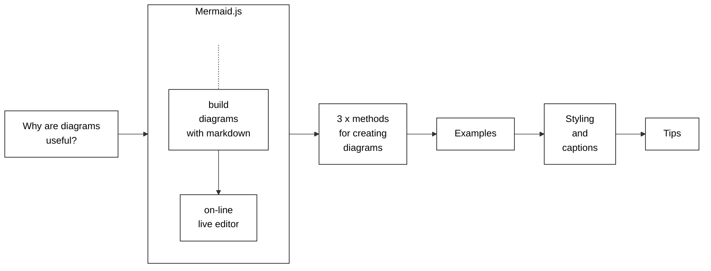

```mermaid
flowchart LR
    subgraph m[Mermaid.js]
    direction TB
        S[ ]-.-
        C[build<br>diagrams<br>with markdown] -->
        D[on-line<br>live editor]
    end
    A[Why are diagrams<br>useful?] --> m
    m --> N[3 x methods<br>for creating<br>diagrams]
    N --> T[Examples]
    T --> X[Styling<br>and<br>captions]
    X --> V[Tips]


    classDef box fill:#fff,stroke:#000,stroke-width:1px,color:#000;
    classDef spacewhite fill:#ffffff,stroke:#fff,stroke-width:0px,color:#000
    class A,C,D,N,X,m,T,V box
    class S spacewhite
```

