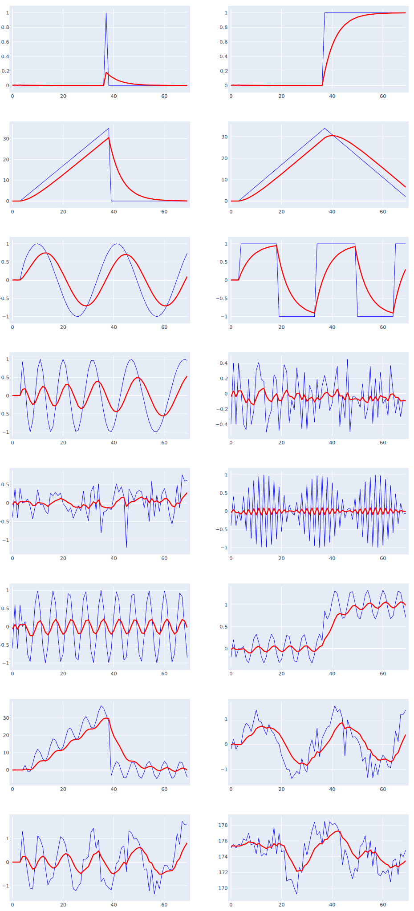

# EMA: Exponential Moving Average

Also known as exponentially weighted moving average, as it places greater weight on the most recent data points.
EMA reacts more agressively to recent data changes and  calculates the current value using just the previous EMA value and current data point. The weight applied to the new value is typically $k = 2 / (period-1)$

## Calculation

EMA is a rolling calculation requiring only one historical data point to calculate the current value and is denoted as ${EMA}_{p}{(data)}$ where $p$ represents the period and $data$ represents the list of data points.

Some implementations of EMA calculate a seeding value of $EMA$ as a ${SMA}_{p}$ when $n < period$ - and start the $EMA$ calculation only after the warm-up period. QuanTAlib offers an option to enable/disable SMA warm-up.

$$
EMA_n = \left\{ \begin{array}{cl}
\frac{1}{p}\left( data_{n}-data_{n-p}\right)+SMA_{n-1} & : \ n \leq period \\
{k}\times ({data_{n}} - EMA_{n-1}) + EMA_{n-1} & : \ n > period
\end{array} \right.
$$

## Behavior


## Reference Calculation
period = 5
```
TSeries data = new() {81.59, 81.06, 82.87, 83.00, 83.61, 83.15, 82.84, 83.99, 84.55, 84.36, 85.53, 86.54, 86.89, 87.77, 87.29};
EMA_Series ema = new(data, 5, useNaN: false);
EMA_Series ema_nan = new(data, 5, useNaN: true);
for (int i=0; i< data.Count; i++)
    Console.WriteLine($"{i}\t{data[i].v,7:f2}\t{ema_nan[i].v,7:f3}\t{ema[i].v,7:f3}");
```
| #| Input | **QuanTAlib** | _TA-LIB_ | _Skender_ | _Pandas-TA_ | _Tulip_ |
|--|:--:|:--:|:--:|:--:|:--:|:--:|
|0|   81.59| **81.590**| _NaN_| _NaN_| _NaN_| _NaN_|
|1|   81.06| **81.840**| _NaN_| _NaN_| _NaN_| _NaN_|
|2|   82.87| **81.840**| _NaN_| _NaN_| _NaN_| _NaN_|
|3|   83.00| **82.130**| _NaN_| _NaN_| _NaN_| _NaN_|
|4|   83.61| **82.426**| _82.426_| _82.426_| _82.426_| _82.426_|
|5|   83.15| **82.667**| _82.667_| _82.667_| _82.667_|_82.667_|
|6|   82.84| **82.725**| _82.725_| _82.725_| _82.725_|_82.725_|
|7|   83.99| **83.147**| _83.147_| _83.147_| _83.147_|_83.147_|
|8|   84.55| **83.614**| _83.614_| _83.614_| _83.614_|_83.614_|
|9|   84.36| **83.863**| _83.863_| _83.863_| _83.863_|_83.863_|
|10|  85.53| **84.419**| _84.419_| _84.419_| _84.419_|_84.419_|
|11|  86.54| **85.126**| _85.126_| _85.126_| _85.126_|_85.126_|
|12|  86.89| **85.714**| _85.714_| _85.714_| _85.714_|_85.714_|
|13|  87.77| **86.399**| _86.399_| _86.399_| _86.399_|_86.399_|
|14|  87.29| **86.696**| _86.696_| _86.696_| _86.696_|_86.696_|
## References

- https://en.wikipedia.org/wiki/Exponential_smoothing