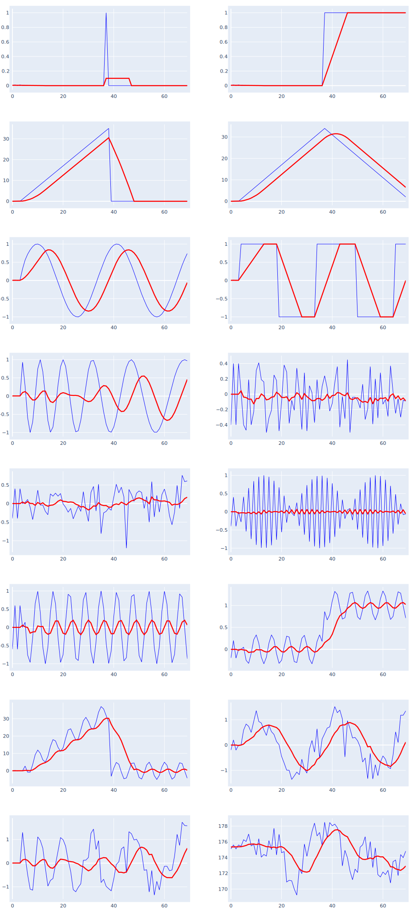

# SMA: Simple Moving Average

SMA is is an arithmetic moving average where the weights in SMA are **equally** distributed across the given period, resulting in a mean() of the data within the period.

## Calculation

SMA is a rolling calculation that is looking backwards from the position ${n}$ and is denoted as ${SMA}_{p}{(data)}$ where $p$ represents the period and $data$ represents the list of data points:
$$
SMA_p{(data)} = \frac{1}{p}\sum_{i=n-p+1}^{n} data_i
$$
When calculating the value of the next $SMA_{p,next}$ while knowing previous SMA values, SMA calculation can be reduced to:
$$
SMA_{p,next} = SMA_{p,prev}+\frac{1}{p}\left( data_{n+1}-data_{n+1-p}\right)
$$

## Implementation
`TSeries SMA_Series (TSeries source, int period = 0, bool useNaN = false)`

- SMA_Series returns TSeries list
- `source`: input of type TSeries; SMA_Series automatically subscribes to events of new data added to the source
- `period`: optional size of a lookback window; if set to 0, SMA calculates cumulative average across the whole source
- `useNaN`: if set to _true_, SMA_Series will hide values within the initial period with NaN (for compatibility with other libraries)

[Link to source](..\Source\Trends\SMA_Series.cs)

## Behavior

## Reference Calculation & Validation
period = 5
```
TSeries data = new() {81.59, 81.06, 82.87, 83.00, 83.61, 83.15, 82.84, 83.99, 84.55, 84.36, 85.53, 86.54, 86.89, 87.77, 87.29};
SMA_Series sma = new(data, 5, useNaN: false);
```

| #| Input | **QuanTAlib** | _TA-LIB_ | _Skender_ | _Pandas-TA_ | _Tulip_ |
|--|:--:|:--:|:--:|:--:|:--:|:--:|
| 0| 212.80|**212.80**| _NaN_| _NaN_| _NaN_| _NaN_|
| 1| 214.06|**213.43**| _NaN_| _NaN_| _NaN_| _NaN_|
| 2| 213.89|**213.58**| _NaN_| _NaN_| _NaN_| _NaN_|
| 3| 214.66|**213.85**| _NaN_| _NaN_| _NaN_| _NaN_|
| 4| 213.95|**213.87**| _213.87_| _213.87_| _213.87_| _213.87_|
| 5| 213.95|**214.10**| _214.10_| _214.10_| _214.10_| _214.10_|
| 6| 214.55|**214.20**| _214.20_| _214.20_| _214.20_| _214.20_|
| 7| 214.02|**214.23**| _214.23_| _214.23_| _214.23_| _214.23_|
| 8| 214.51|**214.20**| _214.20_| _214.20_| _214.20_| _214.20_|
| 9| 213.75|**214.16**| _214.16_| _214.16_| _214.16_| _214.16_|
|10| 214.22|**214.21**| _214.21_| _214.21_| _214.21_| _214.21_|
|11| 213.43|**213.99**| _213.99_| _213.99_| _213.99_| _213.99_|
|12| 214.21|**214.02**| _214.02_| _214.02_| _214.02_| _214.02_|
|13| 213.66|**213.85**| _213.85_| _213.85_| _213.85_| _213.85_|
|14| 215.03|**214.11**| _214.11_| _214.11_| _214.11_| _214.11_|
|15| 216.89|**214.64**| _214.64_| _214.64_| _214.64_| _214.64_|
|16| 216.66|**215.29**| _215.29_| _215.29_| _215.29_| _215.29_|


## References
   - https://en.wikipedia.org/wiki/Moving_average#Simple_moving_average
   - Kaufman, Perry J. (2013) Trading Systems and Methods
   - Murphy, J. (1999) Technical Analysis of the Financial Markets