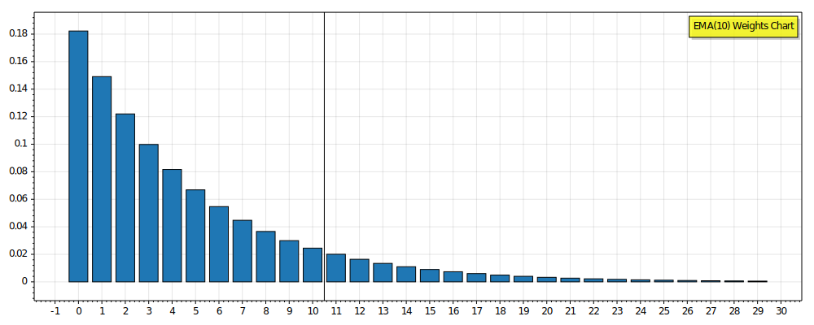

## EMA - Qualitative Ratings

**Smoothness: 3/5** - EMA provides moderate smoothing. It's smoother than raw price data but less smooth than a Simple Moving Average (SMA) of the same period. The exponential weighting can sometimes allow short-term fluctuations to influence the average more than in an SMA.

**Sensitivity: 4/5** - EMA can be quite sensitive to price changes, especially with high alpha values that prioritize more recent values. The exponential weighting means it reacts more quickly to new data compared to an SMA, making it more responsive to recent price movements and potential trend changes.

**Overshooting: 5/5** - EMA, by its mathematical formulation, does not overshoot the latest price. It always falls between the most recent price and the previous EMA value. This property makes it excellent at avoiding overshooting, which is a significant advantage over some other types of moving averages that can extend beyond the range of actual prices.

**Lag: 2/5** - EMA reduces lag compared to an SMA of the same period, but still introduces a very noticeable delay. While it responds more quickly to price changes than an SMA, it still lags behind the actual price movements, especially in rapidly trending markets or during significant reversals.

### EMA - Key Characteristics

- **IIR nature:** As an IIR filter, EMA's current value depends on **all** past inputs, theoretically extending the need for historical values back to infinity. IIR nature of EMA is a reason that EMA requires at least 1 - (1 - α)^N points to get to desired percentile of accuracy and be deemed 'warmed-up' for trading:
```
EMA(5): 13    points to reach 95% accuracy
EMA(10): 27   ponts to reach 95% accuracy
EMA(20): 55   points to reach 95% accuracy
EMA(50): 138  points to reach 95% accuracy
EMA(100): 277 points to reach 95% accuracy
```

- **Weighted calculation:** Recent data points carry more significance, with weights decreasing exponentially for older data. The *period* number of bars represents only 86.5% of weights of calculated Ema.



- **Period parameter:** Period has no meaningful value beyond trivialization of calculating alpha. Weighting coefficient *alpha* is calculated from *period* as `alpha = 2/(period+1)`, making initial set of alphas:

```
Period (N) | Alpha (α)
-----------|-----------
    1      | 1.00
    2      | 0.67
    3      | 0.50
    4      | 0.40
    5      | 0.33
    6      | 0.29
    7      | 0.25
    8      | 0.22
    9      | 0.20
   10      | 0.18
```

But alpha factor can be any value between 1.00 and 0.00, not just discrete numbers calculated from Period. For fine-tuning trading strategies, avoid using period for any indicator in exponential (EMA) family.

- **Reduced lag:** EMA exhibits less delay in reflecting trend changes compared to Simple Moving Average (SMA) as it weights more recent values progressively more.


