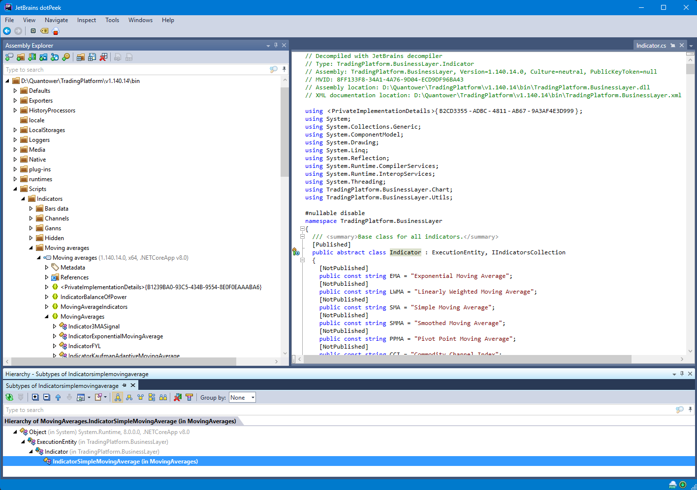

# Unearthing Quantower Secrets with dotPeek

## Step 1: Acquire Your Digital Pickaxe (dotPeek)

1. Visit JetBrains' dotPeek download page: https://www.jetbrains.com/decompiler/download/
2. Click the **Download** button (it's big and blue, kinda hard to miss)
3. Once downloaded, run the installer

## Step 2: Fire Up dotPeek

1. Launch dotPeek (look for the DP icon )
2. Marvel at its sleek interface from early 2000's (but who needs fancy UI, right?)

## Step 3: Load the *TradingPlatform.BusinessLayer.dll*

1. File > Open > Navigate to your Quantower installation folder, like `D:\Quantower\TradingPlatform\v1.140.14\bin`
2. Find and open `TradingPlatform.BusinessLayer.dll`
4. Watch as dotPeek works its magic, decompiling the assembly

## Step 4: Uncover the Secrets

1. Expand the assembly tree in the left pane and look for interesting namespaces and classes
   - `\Scripts\Indicators\Moving Averages\` is a good starting point

3. Double-click on classes to view their decompiled source
4. Pay attention to:
   - Public and internal classes/methods
   - Interfaces and abstract classes
   - Attributes and custom annotations
   - Hardcoded values and constants

## Step 5: Document Your Findings

1. Use dotPeek's "Save All" feature to export the decompiled source
2. Create a document to note interesting discoveries and stuff that Quantower documentation didn't tell you
3. Some parts of Quantower are obfuscated. Which is funny, in the era of generative AI and easy-peasy de-obfuscation ability.

## Ethical Considerations

Remember, with great power comes great responsibility:
- Respect Quantower's intellectual property
- Consider contributing to Quantower's documentation if you find features worth documenting

Happy exploring! May your code be clean and your discoveries plentiful.

