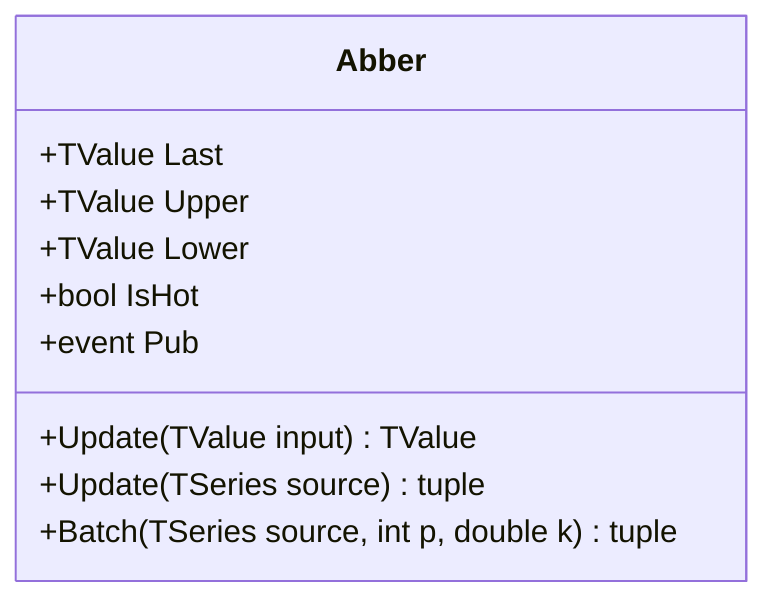

# ABBER: Aberration Bands

> "Standard deviation punishes outliers twice: once when they happen, once when they distort everything else."

ABBER (Aberration Bands) measures price deviation from a central moving average using absolute deviation rather than standard deviation. The result: dynamic bands that adapt to volatility while remaining robust against extreme outliers. Where Bollinger Bands amplify outliers through squaring, ABBER uses raw absolute differences efficiently. Bands respond to typical price behavior, not the occasional spike that yanks everything sideways.

## Historical Context

Aberration Bands emerged as a response to the statistical assumptions baked into Bollinger Bands. Standard deviation assumes normally distributed returns. Markets often defy that assumption daily with fat tails, volatility clustering, and flash crashes. The squared-deviation approach treats these events as if they carry information about typical behavior, whereas they often represent noise.

The absolute deviation approach predates Bollinger's work (mean absolute deviation appears in early 20th-century statistics), but applying it to band construction arrived later, once practitioners grew tired of watching their bands blow out on single-bar anomalies. No single inventor claims credit; the technique spread through trading floors where robustness mattered more than textbook elegance.

## Architecture & Physics

ABBER computes three outputs through running sums maintained in O(1) streaming time. The fundamental difference from standard deviation is linearity: ABBER is a linear damper, while standard deviation is a quadratic spring.

### Calculation Steps

The algorithm maintains a central tendency (SMA) and a dispersion measure (Average Absolute Deviation).

1. **Middle Band (SMA)**
    $$\text{Middle}_t = \frac{1}{n} \sum_{i=0}^{n-1} \text{Source}_{t-i}$$

2. **Absolute Deviation**
    $$\text{Deviation}_t = |\text{Source}_t - \text{Middle}_{t-1}|$$

3. **Average Absolute Deviation**
    $$\text{AvgDev}_t = \frac{1}{n} \sum_{i=0}^{n-1} \text{Deviation}_{t-i}$$

4. **Band Calculation**
    $$\text{Upper}_t = \text{Middle}_t + (k \times \text{AvgDev}_t)$$
    $$\text{Lower}_t = \text{Middle}_t - (k \times \text{AvgDev}_t)$$

    Where $n$ = lookback period (default: 20), $k$ = multiplier (default: 2.0).

## Performance Profile

The implementation uses circular buffers to maintain running sums for both the SMA and the Average Deviation, ensuring O(1) complexity per update regardless of period length.

### Operation Count - Single value

| Operation | Count | Cost (cycles) | Subtotal |
| :--- | :---: | :---: | :---: |
| ADD/SUB | 6 | 1 | 6 |
| MUL | 2 | 3 | 6 |
| DIV | 2 | 15 | 30 |
| ABS | 1 | 1 | 1 |
| **Total** | **11** | — | **~43 cycles** |

### Operation Count - Batch processing

While the recursive nature of SMA prevents full vectorization of the running state dependent steps, the final band construction supports SIMD.

| Operation | Scalar Ops | SIMD Ops (AVX/SSE) | Acceleration |
| :--- | :---: | :---: | :---: |
| Band Construction | 2N | 2N/VectorSize | ~4-8× |
| Deviation | N | N | 1× |

## Validation

ABBER lacks wide support in standard libraries like TA-Lib, so validation relies on internal consistency checks between streaming, batch, and span-based modes.

| Library | Status | Notes |
| :--- | :--- | :--- |
| **TA-Lib** | N/A | Not implemented |
| **Skender** | N/A | Not implemented |
| **Internal** | ✅ | Streaming/Batch/Span match exactly |
| **Manual** | ✅ | Validated against spreadsheet calculation |

## Usage & Pitfalls

- **Parameter Sensitivity**: Multiplier of 2.0 captures ~89% of data under Gaussian assumptions, but market distributions vary. Adjust based on asset volatility characteristics.
- **Lag Inheritance**: ABBER inherits SMA lag. For a 20-period setting, expect approximately 10 bars of delay in band response.
- **Band Squeeze**: Narrowing bands signal consolidation, but ABBER narrows more slowly than Bollinger Bands after volatility spikes.
- **Interpretation**: Price touching the upper band indicates strength (potentially overbought), while touching the lower band indicates weakness.

## API



### Class: `Abber`

| Parameter | Type | Default | Range | Description |
| :--- | :--- | :--- | :--- | :--- |
| `period` | `int` | — | `>0` | Lookback period for SMA and deviation. |
| `multiplier` | `double` | `2.0` | `>0` | Multiplier for band width (k). |
| `source` | `TSeries` | — | `any` | Initial input source (optional). |

### Properties

- `Last` (`TValue`): The current middle band value (SMA).
- `Upper` (`TValue`): The current upper band value.
- `Lower` (`TValue`): The current lower band value.
- `IsHot` (`bool`): Returns `true` if valid data is available (warmup complete).

### Methods

- `Update(TValue input)`: Updates the indicator with a new data point.
- `Update(TSeries source)`: Processes a full series.
- `Batch(...)`: Static method for high-performance batch processing.

## C# Example

```csharp
using QuanTAlib;

// Initialize
var indicator = new Abber(period: 20, multiplier: 2.0);

// Update Loop
foreach (var bar in quotes)
{
    // Update with Close price
    var result = indicator.Update(bar.Close);
    
    // Use valid results
    if (indicator.IsHot)
    {
        Console.WriteLine($"{bar.Date}: Middle={result.Value:F2} Upper={indicator.Upper.Value:F2} Lower={indicator.Lower.Value:F2}");
    }
}
```
