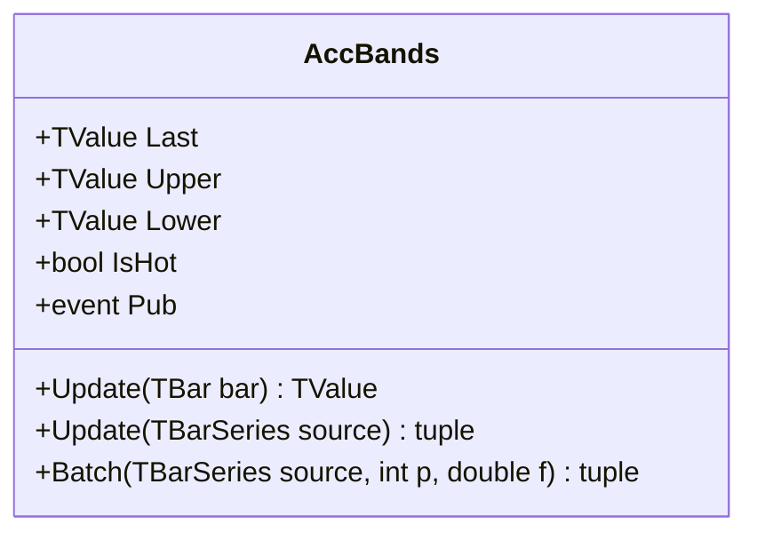

# ACCBANDS: Acceleration Bands

> "Price creates its own envelope, expanding with potential and contracting with consensus."

Acceleration Bands (ACCBANDS) serve as an adaptive volatility envelope based on the high-low range rather than standard deviation. Unlike Bollinger Bands which use close-to-close variance, Acceleration Bands utilize the intra-bar high-low spread to gauge volatility, creating channels that accommodate the full price excursion of the underlying asset.

## Historical Context

Developed by Price Headley and detailed in *Big Trends in Trading* (2002), Acceleration Bands addressed the need for a breakout-specific envelope. Headley observed that standard deviation often lagged in fast-moving breakout scenarios. By incorporating the High and Low prices directly into the band width calculation, he created a system that reacts immediately to range expansion, often serving as a trigger for trend-following entries when price closes outside the bands.

## Architecture & Physics

The indicator maintains three parallel Simple Moving Averages (High, Low, and Close) to construct the bands. The width is derived from the smoothed High-Low range, scaled by a user-defined factor.

### Calculation Steps

1. **Component SMAs**:
    $$SMA_{High} = \frac{1}{n} \sum_{i=0}^{n-1} \text{High}_{t-i}$$
    $$SMA_{Low} = \frac{1}{n} \sum_{i=0}^{n-1} \text{Low}_{t-i}$$
    $$SMA_{Close} = \frac{1}{n} \sum_{i=0}^{n-1} \text{Close}_{t-i}$$

2. **Band Width**:
    $$Width_t = (SMA_{High} - SMA_{Low}) \times Factor$$

3. **Band Construction**:
    $$Upper_t = SMA_{High} + Width_t$$
    $$Lower_t = SMA_{Low} - Width_t$$
    $$Middle_t = SMA_{Close}$$

    Where $n$ = period (default 20), $Factor$ = multiplier (default 2.0).

## Performance Profile

The implementation uses three independent circular buffers (High, Low, Close) to maintain O(1) complexity for the moving averages.

### Operation Count - Single value

| Operation | Count | Cost (cycles) | Subtotal |
| :--- | :---: | :---: | :---: |
| ADD/SUB | 8 | 1 | 8 |
| MUL | 2 | 3 | 6 |
| DIV | 3 | 15 | 45 |
| **Total** | **13** | — | **~59 cycles** |

### Operation Count - Batch processing

SIMD optimization is applied to the final band construction, though the recursive nature of the SMAs limits full vectorization of the state maintenance.

| Operation | Scalar Ops | SIMD Ops (AVX/SSE) | Acceleration |
| :--- | :---: | :---: | :---: |
| Band Construction | 3N | 3N/VectorSize | ~4-8× |
| SMAs | 3N | 3N | 1× |

## Validation

| Library | Status | Notes |
| :--- | :--- | :--- |
| **TA-Lib** | N/A | Not implemented |
| **Skender** | ✅ | Matches `getAccelerationBands` |
| **Internal** | ✅ | Streaming/Batch/Span match exactly |

## Usage & Pitfalls

- **Trend Definition**: Headley defines a breakout as two consecutive closes outside the bands.
- **Parameter Sensitivity**: The default factor of 2.0 is tuned for equities. Crypto or FX may require higher factors (e.g., 3.0) due to "fat tails" in intra-bar range.
- **Lag**: Inherits the lag of the underlying SMA. Not suitable for ultra-high-frequency reacting.
- **Range vs Variance**: Because it uses High-Low range, it is more sensitive to "wicks" or momentary spikes than close-based envelopes.

## API



### Class: `AccBands`

| Parameter | Type | Default | Range | Description |
| :--- | :--- | :--- | :--- | :--- |
| `period` | `int` | — | `>0` | Lookback period for SMAs. |
| `factor` | `double` | `2.0` | `>0` | Multiplier for band width. |
| `source` | `TBarSeries` | — | `any` | Initial input TBar data (optional). |

### Properties

- `Last` (`TValue`): The current middle band value (SMA of Close).
- `Upper` (`TValue`): The current upper band value.
- `Lower` (`TValue`): The current lower band value.
- `IsHot` (`bool`): Returns `true` if valid data is available (warmup complete).

### Methods

- `Update(TBar input)`: Updates the indicator with a new bar.
- `Update(TBarSeries source)`: Processes a full series.
- `Batch(...)`: Static method for high-performance batch processing.

## C# Example

```csharp
using QuanTAlib;

// Initialize
var indicator = new AccBands(period: 20, factor: 2.0);

// Update Loop
foreach (var bar in bars)
{
    var result = indicator.Update(bar);
    
    // Use valid results
    if (indicator.IsHot)
    {
        Console.WriteLine($"{bar.Time}: Mid={result.Value:F2} Up={indicator.Upper.Value:F2} Low={indicator.Lower.Value:F2}");
    }
}
```
