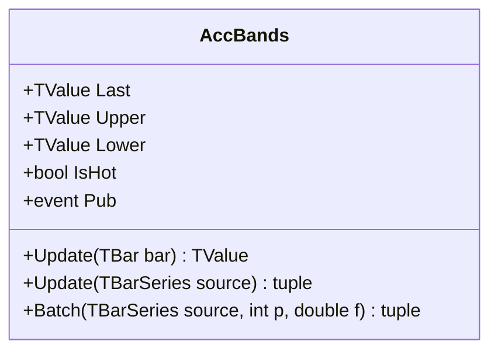

# ACCBANDS: Acceleration Bands

> "Price creates its own envelope, expanding with potential and contracting with consensus."

Acceleration Bands (ACCBANDS) serve as an adaptive volatility envelope based on the high-low range rather than standard deviation. Unlike Bollinger Bands which use close-to-close variance, Acceleration Bands utilize the intra-bar high-low spread to gauge volatility, creating channels that accommodate the full price excursion of the underlying asset.

## Historical Context

Developed by Price Headley and detailed in *Big Trends in Trading* (2002), Acceleration Bands addressed the need for a breakout-specific envelope. Headley observed that standard deviation often lagged in fast-moving breakout scenarios. By incorporating the High and Low prices directly into the band width calculation — using a per-bar normalized range width — he created a system that reacts immediately to range expansion, often serving as a trigger for trend-following entries when price closes outside the bands.

## Architecture & Physics

The indicator applies a per-bar width adjustment based on the normalized range `w = (H-L)/(H+L)` before averaging. This means wider-range bars contribute proportionally more to band expansion. Three Simple Moving Averages (adjusted high, adjusted low, close) construct the bands.

### Calculation Steps (Headley's Formula)

1. **Per-bar normalized width**:
    $$w_t = \frac{High_t - Low_t}{High_t + Low_t}$$

2. **Adjusted prices per bar**:
    $$AdjHigh_t = High_t \times (1 + Factor \times w_t)$$
    $$AdjLow_t = Low_t \times (1 - Factor \times w_t)$$

3. **Band Construction**:
    $$Upper_t = SMA(AdjHigh, n)$$
    $$Lower_t = SMA(AdjLow, n)$$
    $$Middle_t = SMA(Close, n)$$

    Where $n$ = period (default 20), $Factor$ = multiplier (default 4.0).

## Performance Profile

The implementation uses three independent circular buffers (adjusted high, adjusted low, close) to maintain O(1) complexity for the moving averages.

### Operation Count - Single value

| Operation | Count | Cost (cycles) | Subtotal |
| :--- | :---: | :---: | :---: |
| ADD/SUB | 10 | 1 | 10 |
| MUL | 4 | 3 | 12 |
| DIV | 4 | 15 | 60 |
| **Total** | **18** | — | **~82 cycles** |

### Operation Count - Batch processing

SIMD optimization is applied to the sum resynchronization, though the recursive nature of the SMAs limits full vectorization of the state maintenance.

| Operation | Scalar Ops | SIMD Ops (AVX/SSE) | Acceleration |
| :--- | :---: | :---: | :---: |
| Band Construction | 3N | 3N/VectorSize | ~4-8× |
| SMAs | 3N | 3N | 1× |

## Validation

| Library | Status | Notes |
| :--- | :--- | :--- |
| **TA-Lib** | ✅ | All three bands match exactly (same Headley formula) |
| **Internal** | ✅ | Streaming/Batch/Span match exactly |

## Usage & Pitfalls

- **Trend Definition**: Headley defines a breakout as two consecutive closes outside the bands.
- **Parameter Sensitivity**: The default factor of 4.0 matches TA-Lib and Headley's original. Lower factors (e.g., 2.0) produce tighter bands; higher factors (e.g., 6.0) may be needed for crypto/FX.
- **Lag**: Inherits the lag of the underlying SMA. Not suitable for ultra-high-frequency reacting.
- **Range vs Variance**: Because it uses High-Low range, it is more sensitive to "wicks" or momentary spikes than close-based envelopes.
- **Division by Zero**: When High + Low = 0 (price is zero), the normalized width defaults to 0.

## API



### Class: `AccBands`

| Parameter | Type | Default | Range | Description |
| :--- | :--- | :--- | :--- | :--- |
| `period` | `int` | — | `>0` | Lookback period for SMAs. |
| `factor` | `double` | `4.0` | `>0` | Multiplier for normalized width. |
| `source` | `TBarSeries` | — | `any` | Initial input TBar data (optional). |

### Properties

- `Last` (`TValue`): The current middle band value (SMA of Close).
- `Upper` (`TValue`): The current upper band value (SMA of adjusted High).
- `Lower` (`TValue`): The current lower band value (SMA of adjusted Low).
- `IsHot` (`bool`): Returns `true` if valid data is available (warmup complete).

### Methods

- `Update(TBar input)`: Updates the indicator with a new bar.
- `Update(TBarSeries source)`: Processes a full series.
- `Batch(...)`: Static method for high-performance batch processing.

## C# Example

```csharp
using QuanTAlib;

// Initialize
var indicator = new AccBands(period: 20, factor: 4.0);

// Update Loop
foreach (var bar in bars)
{
    var result = indicator.Update(bar);
    
    // Use valid results
    if (indicator.IsHot)
    {
        Console.WriteLine($"{bar.Time}: Mid={result.Value:F2} Up={indicator.Upper.Value:F2} Low={indicator.Lower.Value:F2}");
    }
}
```
