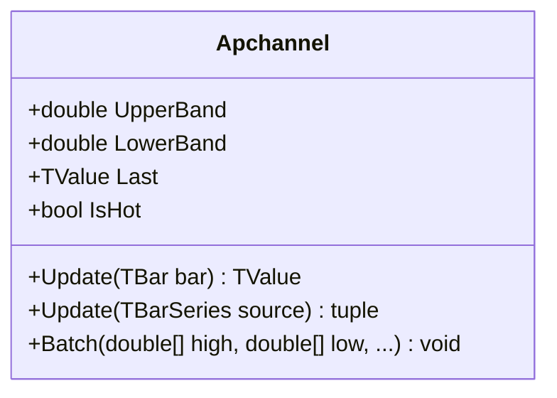

# APCHANNEL: Adaptive Price Channel

> "A channel isn't a prediction—it's an acknowledgment that price has inertia and boundaries."

APCHANNEL (Adaptive Price Channel) transforms the classic high-low tracking problem into an exponentially weighted persistence model. Unlike rigid lookback windows that drop price extremes abruptly, this indicator applies exponential decay to price highs and lows. The result is a channel that "remembers" significant resistance and support levels while gradually fading their influence over time, creating a smooth, lag-free volatility envelope.

## Historical Context

While traditional Price Channels (Donchian) define range by the absolute highest high and lowest low over a fixed period, the Adaptive Price Channel originates from the signal processing domain. It applies the concept of "leaky integration" or exponential smoothing directly to price extremes. This approach addresses the "cliff effect" of fixed windows: where a major high from 20 bars ago suddenly vanishes from the calculation. In APCHANNEL, that high fades gracefully, providing continuous rather than discontinuous volatility modeling.

## Architecture & Physics

The core mechanism is a dual Exponential Moving Average (EMA) system running on parallel tracks: one effectively smoothing the "ceilings" (highs) and another smoothing the "floors" (lows).

### Calculation Steps

1. **Exponential Decay**:
    Each new bar's High and Low is integrated into the channel state using a smoothing factor $\alpha$.
    $$Upper_t = \text{High}_{t} \times \alpha + Upper_{t-1} \times (1 - \alpha)$$
    $$Lower_t = \text{Low}_{t} \times \alpha + Lower_{t-1} \times (1 - \alpha)$$

2. **Midpoint**:
    The center of the channel is simply the arithmetic mean of the bands.
    $$Middle_t = \frac{Upper_t + Lower_t}{2}$$

    Where $\alpha$ (alpha) is the smoothing factor ($0 < \alpha \le 1$).

### Physics of Alpha

- **High Alpha (e.g., 0.8)**: Short memory. The channel snaps quickly to new highs/lows and forgets old ones rapidly.
- **Low Alpha (e.g., 0.1)**: Long memory. Significant highs persist as resistance for a long time, decaying slowly.

## Performance Profile

Because the calculation relies on recursive EMA logic, it is inherently O(1) in a streaming context—no history buffers or iterations are required.

### Operation Count - Single value

| Operation | Count | Cost (cycles) | Subtotal |
| :--- | :---: | :---: | :---: |
| FMA | 2 | 4 | 8 |
| ADD | 1 | 1 | 1 |
| MUL | 0 | 3 | 0 |
| DIV | 1 | 15 | 15 |
| **Total** | **4** | — | **~24 cycles** |

*Note: The implementation utilizes `Math.FusedMultiplyAdd` (FMA) for the EMA recursion step, combining multiplication and addition into a single, higher-precision CPU instruction.*

### Operation Count - Batch processing

| Operation | Scalar Ops | SIMD Ops (AVX/SSE) | Acceleration |
| :--- | :---: | :---: | :---: |
| EMA Recursion | 2N | N/A | 1× |

*Note: EMA recursion is strictly serial (requires $t-1$ to compute $t$), preventing vectorization across the time dimension. However, the High and Low bands are computed independently.*

## Validation

| Library | Status | Notes |
| :--- | :--- | :--- |
| **TA-Lib** | N/A | Not implemented |
| **Skender** | ✅ | Validated against `GetEma` on High/Low |
| **Internal** | ✅ | Streaming/Batch/Span match exactly |

## Usage & Pitfalls

- **Alpha vs Period**: Users familiar with periods can approximate $\alpha \approx 2 / (Period + 1)$.
- **Warmup**: The EMA structure requires a convergence period. The indicator is considered "hot" after $\approx 3/\alpha$ bars.
- **Responsiveness**: Unlike Donchian channels which are flat until a new breakout, APCHANNEL is constantly sloping. This makes it excellent for trend-following stops (trailing variance).
- **Whipsaws**: High alpha values in choppy markets will produce tight bands that generate excessive false breakout signals.

## API



### Class: `Apchannel`

| Parameter | Type | Default | Range | Description |
| :--- | :--- | :--- | :--- | :--- |
| `alpha` | `double` | `0.2` | `(0, 1]` | Smoothing factor (higher = faster decay). |
| `source` | `TBarSeries` | — | `any` | Initial input source (optional). |

### Properties

- `Last` (`TValue`): The current midpoint value.
- `UpperBand` (`double`): The current upper exponential band value.
- `LowerBand` (`double`): The current lower exponential band value.
- `IsHot` (`bool`): Returns `true` if valid data is available (warmup complete).

### Methods

- `Update(TBar input)`: Updates the indicator with a new bar.
- `Update(TBarSeries source)`: Processes a full series.
- `Batch(...)`: Static method for high-performance batch processing.

## C# Example

```csharp
using QuanTAlib;

// Initialize with slowing decay (long memory)
var channel = new Apchannel(alpha: 0.1);

// Update Loop
foreach (var bar in bars)
{
    var mid = channel.Update(bar);
    
    // Use valid results
    if (channel.IsHot)
    {
        Console.WriteLine($"{bar.Time}: Upper={channel.UpperBand:F2} Lower={channel.LowerBand:F2}");
    }
}
```
