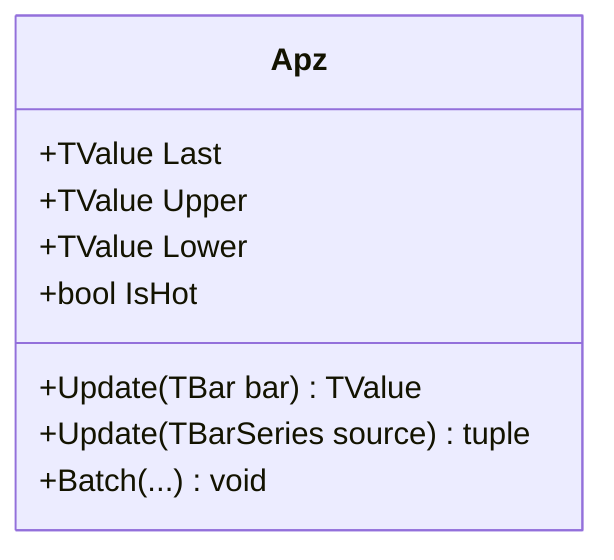

# APZ: Adaptive Price Zone

> "Volatility is not noise; it is the breathing rhythm of the market."

APZ (Adaptive Price Zone) is a volatility-based envelop composed of double-smoothed exponential moving averages. Unlike standard bands that often perform poorly in non-trending "choppy" markets, APZ uses a square-root weighted EMA to create a highly responsive zone that identifies reversal points in sideways action.

## Historical Context

Created by Lee Leibfarth and published in *Technical Analysis of Stocks & Commodities* (Sep 2006, "Trading With An Adaptive Price Zone"), APZ was specifically engineered for the "non-trending" phase of market cycles. Leibfarth recognized that most indicators fail in chop; trend followers get whipsawed, and oscillators saturate. APZ fills this gap by adapting its bandwidth dynamically to statistical noise, allowing traders to fade extremes in range-bound environments.

## Architecture & Physics

APZ relies on a "Double-Smoothed EMA" (DS-EMA) for both the centerline and the band width. The smoothing factor is aggressive, derived from the square root of the period, making it significantly faster than a standard EMA.

### Calculation Steps

1. **Smoothing Factor**:
    $$\alpha = \frac{2}{\sqrt{Period} + 1}$$

2. **Center Line (DS-EMA of Price)**:
    $$EMA1_{Price} = \text{Price}_t \times \alpha + EMA1_{Price, t-1} \times (1 - \alpha)$$
    $$Center_t = EMA1_{Price} \times \alpha + Center_{t-1} \times (1 - \alpha)$$

3. **Adaptive Range (DS-EMA of Range)**:
    $$Range_t = \text{High}_t - \text{Low}_t$$
    $$EMA1_{Range} = Range_t \times \alpha + EMA1_{Range, t-1} \times (1 - \alpha)$$
    $$SmoothRange_t = EMA1_{Range} \times \alpha + SmoothRange_{t-1} \times (1 - \alpha)$$

4. **Bands**:
    $$BandWidth_t = SmoothRange_t \times Factor$$
    $$Upper_t = Center_t + BandWidth_t$$
    $$Lower_t = Center_t - BandWidth_t$$

    Where $Period$ determines responsiveness and $Factor$ scales the zone width.

## Performance Profile

The implementation utilizes compounded warmup compensation to stabilize the nested EMAs derived from bar 1 (zero-lag start).

### Operation Count - Single value

| Operation | Count | Cost (cycles) | Subtotal |
| :--- | :---: | :---: | :---: |
| ADD/SUB | 6 | 1 | 6 |
| MUL | 10 | 3 | 30 |
| FMA | 4 | 4 | 16 |
| SQRT | 1 | 15 | 15 |
| **Total** | **21** | — | **~67 cycles** |

*Note: SQRT is computed once at initialization. The runtime complexity is dominated by the 4 FMA instructions for the double smoothing.*

### Operation Count - Batch processing

| Operation | Scalar Ops | SIMD Ops (AVX/SSE) | Acceleration |
| :--- | :---: | :---: | :---: |
| Double Smoothing | 4N | N/A | 1× |

*Note: Due to the nested recursive nature ($t$ depends on $t-1$), vectorization is limited to parallel processing of Price and Range chains.*

## Validation

| Library | Status | Notes |
| :--- | :--- | :--- |
| **TA-Lib** | N/A | Not implemented |
| **Skender** | N/A | Not implemented |
| **Internal** | ✅ | Validated against Leibfarth's formula |
| **TradingView** | ✅ | Matches standard scripts |

## Usage & Pitfalls

- **Market Regime**: APZ is a **Mean Reversion** tool. It works best when ADX < 30. In strong trends, price will "surf" the bands rather than reverse.
- **Whipsaw**: The bands are extremely responsive. A closing price outside the bands suggests an immediate reversal, not a breakout.
- **Period Selection**: Because of the square root, a period of 20 (sqrt≈4.47) behaves like an EMA of ~3.5. It is much faster than a standard 20 EMA.

## API



### Class: `Apz`

| Parameter | Type | Default | Range | Description |
| :--- | :--- | :--- | :--- | :--- |
| `period` | `int` | — | `>0` | Lookback period (internally $\sqrt{P}$). |
| `multiplier` | `double` | `2.0` | `>0` | Band width factor. |
| `source` | `TBarSeries` | — | `any` | Initial input source (optional). |

### Properties

- `Last` (`TValue`): The current center line (DS-EMA Price).
- `Upper` (`TValue`): The current upper band.
- `Lower` (`TValue`): The current lower band.
- `IsHot` (`bool`): Returns `true` if valid data is available (warmup complete).

### Methods

- `Update(TBar input)`: Updates the indicator with a new bar.
- `Update(TBarSeries source)`: Processes a full series.
- `Batch(...)`: Static method for high-performance batch processing.

## C# Example

```csharp
using QuanTAlib;

// Initialize
var indicator = new Apz(period: 20, multiplier: 2.0);

// Update Loop
foreach (var bar in bars)
{
    var center = indicator.Update(bar);
    
    // Mean reversion logic
    if (indicator.IsHot)
    {
        if (bar.Close > indicator.Upper.Value)
            Console.WriteLine("Overshoot: Sell Signal");
        if (bar.Close < indicator.Lower.Value)
            Console.WriteLine("Undershoot: Buy Signal");
    }
}
```
