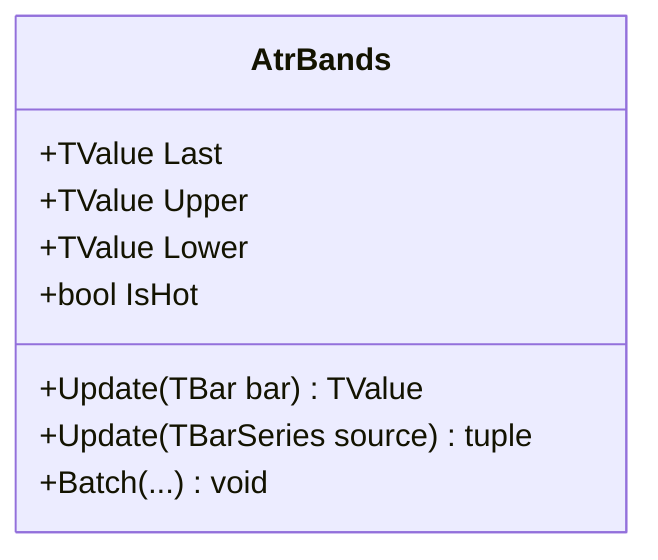

# ATRBANDS: Average True Range Bands

> "True Range reveals the market's actual footprint, ignoring the gaps that deceive the eye."

ATR Bands create a volatility-adaptive envelope around a central moving average. Unlike fixed-percentage bands (like Envelopes) or standard deviation bands (like Bollinger), ATR Bands use Wilder's Average True Range to measure volatility. This makes them particularly robust for assets with gaps, pre-market moves, or 24/7 discontinuities, as the True Range accounts for the "hidden" volatility between bars.

## Historical Context

Developed by futures traders in the 1980s following J. Welles Wilder's introduction of ATR in *New Concepts in Technical Trading Systems* (1978). While Wilder used ATR primarily for trailing stops (Volty Stop) and directional indicators, traders quickly realized that projecting ATR above and below a Trend MA created an excellent breakout/containment channel. It effectively answers the question: "How far can price move away from the average before it is statistically abnormal?"

## Architecture & Physics

The system consists of a central tendency (SMA) and a dispersion measure (ATR). The physics are those of an elastic boundary: the envelope expands linearly with volatility, creating "breathing room" for price during high-stress periods.

### Calculation Steps

1. **True Range**:
    $$TR_t = \max(\text{High}_t - \text{Low}_t, |\text{High}_t - \text{Close}_{t-1}|, |\text{Low}_t - \text{Close}_{t-1}|)$$

2. **Average True Range (Wilder's Smoothing)**:
    $$ATR_t = \frac{ATR_{t-1} \times (n-1) + TR_t}{n}$$

3. **Bands**:
    $$Middle_t = SMA(\text{Source}, n)$$
    $$Upper_t = Middle_t + (ATR_t \times Multiplier)$$
    $$Lower_t = Middle_t - (ATR_t \times Multiplier)$$

    Where $n$ = period (default 20), $Multiplier$ = scale factor (default 2.0).

## Performance Profile

The implementation uses O(1) iterative updates. The SMA uses a circular buffer for running sums, while the ATR uses a recursive IIR filter (Wilder's smoothing).

### Operation Count - Single value

| Operation | Count | Cost (cycles) | Subtotal |
| :--- | :---: | :---: | :---: |
| ADD/SUB | 6 | 1 | 6 |
| MUL | 4 | 3 | 12 |
| DIV | 1 | 15 | 15 |
| CMP/ABS | 3 | 1 | 3 |
| FMA | 1 | 4 | 4 |
| **Total** | **15** | — | **~40 cycles** |

### Operation Count - Batch processing

| Operation | Scalar Ops | SIMD Ops (AVX/SSE) | Acceleration |
| :--- | :---: | :---: | :---: |
| SMA Update | N | N | 1× |
| ATR Update | N | N | 1× |
| Band Calc | 3N | 3N/VectorSize | ~4-8× |

*Note: The recursive nature of ATR and SMA limits full vectorization, but the final band projection is fully accelerated.*

## Validation

| Library | Status | Notes |
| :--- | :--- | :--- |
| **TA-Lib** | N/A | Not implemented |
| **Skender** | ✅ | Matches `GetAtr` + SMA logic |
| **Internal** | ✅ | Streaming/Batch/Span match exactly |

## Usage & Pitfalls

- **Stop Placement**: ATR Bands are widely used for placing stop-losses. A common technique is placing a stop just outside the 2.0-3.0 ATR band.
- **Keltner Channels Comparison**: Keltner Channels typically use EMA for the center line. ATR Bands use SMA. The bandwidth logic is identical.
- **Lag**: Because it uses SMA, the center line lags significantly compared to an EMA-based channel.
- **Warmup**: ATR requires significant warmup (typically >50 bars) to stabilize fully due to the infinite memory of the Wilder smoothing function.

## API



### Class: `AtrBands`

| Parameter | Type | Default | Range | Description |
| :--- | :--- | :--- | :--- | :--- |
| `period` | `int` | — | `>0` | Lookback for SMA and ATR. |
| `multiplier` | `double` | `2.0` | `>0` | Band width factor. |
| `source` | `TBarSeries` | — | `any` | Initial input source (optional). |

### Properties

- `Last` (`TValue`): The current middle band value (SMA).
- `Upper` (`TValue`): The current upper band.
- `Lower` (`TValue`): The current lower band.
- `IsHot` (`bool`): Returns `true` if valid data is available (warmup complete).

### Methods

- `Update(TBar input)`: Updates the indicator with a new bar.
- `Update(TBarSeries source)`: Processes a full series.
- `Batch(...)`: Static method for high-performance batch processing.

## C# Example

```csharp
using QuanTAlib;

// Initialize
var indicator = new AtrBands(period: 20, multiplier: 2.0);

// Update Loop
foreach (var bar in bars)
{
    var mid = indicator.Update(bar);
    
    // Use valid results
    if (indicator.IsHot)
    {
        Console.WriteLine($"{bar.Time}: Mid={mid.Value:F2} Upper={indicator.Upper.Value:F2}");
    }
}
```
