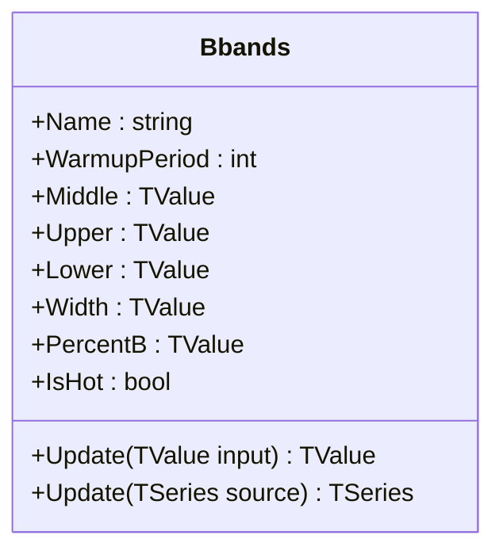

# BBANDS: Bollinger Bands

> "Two standard deviations contain 95% of price action—until they don't."

Bollinger Bands® are volatility-based envelopes that surround a central moving average. The bands adapt to changing market conditions by expanding during periods of high volatility and contracting during periods of low volatility, solving the problem of fixed-width envelopes by using standard deviation as a dynamic measure of width.

## Historical Context

**John Bollinger** developed Bollinger Bands in the early 1980s while working as a market technician. He registered "Bollinger Bands" as a trademark in 1996. The indicator emerged from Bollinger's observation that volatility is not static—a simple percentage envelope fails to account for the market's changing breath.

Bollinger drew inspiration from statistical probability theory. Under a normal distribution, approximately 68% of data falls within ±1σ, 95% within ±2σ, and 99.7% within ±3σ. By setting the default multiplier to 2.0, Bollinger created bands that theoretically contain ~95% of price action. However, financial returns are famously non-Gaussian (fat tails, skewness), so the bands serve more as a volatility-normalized reference than a probability envelope.

The indicator became one of the most widely adopted technical analysis tools, featured in virtually every charting platform. Bollinger authored *Bollinger on Bollinger Bands* (2001), detailing trading methodologies including "the squeeze" (low volatility preceding breakouts) and "%B" (price position within the bands as an oscillator).

## Architecture & Physics

The system relies on the statistical properties of the **Normal Distribution** (Gaussian bell curve):

1. **Central Tendency:** The middle band defines the "center of gravity" for price, typically a Simple Moving Average (SMA).
2. **Dispersion:** The width of the bands is determined by the Population Standard Deviation ($\sigma$), representing the volatility or "energy" in the system.
3. **Probability Event Horizons:**
    - $\pm 2\sigma$ theoretically contains ~95.4% of price action (Chebyshev's inequality guarantees at least 75%, normal distribution implies 95%).
    - Excursions outside the bands represent statistically significant "anomalies" or extreme momentum.

### Calculation Steps

#### 1. Middle Band (SMA)

$$
\text{Middle}_t = \frac{1}{n} \sum_{i=0}^{n-1} \text{Close}_{t-i}
$$

#### 2. Population Standard Deviation

$$
\sigma_t = \sqrt{\frac{1}{n} \sum_{i=0}^{n-1} (\text{Close}_{t-i} - \text{Middle}_t)^2}
$$

#### 3. Band Construction

$$
\text{Upper}_t = \text{Middle}_t + (k \times \sigma_t)
$$

$$
\text{Lower}_t = \text{Middle}_t - (k \times \sigma_t)
$$

Where $n$ = period (default: 20), $k$ = multiplier (default: 2.0).

#### 4. Derived Metrics

$$
\text{BandWidth}_t = \frac{\text{Upper}_t - \text{Lower}_t}{\text{Middle}_t}
$$

$$
\text{PercentB}_t = \frac{\text{Close}_t - \text{Lower}_t}{\text{Upper}_t - \text{Lower}_t}
$$

## Performance Profile

The implementation utilizes **O(1)** circular buffer algorithms for both the SMA and Standard Deviation components, ensuring performance remains constant regardless of the lookback period.

### Operation Count - Single value

| Operation | Count | Cost (cycles) | Subtotal |
| :--- | :---: | :---: | :---: |
| ADD/SUB | 5 | 1 | 5 |
| MUL | 3 | 3 | 9 |
| DIV | 2 | 15 | 30 |
| SQRT | 1 | 15 | 15 |
| **Total** | **11** | — | **~59 cycles** |

### Operation Count - Batch processing

| Operation | Scalar Ops | SIMD Ops (AVX/SSE) | Acceleration |
| :--- | :---: | :---: | :---: |
| SMA computation | N | N | 1× |
| Variance/StdDev | 2N | 2N/4 | ~4× |
| Band construction | 3N | 3N/8 | ~8× |

## Validation

| Library | Status | Notes |
| :--- | :---: | :--- |
| **TA-Lib** | ✅ | Matches `TA_BBANDS` exactly |
| **Skender** | ✅ | Matches `GetBollingerBands` |
| **Pandas-TA** | ✅ | Matches `ta.bbands` |
| **Spreadsheet** | ✅ | Manual Excel validation |

*Note: Differences in Standard Deviation types (Sample vs. Population) are the most common cause of discrepancies across libraries. QuanTAlib uses **Population** Standard Deviation, consistent with John Bollinger's specification.*

## Usage & Pitfalls

- **The Squeeze**: Narrow bands (low BandWidth) often precede explosive moves. Watch for BandWidth at multi-month lows.
- **Walking the Bands**: In strong trends, price can "walk" along the upper or lower band for extended periods. Touching the band is not inherently a reversal signal.
- **%B Oscillator**: Use PercentB as a normalized oscillator: >1.0 = above upper band, <0.0 = below lower band, 0.5 = at middle.
- **Standard Deviation Type**: Ensure your implementation matches your expected behavior—Population σ (divide by n) vs Sample σ (divide by n-1) produces different band widths.
- **Warmup Period**: The indicator requires `period` bars before producing valid results. During warmup, bands may appear artificially narrow.
- **Non-Normal Returns**: Markets exhibit fat tails; expect more than 5% of price action outside ±2σ bands in practice.

## API



### Class: `Bbands`

| Parameter | Type | Default | Range | Description |
| :--- | :--- | :--- | :--- | :--- |
| `period` | `int` | `20` | `>0` | Lookback period for SMA and StdDev. |
| `multiplier` | `double` | `2.0` | `>0` | Number of standard deviations for band width. |
| `source` | `TSeries` | — | `any` | Initial input source (optional). |

### Properties

- `Middle` (`TValue`): The Simple Moving Average (Mean).
- `Upper` (`TValue`): The Upper Bollinger Band.
- `Lower` (`TValue`): The Lower Bollinger Band.
- `Width` (`TValue`): Normalized BandWidth: $(Upper - Lower) / Middle$.
- `PercentB` (`TValue`): %B Indicator: $(Price - Lower) / (Upper - Lower)$.
- `IsHot` (`bool`): Returns `true` after `period` bars.

### Methods

- `Update(TValue input)`: Updates the indicator with a new price point and returns the Middle band.
- `Update(TSeries source)`: Batch processes a series.

## C# Example

```csharp
using QuanTAlib;

// Initialize with standard settings (20, 2.0)
var bbands = new Bbands(period: 20, multiplier: 2.0);

// Update Loop
foreach (var bar in bars)
{
    var result = bbands.Update(bar.Close);

    if (bbands.IsHot)
    {
        Console.WriteLine($"{bar.Time}: Upper={bbands.Upper.Value:F2} Mid={result.Value:F2} Lower={bbands.Lower.Value:F2}");
        Console.WriteLine($"  %B={bbands.PercentB.Value:F2} Width={bbands.Width.Value:F4}");
    }
}
```

## References

- Bollinger, J. (2001). *Bollinger on Bollinger Bands*. McGraw-Hill.
- Bollinger, J. (1992). "Using Bollinger Bands." *Technical Analysis of Stocks & Commodities*.
