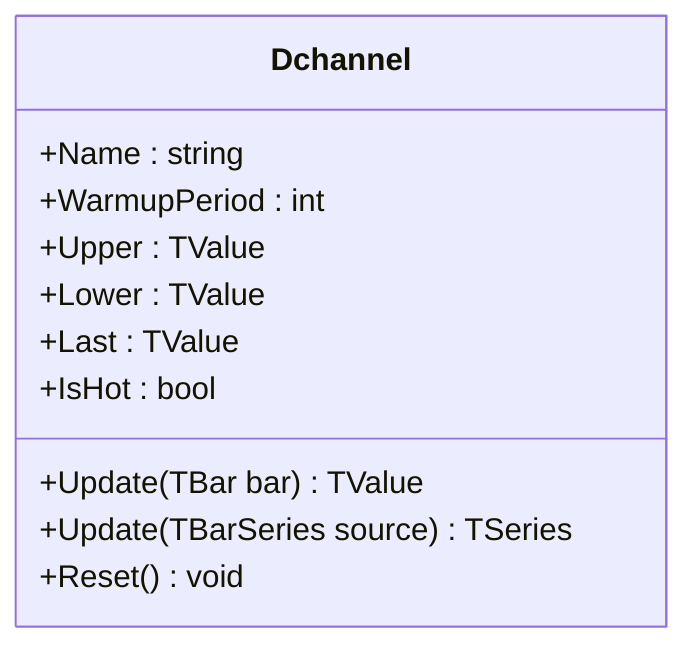

# DCHANNEL: Donchian Channels

> "The Turtles made millions with a simple rule: buy the 20-day high, sell the 20-day low."

Donchian Channels are a price envelope indicator that tracks the highest high and lowest low over a specific lookback period. Unlike volatility-based bands (like Bollinger Bands) which rely on statistical dispersion, Donchian Channels represent actual historical price extremes—they define the "price box" in which the asset has traded. This implementation uses monotonic deques for O(1) amortized updates, making it scalable to long lookback periods and high-frequency data feeds.

## Historical Context

**Richard Donchian** developed this indicator in the 1960s while managing one of the first publicly held commodity funds. Known as the "father of trend following," Donchian pioneered systematic trading approaches in an era dominated by discretionary methods.

The indicator gained legendary status through the **Turtle Trading** experiment in 1983. Richard Dennis and William Eckhardt recruited novice traders and taught them a mechanical system built on channel breakouts. The Turtles reportedly made over $100 million. Curtis Faith's 2007 book *Way of the Turtle* revealed the core system: enter on 20-day breakouts, exit on 10-day counter-breakouts.

Donchian's "4-week rule" (buy on 20-day high, sell on 20-day low) became the foundation for systematic trend-following. The simplicity is the feature: no predictions, no indicators—just price breaking through defined boundaries.

## Architecture & Physics

The physics of Donchian Channels is based on **Price Extremes** within a sliding time window. It answers the question: "What are the absolute boundaries of recent price action?"

### Monotonic Deque Algorithm

Most implementations scan the entire lookback window for every bar, resulting in $O(N \times P)$ complexity (where $P$ is period). QuanTAlib uses **Monotonic Deques** to maintain the maximum and minimum candidates in sorted order.

1. **Efficiency:** This reduces the complexity to **Amortized O(1)**.
2. **Scalability:** Calculating a 500-period channel takes the same CPU time as a 20-period channel.

### Calculation Steps

#### 1. Upper Band (Highest High)

$$
\text{Upper}_t = \max_{i=0}^{n-1}(H_{t-i})
$$

#### 2. Lower Band (Lowest Low)

$$
\text{Lower}_t = \min_{i=0}^{n-1}(L_{t-i})
$$

#### 3. Middle Band

$$
\text{Middle}_t = \frac{\text{Upper}_t + \text{Lower}_t}{2}
$$

Where $n$ = period (default: 20).

### Deque Maintenance

For each new bar:

1. **Upper Band (Max Deque):**
   - Remove indices outside the window from the front
   - Remove values smaller than the current High from the back
   - Add current High to the back
   - Front element is the highest high

2. **Lower Band (Min Deque):**
   - Remove indices outside the window from the front
   - Remove values larger than the current Low from the back
   - Add current Low to the back
   - Front element is the lowest low

**Amortized Analysis:** Each element enters the deque once and leaves at most once. Total work for $N$ bars is $O(N)$, yielding $O(1)$ amortized per bar.

## Performance Profile

The implementation is highly optimized using the Monotonic Deque pattern, solving the performance bottleneck common in "sliding window max/min" problems.

### Operation Count - Single value

| Operation | Count | Cost (cycles) | Subtotal |
| :--- | :---: | :---: | :---: |
| CMP (deque maint.) | ~4 | 1 | ~4 |
| ADD (index/middle) | 2 | 1 | 2 |
| MUL (middle) | 1 | 3 | 3 |
| Deque ops | ~2 | 1 | ~2 |
| **Total** | **~9** | — | **~11 cycles** |

**Complexity:** O(1) amortized per bar.

### Operation Count - Batch processing

| Operation | Scalar Ops | SIMD Ops (AVX/SSE) | Acceleration |
| :--- | :---: | :---: | :---: |
| Deque maintenance | ~6N | N/A | 1× |
| Middle calculation | N | N/8 | 8× |

*Note: Sliding window max/min is inherently sequential, limiting SIMD benefit. The deque algorithm is already highly efficient.*

## Validation

| Library | Status | Notes |
| :--- | :---: | :--- |
| **TA-Lib** | ✅ | Matches `MAX` and `MIN` functions |
| **Skender** | ✅ | Matches `DonchianChannels` exactly |
| **Tulip** | ✅ | Matches `max` and `min` functions |
| **Ooples** | ✅ | Cross-validated |
| **Manual** | ✅ | Verified against extreme values |

## Usage & Pitfalls

- **Breakout Trading**: The classic Donchian strategy: buy when price closes above Upper band, sell when it closes below Lower band. Simple but effective in trending markets.
- **Turtle Rules**: Consider asymmetric periods—20-day for entry, 10-day for exit—to lock in profits faster.
- **Stale Extremes**: The bands stay flat until a new extreme occurs or the old extreme exits the window. A band that hasn't moved in 15 bars is waiting for new information.
- **Breakout vs. Touch**: Price touching the band is not the same as breaking out. True breakouts require closes above/below the band. Intrabar spikes often reverse.
- **Choppy Markets**: In range-bound markets, Donchian generates many false breakouts. Consider filtering with ADX or volume.
- **Gap Handling**: Overnight gaps immediately extend the relevant band. These may not represent sustainable price levels.

## API



### Class: `Dchannel`

| Parameter | Type | Default | Range | Description |
| :--- | :--- | :--- | :--- | :--- |
| `period` | `int` | `20` | `>0` | Lookback window for finding highest high and lowest low. |
| `source` | `TBarSeries` | — | `any` | Initial input (optional). |

### Properties

- `Last` (`TValue`): The Middle Band value ((Upper + Lower) / 2).
- `Upper` (`TValue`): The Highest High over the lookback period.
- `Lower` (`TValue`): The Lowest Low over the lookback period.
- `IsHot` (`bool`): Returns `true` after `period` bars.

### Methods

- `Update(TBar bar)`: Updates the indicator with new OHLC data and returns the Middle band.
- `Update(TBarSeries source)`: Batch processes a bar series.
- `Reset()`: Clears all historical data and deques.

## C# Example

```csharp
using QuanTAlib;

// Initialize for a 20-day breakout system
var dchannel = new Dchannel(period: 20);

// Update Loop
foreach (var bar in bars)
{
    var result = dchannel.Update(bar);

    if (dchannel.IsHot)
    {
        Console.WriteLine($"{bar.Time}: Mid={result.Value:F2} Upper={dchannel.Upper.Value:F2} Lower={dchannel.Lower.Value:F2}");

        // Turtle-style breakout detection
        if (bar.Close > dchannel.Upper.Value)
            Console.WriteLine("  BREAKOUT! Price exceeds 20-day high");
        else if (bar.Close < dchannel.Lower.Value)
            Console.WriteLine("  BREAKDOWN! Price below 20-day low");
    }
}
```

## References

- Donchian, R. (1960). "High Finance in Copper." *Financial Analysts Journal*, 16(6), 133-142.
- Faith, C. (2007). *Way of the Turtle: The Secret Methods that Turned Ordinary People into Legendary Traders*. McGraw-Hill.
- Covel, M. (2007). *The Complete TurtleTrader*. HarperBusiness.
