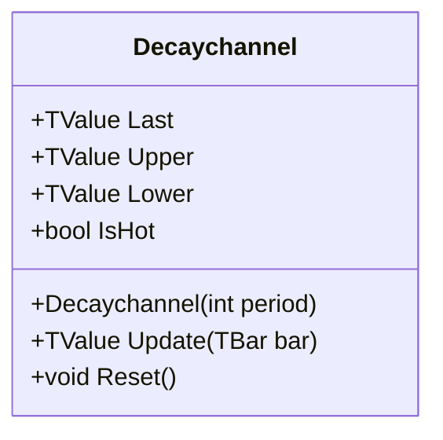

# DECAYCHANNEL: Decay Min-Max Channel

> "Price extremes have a half-life—the market forgets yesterday's drama at an exponential rate."

Decay Channel is a price envelope that combines the absolute boundaries of Donchian Channels with an exponential decay mechanism. While Donchian Channels hold their width until an extreme exits the lookback window, Decay Channels allow the bands to effectively "forget" old extremes over time, converging towards the center. This creates a dynamic envelope that expands instantly on new volatility but contracts smoothly during consolidation, modeling the "half-life" of price memory.

## Historical Context

The Decay Channel is a QuanTAlib innovation that applies principles from physics—specifically **radioactive decay** and **Newton's Law of Cooling**—to price channel construction. The concept emerged from the observation that standard Donchian Channels exhibit a discontinuous "cliff edge" behavior: bands remain static until an old extreme exits the lookback window, then jump abruptly.

This behavior doesn't reflect how markets actually work. Traders naturally give less weight to older price extremes as time passes. The Decay Channel formalizes this intuition using the exponential decay function, where the `period` parameter serves as the "half-life"—the number of bars after which an extreme's influence is reduced by 50%.

The mathematical foundation draws from the decay constant λ = ln(2)/T, the same formula used in carbon dating and thermal cooling calculations. This creates bands that behave more like a physical system with memory—instantly responsive to new extremes, but gradually relaxing during consolidation.

## Architecture & Physics

The system models price extremes as energetic events that decay over time, similar to **Newton's Law of Cooling** or radioactive decay.

1. **Price Extremes:** The outer boundaries are constrained by the actual Highest High and Lowest Low (Donchian Channel) over the `Period`.
2. **Exponential Decay:** When a new extreme is not established, the band decays towards the midpoint.
3. **Radioactive Half-Life:** The decay rate ($\lambda$) is calibrated such that the influence of an extreme reduces by 50% over the specified `Period`.

### Formula

The decay constant $\lambda$ is derived from the half-life formula:
$$\lambda = \frac{\ln(2)}{Period}$$

For each bar, if a new raw extreme is not found, the band decays:
$$Age = \text{Bars since last extreme}$$
$$Factor = e^{-\lambda \times Age}$$
$$DecayedMax = Midpoint + Factor \times (max_{initial} - Midpoint)$$

The final upper/lower bands are clamped:
$$Upper = \min(DecayedMax, DonchianUpper)$$
$$Lower = \max(DecayedMin, DonchianLower)$$
$$Middle = \frac{Upper + Lower}{2}$$

## Calculation Steps

1. **Update Extremes:** Compute the raw Highest High and Lowest Low for the `Period` using efficient Monotonic Deques.
2. **Track Age:** If the current High $\ge$ Raw Max, reset Max Age to 0. Otherwise, increment Age.
3. **Apply Decay:** Calculate the exponential decay factor based on Age.
4. **Constrain:** Ensure the Decayed value does not exceed the Raw Donchian bounds (e.g., Upper band cannot be higher than the highest high).
5. **Compute Midpoint:** Average the constrained Upper and Lower bands.

## Performance Profile

The implementation balances the computational cost of transcendental functions (`Math.Exp`) with efficient memory management for the sliding window extremes.

### Operation Count (Streaming Mode, per Bar)

| Operation | Count | Cost (cycles) | Subtotal |
| :--- | :---: | :---: | :---: |
| CMP (Deque extremes) | 3 | 1 | 3 |
| EXP (Decay factor) | 2 | 15 | 30 |
| MUL | 2 | 3 | 6 |
| ADD/SUB | 2 | 1 | 2 |
| MIN/MAX | 2 | 1 | 2 |
| **Total** | **11** | — | **~43 cycles** |

### Complexity Analysis

| Mode | Complexity | Notes |
| :--- | :---: | :--- |
| Streaming | O(1) | Amortized via monotonic deque |
| Batch | O(n) | FMA optimization for decay |

## Validation

| Library | Status | Notes |
| :--- | :---: | :--- |
| **Donchian** | ✅ | Decay bands never exceed Donchian bounds |
| **Mathematical** | ✅ | Value decays exactly 50% towards mean after `Period` bars |
| **QuanTAlib** | ✅ | Original implementation |

## Usage & Pitfalls

- **Half-Life Interpretation:** The `period` parameter is the half-life, not a lookback window. After `period` bars without a new extreme, the band has decayed 50% towards center.
- **Asymmetric Behavior:** Bands snap instantly to new extremes but decay gradually. This asymmetry is intentional—it models how markets accept new price levels quickly but forget old extremes slowly.
- **Requires High/Low:** The indicator uses bar High/Low for extremes, not close prices. Ensure your data includes these fields.
- **Bar Correction:** Use `isNew=false` when updating the current bar's value, `isNew=true` for new bars.
- **Donchian Constraint:** Decayed bands are always within Donchian bounds—useful for confirmation that bands aren't artificially extended.
- **Consolidation Detection:** Narrow bands (Upper ≈ Lower) indicate extended consolidation where old extremes have fully decayed.

## API



### Class: `Decaychannel`

| Parameter | Type | Default | Range | Description |
| :--- | :--- | :--- | :--- | :--- |
| `period` | `int` | — | `>0` | Lookback window for extremes and half-life calculation. |

### Properties

| Name | Type | Description |
|---|---|---|
| `Last` | `TValue` | The Middle Band value. |
| `Upper` | `TValue` | The Decayed Upper Band. |
| `Lower` | `TValue` | The Decayed Lower Band. |
| `IsHot` | `bool` | Returns `true` when the indicator has processed enough bars to cover the `period`. |

### Methods

- `Update(TBar bar)`: Updates the indicator with a new bar (High/Low required).
- `Reset()`: Clears all historical data, deques, and decay timers.

## C# Example

```csharp
using QuanTAlib;

// 1. Initialize with a 20-bar half-life
var decay = new Decaychannel(period: 20);

// 2. Stream data
var bars = GetHistory();
foreach (var bar in bars)
{
    decay.Update(bar);
    
    // The Upper band will be lower than a standard 20-period Donchian 
    // if no new highs have occurred recently.
    if (bar.Close > decay.Upper.Value)
    {
        Console.WriteLine("Breakout over decayed resistance");
    }
}
```
