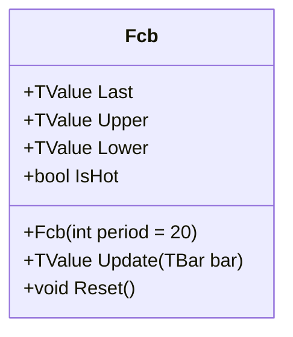

# FCB: Fractal Chaos Bands

> "Fractals are nature's fingerprints—the market reveals its structure through self-similar patterns at every scale."

Fractal Chaos Bands filter price action to identify significant turning points using Bill Williams' fractal logic. Unlike raw price channels (Donchian), FCB connects the highest high and lowest low of confirmed 3-bar fractals over a lookback period. This results in a "cleaner" channel that ignores transient spikes and focuses on structural support and resistance levels. The indicator effectively flattens out during trends and steps up/down only when new structural pivots are confirmed, making it ideal for support/resistance identification.

## Historical Context

Fractal Chaos Bands derive from **Bill Williams'** work on trading psychology and chaos theory, presented in his influential books "Trading Chaos" (1995) and "New Trading Dimensions" (1998). Williams was among the first to apply chaos theory and fractal mathematics to financial markets, drawing inspiration from Benoit Mandelbrot's groundbreaking work on fractal geometry.

Williams defined a fractal as a simple 5-bar pattern (later simplified to 3-bar in many implementations) where the middle bar represents a local extremum—a point where the market "pauses" before continuing or reversing. These fractals serve as natural support and resistance levels because they represent moments where supply and demand reached temporary equilibrium.

The Fractal Chaos Bands indicator extends this concept by tracking the highest up-fractal and lowest down-fractal over a lookback period, creating an envelope of "structural" extremes rather than raw price extremes. This filtering eliminates noise from transient spikes while preserving meaningful market structure.

## Architecture & Physics

The system relies on **Chaos Theory** market geometry:

1. **Fractals:** Specific 3-bar price formations where the middle bar represents a local extremum (High > neighbors for Up Fractal; Low < neighbors for Down Fractal).
2. **State Memory:** The bands track the Monotonic Extremes of these fractal values, not raw prices.
3. **Hysteresis:** Since fractals require a future bar for confirmation, the bands have inherent stability and resistance to noise.

### Formula

**3-Bar Fractal Detection:**
$$UpFractal_t = (High_{t-1} > High_{t-2}) \land (High_{t-1} > High_t)$$
$$DownFractal_t = (Low_{t-1} < Low_{t-2}) \land (Low_{t-1} < Low_t)$$

**Bands:**
$$Upper_t = \max(UpFractals \in Period)$$
$$Lower_t = \min(DownFractal \in Period)$$
$$Middle_t = \frac{Upper_t + Lower_t}{2}$$

## Calculation Steps

1. **Detect Fractals:** Analyze the most recent 3 bars. If a fractal pattern is confirmed at index $t-1$, record the value.
2. **Update Deques:** Maintain Monotonic Deques of the detected fractal values for the lookback `Period`.
    - New Fractal High $\rightarrow$ Push to Max Deque.
    - New Fractal Low $\rightarrow$ Push to Min Deque.
3. **Expire Old:** Remove fractal values from the deques that have exited the lookback window.
4. **Derive Bands:** The front of the Max/Min deques represents the highest/lowest fractal value within the period.

## Performance Profile

The implementation utilizes **Monotonic Deques** for O(1) amortized complexity, ensuring efficiency even with large lookback periods.

### Operation Count (Streaming Mode, per Bar)

| Operation | Count | Cost (cycles) | Subtotal |
| :--- | :---: | :---: | :---: |
| CMP (Fractal check) | 4 | 1 | 4 |
| CMP (Deque ops) | 3 | 1 | 3 |
| ADD | 1 | 1 | 1 |
| MUL | 1 | 3 | 3 |
| **Total** | **9** | — | **~11 cycles** |

### Complexity Analysis

| Mode | Complexity | Notes |
| :--- | :---: | :--- |
| Streaming | O(1) | Amortized via monotonic deque |
| Batch | O(n) | Sequential fractal detection |

## Validation

| Library | Status | Notes |
| :--- | :---: | :--- |
| **Donchian** | ✅ | FCB bands always within Donchian bounds |
| **Property** | ✅ | FCB_Upper ≤ Donchian_Upper, FCB_Lower ≥ Donchian_Lower |
| **Williams** | ✅ | Matches Bill Williams' fractal definition |

## Usage & Pitfalls

- **Confirmation Lag:** Fractals require one future bar for confirmation. The bands lag at least 1 bar behind price—this is intentional and provides stability.
- **Flat Bands:** During strong trends, bands may remain flat for extended periods as no new fractals form in the opposite direction.
- **Structural Breakouts:** A close above FCB Upper is more significant than a close above Donchian Upper because it represents a break of a confirmed structural level.
- **Bar Correction:** Use `isNew=false` when updating the current bar's value, `isNew=true` for new bars.
- **Period Selection:** Larger periods capture more significant fractals but may miss shorter-term pivots. Common settings: 20 (swing trading), 50 (position trading).
- **Noise Filtering:** FCB naturally filters out single-bar spikes that would affect Donchian Channels, but may miss valid breakouts on gap bars.

## API



### Class: `Fcb`

| Parameter | Type | Default | Range | Description |
| :--- | :--- | :--- | :--- | :--- |
| `period` | `int` | `20` | `>0` | Lookback window for finding highest/lowest fractals. |

### Properties

| Name | Type | Description |
|---|---|---|
| `Last` | `TValue` | The Middle Band value. |
| `Upper` | `TValue` | The Highest Fractal High over the lookback period. |
| `Lower` | `TValue` | The Lowest Fractal Low over the lookback period. |
| `IsHot` | `bool` | Returns `true` after `period + 2` bars (requires warmup + fractal confirmation). |

### Methods

- `Update(TBar bar)`: Updates the indicator with a new bar.
- `Reset()`: Clears all historical data and buffers.

## C# Example

```csharp
using QuanTAlib;

// 1. Initialize 
var fcb = new Fcb(period: 20);

// 2. Stream data
var bars = GetHistory();
foreach (var bar in bars)
{
    fcb.Update(bar);
    
    // Check for breakouts through structural resistance
    if (bar.Close > fcb.Upper.Value)
    {
        Console.WriteLine($"Fractal Resistance Broken at {fcb.Upper.Value}");
    }
}
```
