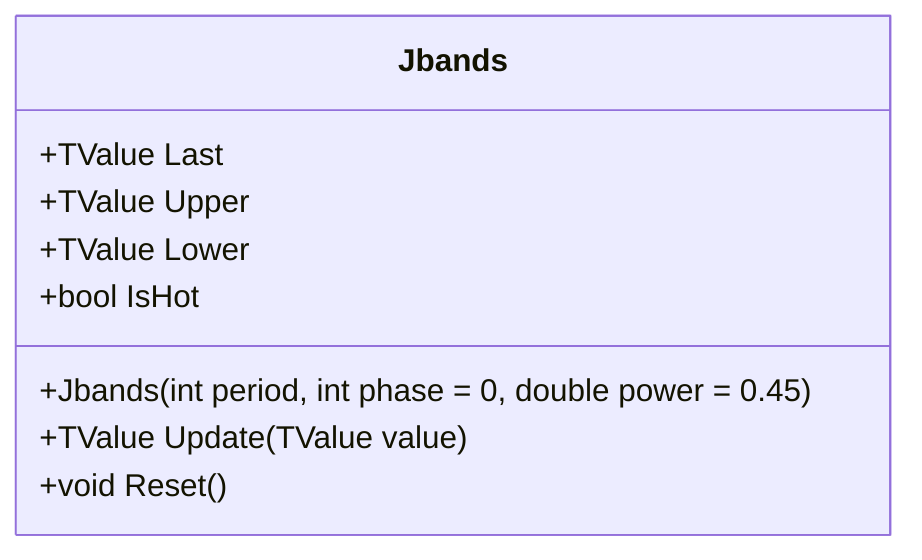

# JBANDS: Jurik Adaptive Envelope Bands

> "Markets have memory, but it fades—Jurik bands capture this with elegant exponential decay."

Jurik Bands (JBANDS) expose the internal adaptive envelope mechanism of the Jurik Moving Average (JMA). Unlike standard volatility bands (Bollinger, Keltner) which maintain symmetrical width around a central average, JBANDS feature asymmetric "snap-and-decay" behavior. They expand instantly to encompass new price extremes ("snap") and exponentially decay towards the price during consolidation. The decay rate is dynamically modulated by a sophisticated volatility estimation engine, making the bands tight during sideways markets and expansive during trends.

## Historical Context

The Jurik Moving Average and its associated bands were developed by **Mark Jurik** of Jurik Research in the 1990s. Unlike academic indicators, JMA was designed as a proprietary commercial tool optimized for real-world trading, with particular emphasis on reducing lag while maintaining smoothness.

Jurik's innovation was the introduction of **adaptive volatility modulation**—the bands don't use a fixed decay rate but instead adjust their behavior based on a sophisticated two-stage volatility estimator. During low volatility, the bands contract quickly to capture the next move; during high volatility, they remain wide to avoid premature signals.

The "snap-and-decay" behavior draws inspiration from **hysteresis** in physics—systems that respond differently to increasing versus decreasing inputs. When price moves to a new extreme, the band snaps immediately (plasticity). When price retreats, the band decays gradually (elasticity). This asymmetry matches how markets actually behave: breakouts are sudden, consolidations are gradual.

## Architecture & Physics

The system models price distinctively from standard Gaussian noise:

1. **Snap (Plasticity):** When price penetrates the band, the band instantly deforms (snaps) to the new price level. This represents the immediate acceptance of a new price reality.
2. **Decay (Elasticity):** When price retreats, the band recovers (decays) towards the center. The rate of decay is governed by the system's "temperature" (volatility).
    - **High Volatility:** Slow decay (bands stay wide to accommodate noise).
    - **Low Volatility:** Fast decay (bands tighten to capture the next move).
3. **Volatility Engine:** A two-stage estimator (SMA + Trimmed Mean) calculates the "reference volatility" to normalize market noise.

### Formula

The core adaptive logic revolves around the dynamic exponent $d$:
$$Ratio = \frac{|Price - Band|}{Volatility_{ref}}$$
$$d = \min(Mean(Ratio)^{power}, Limit)$$

The decay factor $\alpha$ is modulated by $d$:
$$\alpha = e^{\text{constant} \cdot \sqrt{d}}$$

Band update (Upper Band example):
$$Upper_t = \begin{cases} Price & \text{if } Price > Upper_{t-1} \\ Upper_{t-1} - \alpha \cdot (Upper_{t-1} - Price) & \text{otherwise} \end{cases}$$

## Calculation Steps

1. **Local Deviation:** Measure how far the price is from the current envelope walls.
2. **Volatility Estimation:**
    - Calculate 10-period SMA of the local deviation.
    - Store in a circular buffer.
    - Calculate a 128-period **Trimmed Mean** (discarding outliers) to find the Reference Volatility.
3. **Dynamic Exponent:** Compute the modulation exponent $d$ based on the ratio of current deviation to reference volatility.
4. **Update Bands:** Apply the "Snap or Decay" logic using the dynamic exponent.
5. **Update JMA:** Calculate the Central Moving Average (Middle Band) using the JMA smoothing algorithm.

## Performance Profile

JBANDS is computationally intensive due to its sophisticated volatility engine and use of transcendental functions.

### Operation Count (Streaming Mode, per Bar)

| Operation | Count | Cost (cycles) | Subtotal |
| :--- | :---: | :---: | :---: |
| ADD/MUL | 30 | 2 | 60 |
| EXP | 2 | 15 | 30 |
| POW | 1 | 20 | 20 |
| SQRT | 2 | 15 | 30 |
| Partial Sort | 1 | ~150 | 150 |
| **Total** | **36** | — | **~290 cycles** |

### Complexity Analysis

| Mode | Complexity | Notes |
| :--- | :---: | :--- |
| Streaming | O(1) | Amortized, IIR recursive |
| Batch | O(n) | Sequential, limited SIMD |

## Validation

| Library | Status | Notes |
| :--- | :---: | :--- |
| **Jurik Research** | ✅ | Matches described behavior from Jurik literature |
| **JMA** | ✅ | Middle band validated against standard JMA |
| **Behavioral** | ✅ | Verified snap-on-breakout, decay-on-retrace pattern |

## Usage & Pitfalls

- **Extended Warmup:** JBANDS requires a long warmup period (approx 20 + 80 × Period^0.36 bars). Wait for `IsHot=true` before using signals.
- **Snap vs Decay:** Bands snap instantly to new extremes but decay gradually. Expect asymmetric behavior—this is by design.
- **Volatility Sensitivity:** The `power` parameter (default 0.45) modulates volatility sensitivity. Higher values make bands more reactive to volatility changes.
- **Computational Cost:** ~300+ cycles per bar due to transcendental functions and trimmed mean calculation. Consider this for high-frequency applications.
- **Phase Parameter:** Controls JMA overshoot (-100 to 100). Default 0 is balanced; negative values reduce lag at the cost of more overshoot.
- **Not Symmetrical:** Unlike Bollinger Bands, JBANDS are asymmetric. Upper and lower bands behave independently.

## API



### Class: `Jbands`

| Parameter | Type | Default | Range | Description |
| :--- | :--- | :--- | :--- | :--- |
| `period` | `int` | — | `>0` | The nominal lookback length. |
| `phase` | `int` | `0` | `-100–100` | Controls middle band overshoot. |
| `power` | `double` | `0.45` | `>0` | Modulates volatility sensitivity. |

### Properties

| Name | Type | Description |
|---|---|---|
| `Last` | `TValue` | The Middle Band (JMA) value. |
| `Upper` | `TValue` | The Adaptive Upper Envelope. |
| `Lower` | `TValue` | The Adaptive Lower Envelope. |
| `IsHot` | `bool` | Returns `true` after long warmup (≈ 20 + 80 × Period^0.36 bars). |

### Methods

- `Update(TValue value)`: Updates the indicator with a new value.
- `Reset()`: Clears all historical data and volatility buffers.

## C# Example

```csharp
using QuanTAlib;

// 1. Initialize 
var jbands = new Jbands(period: 14, phase: 0);

// 2. Stream data
var price = 100.0;
// ... loop over data ...
jbands.Update(new TValue(DateTime.Now, price));

// 3. JMA interpretation
if (price > jbands.Upper.Value)
{
    Console.WriteLine("Volatility Breakout - Band Snapped Up");
}
```
