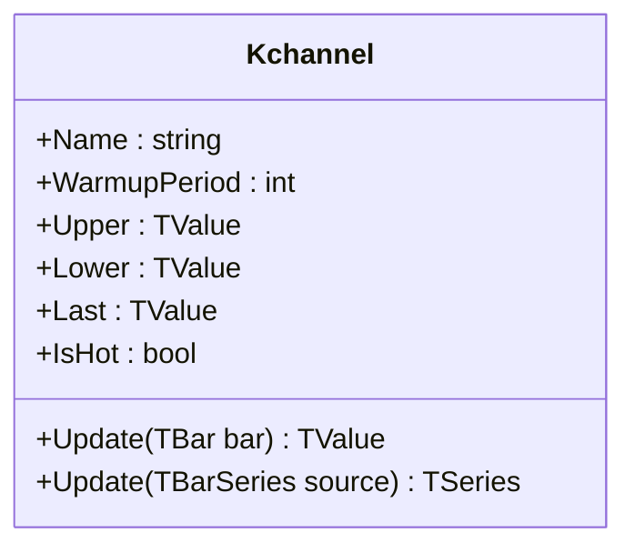

# KCHANNEL: Keltner Channel

> "True Range reveals what close-to-close volatility hides—the overnight gaps."

Keltner Channels are volatility-based envelopes set above and below an **Exponential Moving Average (EMA)**. Unlike Bollinger Bands, which use Standard Deviation (statistical dispersion), Keltner Channels use **Average True Range (ATR)** (actual price range). This produces bands that are smoother and less prone to "sausage" effects (violent pinching/expanding) than Bollinger Bands, making them particularly effective for trend identification and gap handling in futures and gapping markets.

## Historical Context

**Chester Keltner** introduced the original Keltner Channel in his 1960 book *How To Make Money in Commodities*. His version used a 10-day Simple Moving Average of "typical price" (High+Low+Close)/3 with bands at ±1× the 10-day SMA of the daily range (High-Low).

**Linda Bradford Raschke** modernized the indicator in the 1980s, replacing the SMA with an EMA for faster response and substituting the simple range with Wilder's Average True Range (ATR). ATR captures gap volatility that the simple High-Low range misses, making the channel more robust for markets that trade overnight or have limit moves.

The modern Keltner Channel (EMA + ATR) gained popularity through Raschke's work and is now the standard implementation in most charting platforms. The indicator became central to the "TTM Squeeze" setup, which detects when Bollinger Bands nest inside Keltner Channels—a compression pattern often preceding explosive moves.

## Architecture & Physics

The system relies on "True Range" volatility, which accounts for gaps between bars:

1. **Center of Gravity:** The middle line is an EMA, providing a more responsive center than the SMA used in Bollinger Bands.
2. **Volatility Measure:** The width is determined by ATR (specifically, Wilder's RMA of True Range), which captures the typical "spatial volume" of price movement.
3. **Envelope Logic:**
    - Price above the upper channel indicates strong momentum (breakout/trend).
    - Price below the lower channel indicates weakness.
    - Mean reversion is expected when price moves significantly outside the bands.

### Calculation Steps

#### 1. True Range

$$
TR_t = \max(H_t - L_t, |H_t - C_{t-1}|, |L_t - C_{t-1}|)
$$

Where $H$ = High, $L$ = Low, $C$ = Close.

#### 2. Average True Range (Wilder's Smoothing)

$$
ATR_t = \frac{ATR_{t-1} \times (n-1) + TR_t}{n}
$$

#### 3. Middle Band (EMA)

$$
\alpha = \frac{2}{n + 1}
$$

$$
EMA_t = \alpha \times C_t + (1 - \alpha) \times EMA_{t-1}
$$

#### 4. Channel Construction

$$
\text{Upper}_t = EMA_t + (k \times ATR_t)
$$

$$
\text{Lower}_t = EMA_t - (k \times ATR_t)
$$

Where $n$ = period (default: 20), $k$ = multiplier (default: 2.0).

## Performance Profile

The calculation is highly efficient, relying on recursive O(1) formulas (EMA and RMA).

### Operation Count - Single value

| Operation | Count | Cost (cycles) | Subtotal |
| :--- | :---: | :---: | :---: |
| ADD/SUB | 5 | 1 | 5 |
| MUL | 4 | 3 | 12 |
| DIV | 1 | 15 | 15 |
| CMP/ABS | 4 | 1 | 4 |
| FMA | 2 | 4 | 8 |
| **Total** | **16** | — | **~44 cycles** |

### Operation Count - Batch processing

| Operation | Scalar Ops | SIMD Ops (AVX/SSE) | Acceleration |
| :--- | :---: | :---: | :---: |
| TR calculation | 3N | 3N/8 | ~8× |
| ATR (IIR) | N | N | 1× |
| EMA (IIR) | N | N | 1× |
| Band construction | 2N | 2N/8 | ~8× |

*Note: Recursive filters (EMA, ATR) cannot be fully vectorized, but the final band projection and TR calculation benefit from SIMD.*

## Validation

| Library | Status | Notes |
| :--- | :---: | :--- |
| **TA-Lib** | N/A | No direct implementation |
| **Skender** | ✅ | Matches `GetKeltnerChannels` |
| **TradingView** | ✅ | Matches standard "Keltner Channels" indicator |
| **Pandas-TA** | ✅ | Matches `ta.kc` |

*Note: Minor startup divergence may occur due to different warmup seeding strategies.*

## Usage & Pitfalls

- **TTM Squeeze**: When Bollinger Bands move inside Keltner Channels, volatility is compressed. Watch for the squeeze release.
- **Trend Following**: In strong trends, use the middle band (EMA) as trailing support/resistance. Price respecting the EMA confirms trend continuation.
- **EMA vs SMA**: The EMA middle band reacts faster than an SMA-based center. This reduces lag but may produce more whipsaws in choppy markets.
- **ATR Warmup**: Wilder's smoothing has infinite memory—ATR requires significant warmup (~50+ bars) to fully stabilize. Early values may differ from other implementations.
- **Multiplier Selection**: 2.0× ATR is standard for daily charts. Consider 1.5× for intraday or 2.5× for weekly timeframes.
- **Gap Sensitivity**: ATR includes gaps, so a large overnight gap will widen the channel. This is feature, not bug—it reflects actual volatility.

## API



### Class: `Kchannel`

| Parameter | Type | Default | Range | Description |
| :--- | :--- | :--- | :--- | :--- |
| `period` | `int` | `20` | `>0` | Lookback for EMA and ATR. |
| `multiplier` | `double` | `2.0` | `>0` | ATR multiplier for band width. |
| `source` | `TBarSeries` | — | `any` | Initial input (optional). |

### Properties

- `Last` (`TValue`): The Middle Band (EMA) value.
- `Upper` (`TValue`): The Upper Keltner Channel.
- `Lower` (`TValue`): The Lower Keltner Channel.
- `IsHot` (`bool`): Returns `true` after `period` bars.

### Methods

- `Update(TBar bar)`: Updates the indicator with OHLC data and returns the Middle band.
- `Update(TBarSeries source)`: Batch processes a bar series.
- `Reset()`: Clears all historical data.

## C# Example

```csharp
using QuanTAlib;

// Initialize with standard settings (20, 2.0)
var kchannel = new Kchannel(period: 20, multiplier: 2.0);

// Update Loop
foreach (var bar in bars)
{
    var result = kchannel.Update(bar);

    if (kchannel.IsHot)
    {
        Console.WriteLine($"{bar.Time}: Mid={result.Value:F2} Upper={kchannel.Upper.Value:F2} Lower={kchannel.Lower.Value:F2}");

        // Trend Confirmation
        if (bar.Close > kchannel.Upper.Value)
            Console.WriteLine("  Strong Uptrend (Above Keltner)");
    }
}
```

## References

- Keltner, C. (1960). *How To Make Money in Commodities*. The Keltner Statistical Service.
- Raschke, L.B. & Connors, L.A. (1995). *Street Smarts: High Probability Short-Term Trading Strategies*.
- Wilder, J.W. (1978). *New Concepts in Technical Trading Systems*. Trend Research.
