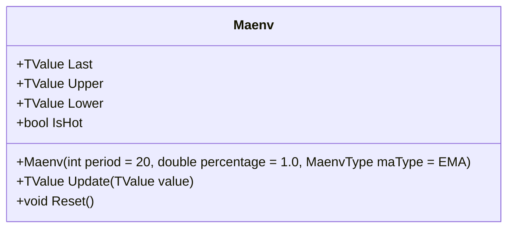

# MAENV: Moving Average Envelope

> "Sometimes the simplest tools are the most honest—a fixed percentage tells you exactly where you stand."

Moving Average Envelope is a straightforward channel indicator that creates a fixed percentage-based envelope around a central moving average. Unlike volatility-based bands (which expand/contract), MAENV maintains a constant proportional width relative to the price. This simplicity makes it ideal for identifying mean reversion candidates in stable markets, or for defining "safe" trading zones where price deviation is considered normal.

## Historical Context

Moving Average Envelopes are among the oldest channel indicators in technical analysis, predating even Bollinger Bands. The concept emerged from the simple observation that prices tend to oscillate around their moving average by a relatively consistent percentage during normal market conditions.

The indicator gained popularity in the 1970s and 1980s as traders sought objective methods to identify overbought and oversold conditions. Unlike the later volatility-based approaches of Bollinger (1983) and Keltner (1960), MA Envelopes use a fixed percentage, making them conceptually simpler but less adaptive to changing market conditions.

The trade-off is intentional: a fixed percentage provides a stable reference frame that doesn't expand during volatility spikes—useful for identifying when prices have moved "too far" from the mean regardless of current market conditions. This makes MAENV particularly valuable in ranging markets where volatility-based bands would produce false signals.

## Architecture & Physics

The system geometry is constant and proportional:

1. **Central Tendency:** A user-selectable moving average (SMA, EMA, or WMA) defines the trend baseline.
2. **Fixed Proportionality:** The bands are calculated as a direct percentage of the moving average value.
3. **Behavior:**
    - **SMA:** Stable, laggy, reliable for long-term trends.
    - **EMA:** Responsive, recent-bias, good for shorter-term pullbacks.
    - **WMA:** Linear weighting, compromise between stability and speed.

### Formula

$$Middle = MA(Source, Period)$$
$$Offset = Middle \times \frac{Percentage}{100}$$
$$Upper = Middle + Offset$$
$$Lower = Middle - Offset$$

## Calculation Steps

1. **Compute MA:** Calculate the selected Moving Average (SMA/EMA/WMA) for the current bar.
    - *SMA/WMA use efficient ring buffers.*
    - *EMA uses recursive calculation with warmup compensation.*
2. **Compute Offset:** Multiply the MA value by the target percentage (e.g., 2.0%).
3. **Apply Bands:** Add/Subtract the offset from the MA.

## Performance Profile

Performance varies slightly by MA type but is generally extremely fast.

### Operation Count (Streaming Mode, per Bar) - SMA/EMA

| Operation | Count | Cost (cycles) | Subtotal |
| :--- | :---: | :---: | :---: |
| ADD/SUB | 3 | 1 | 3 |
| MUL | 1 | 3 | 3 |
| DIV | 1 | 15 | 15 |
| **Total** | **5** | — | **~21 cycles** |

*Note: WMA requires O(N) linear iteration, scaling with period.*

### Complexity Analysis

| Mode | Complexity | Notes |
| :--- | :---: | :--- |
| Streaming (SMA/EMA) | O(1) | Constant per bar |
| Streaming (WMA) | O(N) | Linear in period |
| Batch | O(n) | Sequential processing |

## Validation

| Library | Status | Notes |
| :--- | :---: | :--- |
| **TradingView** | ✅ | Matches "Moving Average Envelopes" indicator |
| **Manual** | ✅ | Verified calculations for SMA, EMA, WMA types |
| **Standard** | ✅ | Industry-standard implementation |

## Usage & Pitfalls

- **Fixed Width:** Unlike Bollinger Bands, MAENV maintains constant percentage width. This means bands won't widen during volatility—useful for stable reference but may produce false signals during high-volatility periods.
- **MA Type Selection:** SMA is stable but laggy; EMA is responsive but may overshoot; WMA is a middle ground. Choose based on your trading timeframe.
- **Percentage Calibration:** Common settings are 1-3% for equities, 0.5-1% for major forex pairs. Backtest to find the optimal percentage for your instrument.
- **Mean Reversion:** MAENV works best in ranging markets where price oscillates around the MA. Avoid during strong trends where price can stay outside bands indefinitely.
- **Bar Correction:** Use `isNew=false` when updating the current bar's value, `isNew=true` for new bars.
- **WMA Performance:** WMA requires O(N) operations per bar, making it slower for large periods. Consider SMA or EMA for performance-critical applications.

## API



### Class: `Maenv`

| Parameter | Type | Default | Range | Description |
| :--- | :--- | :--- | :--- | :--- |
| `period` | `int` | `20` | `>0` | Lookback size for the moving average. |
| `percentage` | `double` | `1.0` | `>0` | Width of envelope (e.g., 1.0 = 1%). |
| `maType` | `MaenvType` | `EMA` | `SMA,EMA,WMA` | Type of moving average. |

### Properties

| Name | Type | Description |
|---|---|---|
| `Last` | `TValue` | The Middle Band (MA) value. |
| `Upper` | `TValue` | The Upper Envelope Band. |
| `Lower` | `TValue` | The Lower Envelope Band. |
| `IsHot` | `bool` | Returns `true` after `period` bars. |

### Methods

- `Update(TValue value)`: Updates the indicator with a new price point.
- `Reset()`: Clears all historical data.

## C# Example

```csharp
using QuanTAlib;

// 1. Initialize (20-period SMA, 2.5% envelope)
var maenv = new Maenv(period: 20, percentage: 2.5, maType: MaenvType.SMA);

// 2. Stream data
var price = 100.0;
maenv.Update(new TValue(DateTime.Now, price));

// 3. Check bounds
if (price > maenv.Upper.Value)
{
    Console.WriteLine($"Overbought (> {maenv.Upper.Value:F2})");
}
```
