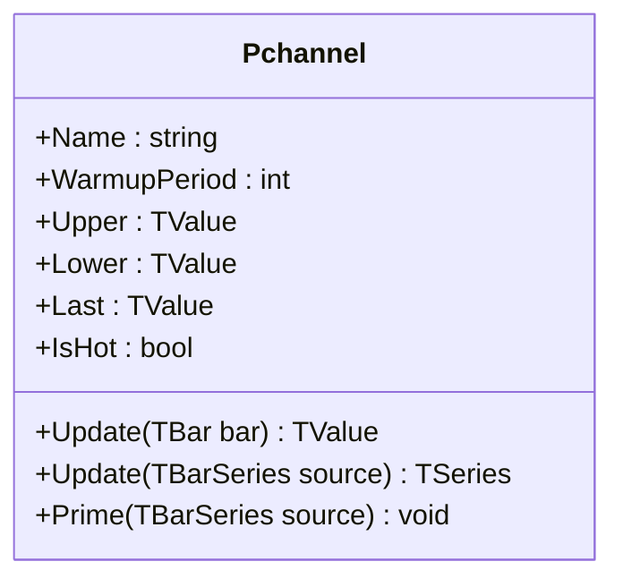

# PCHANNEL: Price Channel

> "The Turtles didn't need complex math. They needed to know when price broke out of its cage."

Price Channel (PC) tracks the highest high and lowest low over a lookback period, creating a price envelope that defines where the market has been. Functionally identical to Donchian Channels—same algorithm, different name. Unlike volatility-based bands (Bollinger, Keltner), Price Channel uses actual price extremes—no standard deviations, no averages of true range. The result: bands that represent real support and resistance levels traders actually watch. This implementation uses monotonic deques for O(1) amortized updates rather than the naive O(n) rescan that plagues most implementations.

## Historical Context

Price Channel is the generic name for what **Richard Donchian** formalized in the 1960s while managing one of the first publicly held commodity funds. The indicator is also known as Donchian Channels, N-period high/low channels, or simply "breakout bands."

The "4-week rule" (buy on 20-day high, sell on 20-day low) became the foundation for systematic trend-following. The indicator gained fame through the **Turtle Trading** experiment in 1983. Richard Dennis and William Eckhardt recruited novice traders and taught them a mechanical system built on channel breakouts. The Turtles reportedly made over $100 million. Curtis Faith's book and subsequent leaks revealed the core: enter on 20-day breakouts, exit on 10-day counter-breakouts.

Most implementations compute max/min by scanning the entire lookback window on every bar—O(n) per update, O(n²) for a series. This works for period=20 but becomes painful for longer windows or real-time feeds. QuanTAlib uses monotonic deques that maintain running max/min in O(1) amortized time, enabling period=500+ without performance degradation.

## Architecture & Physics

Price Channel consists of three components: upper band (highest high), lower band (lowest low), and middle band (their average).

### 1. Upper Band (Highest High)

Tracks the maximum high price over the lookback window:

$$
U_t = \max_{i=0}^{n-1}(H_{t-i})
$$

where $H$ is the high price and $n$ is the period. The upper band moves up immediately when a new high occurs, but only drops when the previous highest high exits the lookback window.

### 2. Lower Band (Lowest Low)

Tracks the minimum low price over the lookback window:

$$
L_t = \min_{i=0}^{n-1}(L_{t-i})
$$

where $L$ is the low price. The lower band drops immediately on new lows but only rises when the previous lowest low exits the window.

### 3. Middle Band

The arithmetic mean of the upper and lower bands:

$$
M_t = \frac{U_t + L_t}{2}
$$

This represents the "equilibrium" price over the lookback period.

### Monotonic Deque Algorithm

Instead of rescanning the window on each bar, the implementation maintains two monotonic deques:

1. **Deque (Max):** Valid indices of decreasing values. Front is always the Max.
2. **Deque (Min):** Valid indices of increasing values. Front is always the Min.
3. **Update:**
    - Remove old indices from front (expired).
    - Remove values from back that are superseded by new value.
    - Add new value to back.

**Complexity:** Each element is added once and removed at most once. Total work for $N$ bars is $O(N)$, averaging $O(1)$ per bar.

## Performance Profile

### Operation Count (Streaming Mode, Scalar)

Per-bar cost using monotonic deque optimization:

| Operation | Count | Cost (cycles) | Subtotal |
| :--- | :---: | :---: | :---: |
| CMP (Bound checks) | 4 | 1 | 4 |
| ADD (Index update) | 1 | 1 | 1 |
| MUL (Average) | 1 | 3 | 3 |
| Deque Maint. | ~2 | 1 | ~2 |
| **Total** | **8** | — | **~10 cycles** |

**Complexity**: O(1) amortized.

### Batch Mode (512 values, SIMD/FMA)

Finding max/min over sliding windows has limited SIMD benefit due to sequential dependency and the efficiency of the scalar deque algorithm.

| Operation | Scalar Ops | SIMD Benefit | Notes |
| :--- | :---: | :---: | :--- |
| Max/Min update | 4 | 1× | Deque-based, sequential |
| Middle band | 2 | 2× | ADD + MUL parallelizable |

| Mode | Cycles/bar | Total (512 bars) | Improvement |
| :--- | :---: | :---: | :---: |
| Scalar streaming | 10 | 5,120 | — |
| Partial SIMD | ~8 | ~4,096 | **~20%** |

## Validation

| Library | Status | Notes |
| :--- | :---: | :--- |
| **TA-Lib** | - | No implementation |
| **Skender** | - | No implementation (uses Donchian) |
| **Tulip** | - | No implementation |
| **Ooples** | ✅ | Cross-validated via Donchian equivalence |
| **Dchannel** | ✅ | Exact match—identical algorithm |

## Usage & Pitfalls

- **Stale Extremes**: Price Channel bands stay flat until a new extreme occurs or the old extreme exits the window. This is feature, not a bug.
- **O(n) Trap**: Naive implementations rescan the full window every bar. QuanTAlib's solution is O(1).
- **Breakout vs. Touch**: Price touching the upper band is not the same as breaking out. True breakouts close above/below the band.
- **Asymmetric Exit**: Consider different periods for long/short entries and exits (e.g., Turtle 20/10 rule).

## API



### Class: `Pchannel`

| Parameter | Type | Default | Range | Description |
| :--- | :--- | :--- | :--- | :--- |
| `period` | `int` | — | `>0` | Lookback window size. |
| `source` | `TBarSeries` | — | `any` | Initial input source (optional). |

### Properties

- `Name` (`string`): The indicator name (e.g., "Pchannel(20)").
- `WarmupPeriod` (`int`): The number of samples needed for full validity.
- `Upper` (`TValue`): The current highest high.
- `Lower` (`TValue`): The current lowest low.
- `Last` (`TValue`): The current middle line value ((Upper + Lower) / 2).
- `IsHot` (`bool`): Returns `true` if we have processed `period` samples.

### Methods

- `Update(TBar bar)`: Updates the indicator with a new bar (High/Low) and returns the Middle band value.
- `Update(TBarSeries source)`: Batch processes a series and returns (Middle, Upper, Lower) tuple.
- `Prime(TBarSeries source)`: Pre-loads the indicator with history without returning results.

## C# Example

```csharp
using QuanTAlib;

// Initialize
var channel = new Pchannel(period: 20);

// Update Loop
foreach (var bar in bars)
{
    var result = channel.Update(bar);

    if (channel.IsHot)
    {
        Console.WriteLine($"{bar.Time}: Mid={result.Value:F2} Upper={channel.Upper.Value:F2} Lower={channel.Lower.Value:F2}");
    }
}

// Batch Processing
var (mid, upper, lower) = channel.Update(bars);
```

## References

- Donchian, R. (1960). "High Finance in Copper." *Financial Analysts Journal*.
- Faith, C. (2007). *Way of the Turtle: The Secret Methods that Turned Ordinary People into Legendary Traders*.
