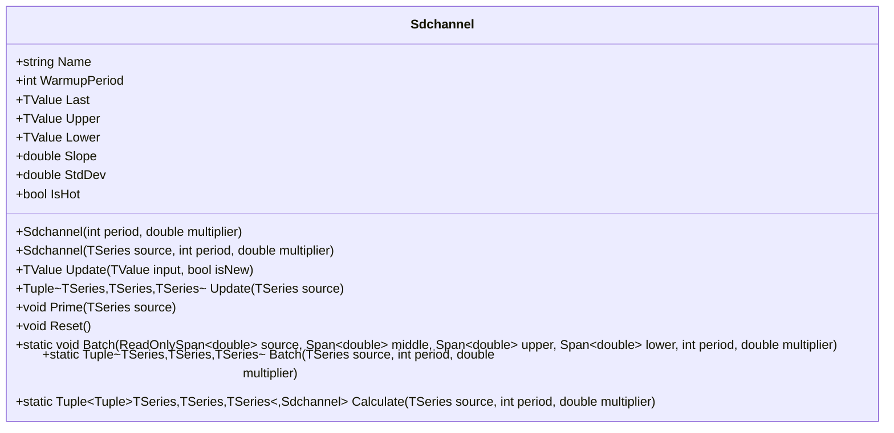

# SDCHANNEL: Standard Deviation Channel

> "The regression line tells you where price should be. The standard deviation tells you how wrong the market usually is."

Standard Deviation Channel (SDCHANNEL) plots a linear regression line through price data with parallel bands positioned at a specified number of standard deviations of the residuals above and below. Unlike Bollinger Bands which measure deviation from a moving average, SDCHANNEL measures deviation from the best-fit trend line—capturing how much price wanders from its underlying trajectory rather than from its simple average.

## Historical Context

Linear regression channels emerged from statistical methods applied to financial markets in the 1980s and 1990s. Gilbert Raff popularized "Raff Regression Channels" which use similar concepts. The standard deviation of residuals approach provides a statistically meaningful measure of dispersion around the trend.

The key insight: a moving average treats all recent prices equally, while linear regression fits a line that best explains the trend. The residuals (differences between actual and predicted prices) measure how much price deviates from this trend. When prices consistently touch the upper band, the trend is accelerating; when they hug the lower band, momentum is fading.

Most charting platforms compute linear regression naively with O(n) operations per bar. This implementation precomputes constants and uses FMA operations for efficiency.

## Architecture & Physics

Standard Deviation Channels consist of three components: the linear regression line (middle), and upper/lower bands at ±multiplier × standard deviation of residuals.

### 1. Linear Regression (Middle Band)

The best-fit line through the lookback window using ordinary least squares:

$$
y = mx + b
$$

where:

$$
m = \frac{n \sum xy - \sum x \sum y}{n \sum x^2 - (\sum x)^2}
$$

$$
b = \frac{\sum y - m \sum x}{n}
$$

The middle band value is the regression line evaluated at the current bar (x = n-1).

### 2. Standard Deviation of Residuals

For each point, compute the residual (difference between actual and predicted):

$$
r_i = y_i - (m \cdot x_i + b)
$$

The standard deviation of these residuals:

$$
\sigma = \sqrt{\frac{\sum_{i=0}^{n-1} r_i^2}{n}}
$$

Note: This uses population standard deviation (divide by n), not sample standard deviation (divide by n-1).

### 3. Upper and Lower Bands

Parallel lines at fixed distance from the regression line:

$$
U_t = R_t + k \cdot \sigma
$$

$$
L_t = R_t - k \cdot \sigma
$$

where $R_t$ is the regression value at time $t$ and $k$ is the multiplier (typically 2.0).

## Mathematical Foundation

### Precomputed Constants

For a fixed period $n$, several sums can be precomputed:

$$
\sum x = 0 + 1 + ... + (n-1) = \frac{n(n-1)}{2}
$$

$$
\sum x^2 = 0^2 + 1^2 + ... + (n-1)^2 = \frac{(n-1)n(2n-1)}{6}
$$

$$
\text{denom} = n \sum x^2 - (\sum x)^2
$$

This reduces per-bar computation to:

1. Calculate $\sum y$ and $\sum xy$ over the window
2. Compute slope and intercept using precomputed values
3. Evaluate regression at current point
4. Compute residuals and their standard deviation

### Slope Interpretation

The slope indicates trend direction and strength:

- $m > 0$: Uptrend (higher slope = steeper ascent)
- $m < 0$: Downtrend (lower slope = steeper descent)
- $m \approx 0$: Sideways/consolidating market

### Residual Properties

By definition of least squares regression:

- Sum of residuals = 0
- Residuals are uncorrelated with x values
- Points above and below the line balance out

When $\sigma = 0$, all points lie exactly on the regression line (perfect linear trend).

## Performance Profile

### Operation Count (Streaming Mode, Scalar)

Per-bar cost for streaming update:

| Operation | Count | Cost (cycles) | Subtotal |
| :--- | :---: | :---: | :---: |
| ADD/SUB | ~4n | 1 | 4n |
| MUL | ~2n | 3 | 6n |
| DIV | 4 | 15 | 60 |
| SQRT | 1 | 15 | 15 |
| FMA | 2n | 4 | 8n |
| **Total** | — | — | **~18n + 75 cycles** |

For period=20: ~435 cycles per bar. The algorithm is O(n) per bar due to the sum calculations over the window.

### Batch Mode (512 values, SIMD/FMA)

Linear regression has limited SIMD benefit due to sequential dependencies and the need to accumulate sums:

| Operation | Scalar Ops | SIMD Benefit | Notes |
| :--- | :---: | :---: | :--- |
| Sum Y, Sum XY | O(n) | Partial | Reduction operations |
| Residual calc | O(n) | 4-8× | Embarrassingly parallel |
| StdDev | O(n) | Partial | Reduction at end |

**Batch efficiency (512 bars, period=20):**

| Mode | Cycles/bar | Total (512 bars) | Overhead |
| :--- | :---: | :---: | :---: |
| Scalar streaming | 435 | 222,720 | — |
| SIMD residuals | ~380 | ~194,560 | — |
| **Improvement** | **~13%** | **~28K saved** | — |

### Quality Metrics

| Metric | Score | Notes |
| :--- | :---: | :--- |
| **Accuracy** | 10/10 | Exact least squares calculation |
| **Timeliness** | 5/10 | Regression lags by nature—fits past data |
| **Overshoot** | 8/10 | Bands based on residuals, not price velocity |
| **Smoothness** | 7/10 | Regression line smooths noise; bands vary with residual dispersion |

## Validation

| Library | Status | Notes |
| :--- | :---: | :--- |
| **TA-Lib** | N/A | No equivalent function |
| **Skender** | N/A | No equivalent function |
| **Tulip** | N/A | No equivalent function |
| **Ooples** | N/A | No equivalent function |
| **Manual** | ✅ | Verified against hand calculations |

The indicator is validated against manual calculations of linear regression and standard deviation of residuals.

## Usage & Pitfalls

- **Period Selection**: Short periods (5-10) make the regression overly sensitive to recent bars; long periods (50+) create substantial lag. Period 20 is common, matching roughly one month of daily data.
- **Multiplier Choice**: The default multiplier of 2.0 captures ~95% of residuals assuming normal distribution. Use 1.0 for tighter bands (~68%), 3.0 for wider bands (~99.7%).
- **Warmup Period**: The indicator requires at least 2 bars to compute a regression line. WarmupPeriod equals the period parameter. Before warmup, bands equal the input value.
- **Zero Standard Deviation**: When all points lie exactly on a line (perfect linear trend or constant values), $\sigma = 0$ and bands collapse to the regression line.
- **Regression vs. Moving Average**: The regression line projects the trend, not the average. It can be above or below all recent prices if the trend is strong.
- **O(n) Complexity**: Unlike EMA (O(1)) or SMA with ring buffer (O(1)), linear regression requires O(n) operations per bar.
- **Memory**: The ring buffer stores `period` doubles. For period=50, that's 400 bytes per instance.

## API



### Class: `Sdchannel`

| Parameter | Type | Default | Range | Description |
| :--- | :--- | :--- | :--- | :--- |
| `period` | `int` | `20` | `>1` | Lookback period for linear regression calculation. |
| `multiplier` | `double` | `2.0` | `>0` | Standard deviation multiplier for band width. |

### Properties

- `Last` (`TValue`): The current linear regression value (middle line).
- `Upper` (`TValue`): The upper band (regression + multiplier × σ).
- `Lower` (`TValue`): The lower band (regression - multiplier × σ).
- `Slope` (`double`): The slope of the linear regression line.
- `StdDev` (`double`): The standard deviation of residuals.
- `IsHot` (`bool`): Returns `true` when warmup period is complete.

### Methods

- `Update(TValue input, bool isNew)`: Updates the indicator with a new value and returns the result.
- `Update(TSeries source)`: Processes an entire series and returns (Middle, Upper, Lower) tuple of TSeries.
- `Prime(TSeries source)`: Initializes internal state from historical data.
- `Reset()`: Resets the indicator to its initial state.
- `Batch(...)`: Static method for span-based batch processing.
- `Calculate(TSeries source, int period, double multiplier)`: Static factory that returns results and indicator instance.

## C# Example

```csharp
using QuanTAlib;

// Initialize
var sdchannel = new Sdchannel(period: 20, multiplier: 2.0);

// Update Loop
foreach (var bar in quotes)
{
    var result = sdchannel.Update(bar.Close);

    // Use valid results
    if (sdchannel.IsHot)
    {
        Console.WriteLine($"{bar.Time}: Mid={result.Value:F2}, Upper={sdchannel.Upper.Value:F2}, Lower={sdchannel.Lower.Value:F2}, Slope={sdchannel.Slope:F4}");
    }
}
```

## References

- Raff, G. (1991). "Trading the Regression Channel." *Technical Analysis of Stocks & Commodities*.
- Bulkowski, T. (2005). *Encyclopedia of Chart Patterns*, 2nd ed. Wiley. (Chapter on Linear Regression)
- Kaufman, P. J. (2013). *Trading Systems and Methods*, 5th ed. Wiley. (Linear Regression Indicators)
