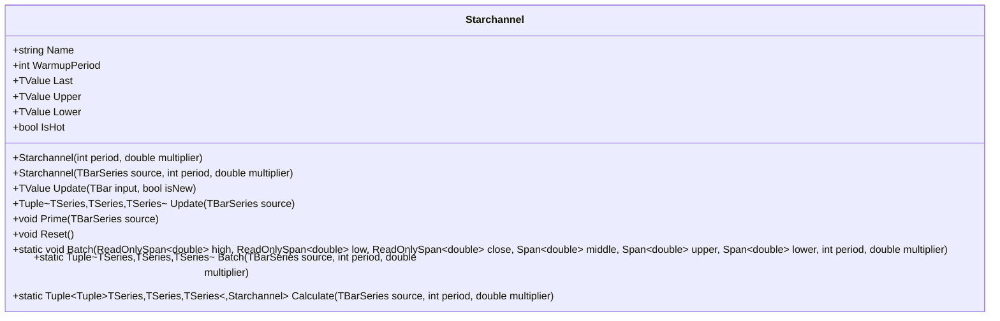

# STARCHANNEL: Stoller Average Range Channel

> "Volatility is the market's pulse—STARC channels let you feel it."

The Stoller Average Range Channel (STARCHANNEL) creates a volatility-adaptive price envelope using the Average True Range (ATR) to determine band width around a simple moving average centerline. Developed by Manning Stoller, this indicator provides dynamic support and resistance levels that automatically expand during volatile periods and contract during calmer markets—offering more relevant and responsive trading signals than fixed percentage envelopes.

## Historical Context

Manning Stoller developed the STARC Bands in the early 1980s as a volatility-adaptive alternative to fixed percentage envelopes. His insight was simple: channels should widen during high volatility and contract during low volatility, reflecting actual market conditions rather than arbitrary percentages.

The indicator combines two established concepts: the simple moving average (for trend direction) and Average True Range (for volatility measurement). J. Welles Wilder had already popularized ATR in his 1978 book "New Concepts in Technical Trading Systems." Stoller's contribution was recognizing that ATR-based bands would naturally adapt to each security's volatility characteristics.

STARC Bands gained popularity among futures traders in the 1980s and remain widely used today. The approach influenced many subsequent indicators that combine trend-following centerlines with volatility-based band widths.

## Architecture & Physics

STARCHANNEL consists of three components: a simple moving average centerline and upper/lower bands at a configurable ATR multiple.

### 1. Simple Moving Average (Middle Band)

The centerline is a standard SMA of the close price:

$$
\text{Middle}_t = \frac{1}{n} \sum_{i=0}^{n-1} C_{t-i}
$$

where $C$ is the close price and $n$ is the period.

### 2. True Range Calculation

True Range captures the full extent of price movement including gaps:

$$
TR_t = \max(H_t - L_t, |H_t - C_{t-1}|, |L_t - C_{t-1}|)
$$

### 3. Average True Range (ATR)

ATR uses Wilder's smoothing (RMA) with warmup compensation:

$$
ATR_t = \frac{ATR_{t-1} \times (n-1) + TR_t}{n}
$$

### 4. Channel Bands

Upper and lower bands are placed at a configurable ATR multiple:

$$
\text{Upper}_t = \text{Middle}_t + k \times ATR_t
$$

$$
\text{Lower}_t = \text{Middle}_t - k \times ATR_t
$$

where $k$ is the multiplier (default 2.0).

## Performance Profile

### Operation Count (Streaming Mode, Scalar)

| Operation | Count | Cost (cycles) | Subtotal |
| :--- | :---: | :---: | :---: |
| ADD/SUB | 6 | 1 | 6 |
| MUL | 3 | 3 | 9 |
| DIV | 2 | 15 | 30 |
| CMP/ABS/MAX | 3 | 1 | 3 |
| **Total** | **14** | — | **~48 cycles** |

**Complexity:** O(1) per bar for streaming updates using running sums.

### Batch Mode (SIMD)

| Operation | Scalar Ops | SIMD Benefit | Notes |
| :--- | :---: | :---: | :--- |
| True Range | 3N | 8× | Vectorizable |
| ATR (Wilder) | N | 1× | Sequential dependency |
| SMA running sum | N | 1× | Sequential |
| Band calculation | 4N | 8× | Vectorizable |

### Quality Metrics

| Metric | Score | Notes |
| :--- | :---: | :--- |
| **Accuracy** | 8/10 | ATR provides accurate volatility measure |
| **Timeliness** | 6/10 | SMA lag + ATR smoothing delay |
| **Overshoot** | 7/10 | Bands lag during volatility spikes |
| **Smoothness** | 8/10 | SMA centerline provides smooth reference |

## Validation

| Library | Status | Notes |
| :--- | :---: | :--- |
| **TA-Lib** | N/A | Not directly available |
| **Skender** | N/A | Not directly available |
| **Tulip** | N/A | Not directly available |
| **TradingView** | ✅ | Matches PineScript implementation |
| **Manual** | ✅ | Verified against hand calculations |

## Usage & Pitfalls

- **Lagging nature:** As a moving average-based indicator incorporating ATR, the channel reacts to volatility changes with some delay.
- **Parameter sensitivity:** Performance varies significantly based on period and multiplier settings, requiring optimization for specific securities.
- **False signals in trending markets:** Channel touches may not indicate reversals during strong trends, potentially leading to premature position exits.
- **Complementary tool requirement:** Most effective when combined with trend identification and momentum indicators.
- **Volatility regime changes:** During sudden extreme volatility spikes, channel may widen with a delay.
- **Lookback period trade-offs:** Shorter periods increase responsiveness but also noise; longer periods provide stability but increase lag.
- **Gap handling:** While ATR accounts for gaps, sudden large gaps can temporarily distort channel calculations.

## API



### Class: `Starchannel`

| Parameter | Type | Default | Range | Description |
| :--- | :--- | :--- | :--- | :--- |
| `period` | `int` | `20` | `≥1` | Lookback period for both SMA and ATR calculations. |
| `multiplier` | `double` | `2.0` | `>0` | ATR multiplier for band width. |

### Properties

- `Last` (`TValue`): The current SMA value (middle line).
- `Upper` (`TValue`): The upper band (SMA + multiplier × ATR).
- `Lower` (`TValue`): The lower band (SMA - multiplier × ATR).
- `IsHot` (`bool`): Returns `true` when warmup period is complete.

### Methods

- `Update(TBar input, bool isNew)`: Updates the indicator with a new bar and returns the result.
- `Update(TBarSeries source)`: Processes an entire bar series and returns (Middle, Upper, Lower) tuple of TSeries.
- `Prime(TBarSeries source)`: Initializes internal state from historical data.
- `Reset()`: Resets the indicator to its initial state.
- `Batch(...)`: Static method for zero-allocation span-based batch processing.
- `Calculate(TBarSeries source, int period, double multiplier)`: Static factory that returns results and indicator instance.

## C# Example

```csharp
using QuanTAlib;

// Initialize
var starchannel = new Starchannel(period: 20, multiplier: 2.0);

// Update Loop
foreach (var bar in quotes)
{
    starchannel.Update(bar, isNew: true);

    // Use valid results
    if (starchannel.IsHot)
    {
        Console.WriteLine($"{bar.Time}: Mid={starchannel.Last.Value:F2}, Upper={starchannel.Upper.Value:F2}, Lower={starchannel.Lower.Value:F2}");
    }
}
```

## References

- Stoller, M. (1980s). Development of the Stoller Average Range Channel concept.
- Wilder, J. W. (1978). *New Concepts in Technical Trading Systems*. Trend Research.
- Kaufman, P. J. (2013). *Trading Systems and Methods*, 5th ed. John Wiley & Sons.
- Murphy, J. J. (1999). *Technical Analysis of the Financial Markets*. New York Institute of Finance.
