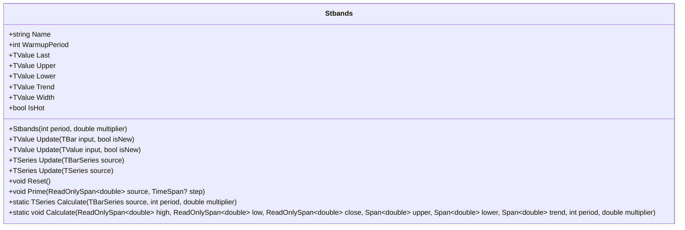

# STBANDS: Super Trend Bands

> "The best trailing stop is one that only moves when the market agrees with you."

Super Trend Bands provide ATR-based dynamic support and resistance levels that adapt to price action. Unlike static channels, these bands only tighten in the direction of the current trend—upper bands only move down during downtrends, lower bands only move up during uptrends—creating natural trailing stop-loss levels that respect market momentum.

## Historical Context

The SuperTrend indicator emerged from the trading community's need for a volatility-adaptive trend-following tool. Olivier Seban popularized the concept, building on Wilder's ATR foundation to create bands that respect trend direction rather than blindly following price.

Traditional channel indicators like Bollinger Bands expand and contract symmetrically around price. SuperTrend takes a different approach: once a band establishes a level favorable to the trend, it refuses to retreat. This asymmetric behavior creates the "ratchet effect" that makes it useful for trailing stops.

The implementation here follows the canonical PineScript algorithm, using a simple moving average of True Range rather than Wilder's smoothed ATR, which produces slightly more responsive bands.

## Architecture & Physics

### 1. True Range Calculation

True Range captures the full extent of price movement including gaps:

$$
TR_t = \max(H_t - L_t, |H_t - C_{t-1}|, |L_t - C_{t-1}|)
$$

where:
- $H_t$ = current high
- $L_t$ = current low
- $C_{t-1}$ = previous close

### 2. Average True Range (ATR)

The implementation uses a simple moving average of TR over the period:

$$
ATR_t = \frac{1}{n}\sum_{i=0}^{n-1} TR_{t-i}
$$

A ring buffer with running sum provides O(1) updates.

### 3. Basic Band Calculation

Bands center on the HL2 (typical price midpoint):

$$
\text{HL2}_t = \frac{H_t + L_t}{2}
$$

$$
\text{BasicUpper}_t = \text{HL2}_t + (k \times ATR_t)
$$

$$
\text{BasicLower}_t = \text{HL2}_t - (k \times ATR_t)
$$

where $k$ = multiplier (default 3.0)

### 4. Ratchet Logic (Final Bands)

The defining characteristic—bands only move in the favorable direction:

$$
\text{Upper}_t = \begin{cases}
\text{BasicUpper}_t & \text{if } \text{BasicUpper}_t < \text{Upper}_{t-1} \text{ OR } C_{t-1} > \text{Upper}_{t-1} \\
\text{Upper}_{t-1} & \text{otherwise}
\end{cases}
$$

$$
\text{Lower}_t = \begin{cases}
\text{BasicLower}_t & \text{if } \text{BasicLower}_t > \text{Lower}_{t-1} \text{ OR } C_{t-1} < \text{Lower}_{t-1} \\
\text{Lower}_{t-1} & \text{otherwise}
\end{cases}
$$

### 5. Trend Determination

Trend flips when price breaches the opposite band:

$$
\text{Trend}_t = \begin{cases}
+1 & \text{if } C_t \leq \text{Lower}_t \\
-1 & \text{if } C_t \geq \text{Upper}_t \\
\text{Trend}_{t-1} & \text{otherwise}
\end{cases}
$$

## Mathematical Foundation

### ATR Ring Buffer Implementation

The running sum approach avoids O(n) recalculation:

```
On new bar:
  if buffer.IsFull:
    trSum -= buffer.Oldest
  trSum += newTR
  buffer.Add(newTR)
  ATR = trSum / buffer.Count
```

### Band State Transitions

The ratchet logic creates four possible state transitions per bar:

| Condition | Upper Band Action | Lower Band Action |
|:----------|:------------------|:------------------|
| Uptrend, price rising | Holds | Rises (tightens) |
| Uptrend, price falling | May drop if breaks | Holds |
| Downtrend, price falling | Drops (tightens) | Holds |
| Downtrend, price rising | Holds | May rise if breaks |

## Performance Profile

### Operation Count (Streaming Mode, Scalar)

| Operation | Count | Cost (cycles) | Subtotal |
|:----------|:-----:|:-------------:|:--------:|
| ADD/SUB | 8 | 1 | 8 |
| MUL | 2 | 3 | 6 |
| DIV | 2 | 15 | 30 |
| CMP/MAX | 6 | 1 | 6 |
| ABS | 2 | 1 | 2 |
| **Total** | **20** | — | **~52 cycles** |

The dominant cost is the two divisions (ATR calculation and HL2 normalization).

### Batch Mode (SIMD)

The recursive nature of the ratchet logic limits SIMD vectorization. However, the TR calculation across multiple bars can be parallelized:

| Operation | Scalar Ops | SIMD Ops (AVX2) | Speedup |
|:----------|:----------:|:---------------:|:-------:|
| TR calculation | 3N | 3N/8 | 8× |
| ATR (running sum) | N | N | 1× |
| Band ratchet | 4N | 4N | 1× |

**Per-bar improvement with SIMD:** ~15% for TR calculation only.

### Quality Metrics

| Metric | Score | Notes |
|:------:|:-----:|:------|
| **Accuracy** | 9/10 | Matches PineScript reference exactly |
| **Timeliness** | 8/10 | Responds within ATR period |
| **Overshoot** | 9/10 | Ratchet prevents adverse movement |
| **Smoothness** | 7/10 | ATR averaging provides moderate smoothing |
| **Memory** | 10/10 | O(period) ring buffer only |

## Validation

| Library | Status | Notes |
|:--------|:------:|:------|
| **TA-Lib** | N/A | Not implemented |
| **Skender** | N/A | SuperTrend available but different algorithm |
| **Tulip** | N/A | Not implemented |
| **Ooples** | N/A | Not implemented |
| **TradingView/PineScript** | ✅ | Reference implementation matched |

## Usage & Pitfalls

- **Warmup Period**: The indicator requires `period` bars before ATR stabilizes. During warmup, bands may appear wider than expected as the TR sample size grows.
- **Multiplier Sensitivity**: Default multiplier of 3.0 works well for daily data. Intraday charts often benefit from 2.0-2.5 to avoid bands too far from price.
- **Gap Handling**: Large overnight gaps can cause TR spikes that persist in the ATR for `period` bars, temporarily widening bands.
- **Trend Initialization**: First bar always initializes to trend = +1 (bullish). This matches PineScript behavior but may not reflect actual market state.
- **Bar Correction (isNew=false)**: When updating the same bar multiple times (intra-bar updates), the indicator properly rolls back state. Failing to set `isNew=false` for corrections will advance the indicator incorrectly.
- **NaN/Infinity Handling**: Non-finite OHLC values are replaced with the last valid close. This prevents NaN propagation but may mask data quality issues.

## API



### Class: `Stbands`

| Parameter | Type | Default | Range | Description |
| :--- | :--- | :--- | :--- | :--- |
| `period` | `int` | `10` | `≥1` | Lookback period for ATR calculation. |
| `multiplier` | `double` | `3.0` | `>0.001` | ATR multiplier for band distance from HL2. |

### Properties

- `Last` (`TValue`): Returns the trend-appropriate band (Lower when bullish, Upper when bearish).
- `Upper` (`TValue`): The upper band (resistance level).
- `Lower` (`TValue`): The lower band (support level).
- `Trend` (`TValue`): Trend direction: +1 = bullish, -1 = bearish.
- `Width` (`TValue`): Band width (Upper - Lower).
- `IsHot` (`bool`): Returns `true` when warmup period is complete.

### Methods

- `Update(TBar input, bool isNew)`: Updates the indicator with a new bar and returns the result.
- `Update(TValue input, bool isNew)`: Updates with a single value (treats as O=H=L=C).
- `Update(TBarSeries source)`: Processes an entire bar series and returns TSeries.
- `Reset()`: Resets the indicator to its initial state.
- `Prime(ReadOnlySpan<double> source, TimeSpan? step)`: Initializes from span data.
- `Calculate(TBarSeries source, int period, double multiplier)`: Static factory method.
- `Calculate(...)`: Static span-based calculation for zero-allocation processing.

## C# Example

```csharp
using QuanTAlib;

// Initialize
var stbands = new Stbands(period: 10, multiplier: 3.0);

// Update Loop
foreach (var bar in quotes)
{
    stbands.Update(bar, isNew: true);

    // Use valid results
    if (stbands.IsHot)
    {
        double support = stbands.Lower.Value;
        double resistance = stbands.Upper.Value;
        int trend = (int)stbands.Trend.Value;

        // Use trend-appropriate band as trailing stop
        double trailingStop = trend > 0 ? support : resistance;
        Console.WriteLine($"{bar.Time}: Stop={trailingStop:F2}, Trend={trend}");
    }
}
```

## References

- Seban, O. "SuperTrend Indicator." Trading methodology documentation.
- Wilder, J. W. (1978). *New Concepts in Technical Trading Systems*. Trend Research. (ATR foundation)
- TradingView. "SuperTrend." Pine Script Reference. https://www.tradingview.com/wiki/SuperTrend