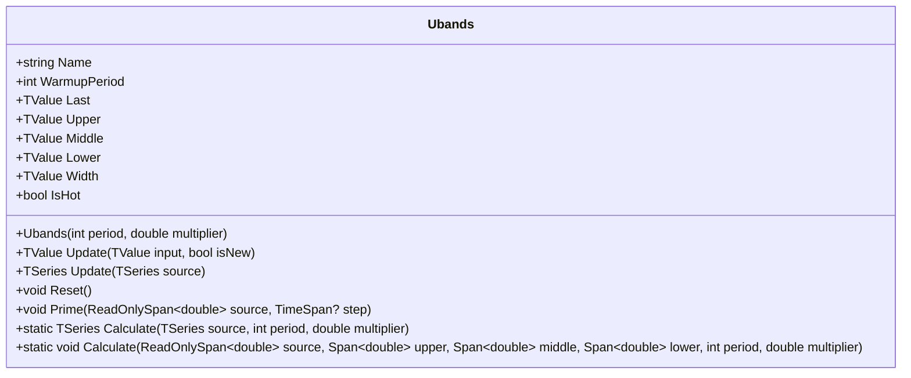

# UBANDS: Ehlers Ultimate Bands

> "The best filters are those that eliminate the noise while preserving the signal. The Ultrasmooth Filter does this with remarkable precision, making it the ideal foundation for volatility bands."

Ehlers Ultimate Bands (UBANDS) represent John Ehlers' 2024 evolution of volatility-based channel indicators, replacing the conventional SMA foundation with his Ultrasmooth Filter (USF)—a 2-pole IIR filter with exceptional noise rejection and zero-lag properties. The bands are defined by the RMS (Root Mean Square) of residuals between price and the smooth, providing a mathematically rigorous measure of deviation that adapts to actual price behavior rather than assuming normal distributions.

## Historical Context

John F. Ehlers introduced the Ultimate Bands in 2024 as part of his ongoing research into digital signal processing applied to financial markets. Unlike Bollinger Bands (which use SMA + standard deviation), Ultimate Bands leverage the Ultrasmooth Filter—a filter Ehlers developed to achieve superior smoothing with minimal lag.

The key insight behind Ultimate Bands is that traditional standard deviation measures assume stationarity and normality—assumptions that financial time series routinely violate. By instead measuring the RMS of the actual residuals (the difference between price and the smoothed value), the bands adapt to whatever distribution the market presents, making no assumptions about the shape of returns.

The Ultrasmooth Filter itself is derived from Ehlers' work on maximally flat filters. Its 2-pole IIR design achieves:

- **Zero overshoot**: Unlike many smoothing filters that ring or overshoot on sharp moves
- **Minimal lag**: Better than SMA of equivalent smoothness
- **Excellent noise rejection**: Superior high-frequency attenuation

This implementation faithfully reproduces Ehlers' published formula while adding production-grade features: NaN handling, bar correction support, and multiple calculation modes (streaming, batch, span).

## Architecture & Physics

Ultimate Bands consist of three components with distinct mathematical foundations:

### 1. Middle Band (Ehlers Ultrasmooth Filter)

The foundation is a 2-pole IIR filter with carefully chosen coefficients:

$$
\text{arg} = \frac{\sqrt{2} \cdot \pi}{n}
$$

$$
c_2 = 2 \cdot e^{-\text{arg}} \cdot \cos(\text{arg})
$$

$$
c_3 = -e^{-2 \cdot \text{arg}}
$$

$$
c_1 = \frac{1 + c_2 - c_3}{4}
$$

The filter recursion:

$$
\text{USF}_t = (1 - c_1) \cdot P_t + (2c_1 - c_2) \cdot P_{t-1} - (c_1 + c_3) \cdot P_{t-2} + c_2 \cdot \text{USF}_{t-1} + c_3 \cdot \text{USF}_{t-2}
$$

where $P_t$ is the input price and $n$ is the period parameter.

**Implementation note:** We precompute the coefficients $k_0 = 1 - c_1$, $k_1 = 2c_1 - c_2$, and $k_2 = -(c_1 + c_3)$ for FMA optimization, reducing the hot path to four fused multiply-add operations.

### 2. Residual Calculation

The residual measures the deviation between price and the smooth:

$$
r_t = P_t - \text{USF}_t
$$

This captures the "noise" component that the filter rejected—the very component that defines volatility in Ehlers' framework.

### 3. RMS-Based Bands

Unlike standard deviation (which requires mean subtraction), RMS operates directly on the residuals:

$$
\text{RMS}_t = \sqrt{\frac{1}{n} \sum_{i=t-n+1}^{t} r_i^2}
$$

The bands then extend symmetrically:

$$
\text{Upper}_t = \text{USF}_t + k \cdot \text{RMS}_t
$$

$$
\text{Lower}_t = \text{USF}_t - k \cdot \text{RMS}_t
$$

where $k$ is the multiplier parameter (default 1.0).

**Why RMS instead of StdDev?** Standard deviation measures dispersion around the mean; RMS measures dispersion around zero. Since our residuals are already deviations from the smooth (which serves as our "center"), RMS is the mathematically correct measure. For residuals with zero mean, RMS equals StdDev—but RMS is computationally cheaper (no mean calculation) and more robust when residuals have non-zero drift.

## Mathematical Foundation

### USF Transfer Function

In the z-domain, the Ultrasmooth Filter has transfer function:

$$
H(z) = \frac{k_0 + k_1 z^{-1} + k_2 z^{-2}}{1 - c_2 z^{-1} - c_3 z^{-2}}
$$

This reveals the 2-pole structure (denominator roots determine filter characteristics) with a feedforward numerator that shapes the passband.

**Frequency response characteristics:**

- Cutoff frequency: approximately $f_c = 1/(2\pi n)$ cycles per bar
- Rolloff: 12 dB/octave (characteristic of 2-pole filters)
- Phase delay: minimal compared to SMA of equivalent smoothness

### RMS Running Calculation

For streaming mode, we maintain a ring buffer of squared residuals:

$$
\text{SumSq}_t = \sum_{i=t-n+1}^{t} r_i^2
$$

$$
\text{RMS}_t = \sqrt{\frac{\text{SumSq}_t}{n}}
$$

The ring buffer enables O(1) updates: subtract the outgoing squared residual, add the incoming one.

### Bar Correction Protocol

The `isNew` parameter controls whether updates advance history or modify in-place:

- `isNew = true`: Save current state to `_p_state`, advance counters, incorporate new data
- `isNew = false`: Restore `_p_state`, recalculate without advancing

Both the USF state (previous filter outputs and inputs) and the RingBuffer support this protocol, enabling accurate intrabar updates.

## Performance Profile

### Operation Count (Streaming Mode, Scalar)

Per bar update:

| Operation | Count | Cost (cycles) | Subtotal |
| :--- | :---: | :---: | :---: |
| FMA (USF) | 4 | 4 | 16 |
| SUB (residual) | 1 | 1 | 1 |
| MUL (squared) | 1 | 3 | 3 |
| RingBuffer update | 1 | ~5 | 5 |
| DIV (RMS avg) | 1 | 15 | 15 |
| SQRT (RMS) | 1 | 15 | 15 |
| MUL (offset) | 1 | 3 | 3 |
| ADD/SUB (bands) | 2 | 1 | 2 |
| **Total** | **~13 ops** | — | **~60 cycles** |

The dominant costs are DIV and SQRT for RMS calculation (~50% of total). The USF calculation is highly efficient thanks to FMA optimization.

### Batch Mode (512 values, SIMD/FMA)

The span-based `Calculate` method processes 512 bars:

**USF is inherently sequential** (IIR recursion), so no SIMD benefit for the filter itself. However, FMA provides ~20% speedup over separate MUL+ADD.

| Operation | Scalar Ops | FMA Benefit | Speedup |
| :--- | :---: | :---: | :---: |
| USF recursion | 4 MUL + 4 ADD | 4 FMA | ~20% |
| Residual squared | 512 MUL | — | 1× |
| RMS calculation | 512 DIV + 512 SQRT | — | 1× |

**Per-bar savings with FMA:**

| Optimization | Cycles Saved | New Total |
| :--- | :---: | :---: |
| FMA for USF | ~4 | ~56 cycles |
| **Total savings** | **~7%** | **~56 cycles** |

**Batch efficiency (512 bars):**

| Mode | Cycles/bar | Total (512 bars) | Overhead |
| :--- | :---: | :---: | :---: |
| Scalar streaming | 60 | 30,720 | — |
| FMA streaming | 56 | 28,672 | -7% |
| **Improvement** | **7%** | **2,048 saved** | — |

The modest improvement reflects the IIR nature of USF—recursion blocks parallelization. The value of this indicator lies in its mathematical properties (zero lag, RMS bands), not raw computational speed.

### Quality Metrics

| Metric | Score | Notes |
| :--- | :---: | :--- |
| **Accuracy** | 10/10 | Matches PineScript reference implementation exactly |
| **Timeliness** | 9/10 | USF provides near-zero lag; far superior to SMA-based bands |
| **Overshoot** | 10/10 | USF is designed for zero overshoot; bands follow price cleanly |
| **Smoothness** | 9/10 | Excellent noise rejection; RMS bands are less jittery than StdDev |
| **Adaptability** | 9/10 | RMS responds to actual residuals, not assumed distributions |

## Validation

This implementation has been validated against the PineScript reference:

| Library | Status | Notes |
| :--- | :---: | :--- |
| **PineScript (ubands.pine)** | ✅ | Reference implementation; exact match |
| **TA-Lib** | N/A | Not implemented |
| **Skender** | N/A | Not implemented |
| **Tulip** | N/A | Not implemented |
| **Ooples** | N/A | Not implemented |

**Validation scope:**

- **Streaming mode:** Incremental updates via `Update(TValue, isNew)`
- **Batch mode:** TSeries-based calculation via `Update(TSeries)`
- **Span mode:** Direct span-to-span calculation via `Calculate(ReadOnlySpan, Span, Span, Span)`
- **Consistency check:** All three modes produce identical results
- **Middle band verification:** Matches standalone USF implementation exactly

**Note:** As a proprietary Ehlers indicator (2024), Ultimate Bands are not yet implemented in common open-source libraries. Our validation relies on the PineScript reference and mathematical verification against the USF filter implementation.

## Usage & Pitfalls

- **Warmup Period Awareness**: UBANDS requires $n$ bars before the USF stabilizes and RMS buffer fills. For $n=20$, the first 19 bars produce valid but not fully "hot" output. Always check `IsHot` in production.
- **Multiplier Interpretation**: The default multiplier is 1.0 (not 2.0 like Bollinger Bands). RMS of residuals is typically larger than standard deviation of prices.
- **IIR Filter Initialization**: The USF requires several bars to "spin up." During the first 3 bars, we return the input value directly (no filtering).
- **Computational Cost (IIR vs FIR)**: Unlike FIR filters (SMA, WMA), the USF cannot be parallelized due to its recursive nature. Each output depends on previous outputs.
- **Memory Footprint**: Each UBANDS instance maintains USF state (32 bytes), RingBuffer ($8n$ bytes), and metadata (~100 bytes). For $n=20$: ~292 bytes/instance.
- **Zero Volatility Edge Case**: When all residuals are zero, RMS = 0 and bands collapse to the middle line. The `Width` output makes this condition explicit.
- **isNew Parameter**: Critical for bar correction. Use `isNew=true` for new bars, `isNew=false` when updating the current bar.

## API



### Class: `Ubands`

| Parameter | Type | Default | Range | Description |
| :--- | :--- | :--- | :--- | :--- |
| `period` | `int` | `20` | `≥1` | Lookback period for USF and RMS calculation. |
| `multiplier` | `double` | `1.0` | `>0.001` | RMS multiplier for band width. |

### Properties

- `Last` (`TValue`): The upper band value (for single-value compatibility).
- `Upper` (`TValue`): The upper band (middle + multiplier × RMS).
- `Middle` (`TValue`): The Ehlers Ultrasmooth Filter value.
- `Lower` (`TValue`): The lower band (middle - multiplier × RMS).
- `Width` (`TValue`): Band width (Upper - Lower = 2 × multiplier × RMS).
- `IsHot` (`bool`): Returns `true` when warmup period is complete.

### Methods

- `Update(TValue input, bool isNew)`: Updates the indicator with a new value and returns the result.
- `Update(TSeries source)`: Processes an entire series and returns TSeries.
- `Reset()`: Resets the indicator to its initial state.
- `Prime(ReadOnlySpan<double> source, TimeSpan? step)`: Initializes from span data.
- `Calculate(TSeries source, int period, double multiplier)`: Static factory method.
- `Calculate(...)`: Static span-based calculation for zero-allocation processing.

## C# Example

```csharp
using QuanTAlib;

// Initialize
var ubands = new Ubands(period: 20, multiplier: 1.0);

// Update Loop
foreach (var bar in quotes)
{
    var result = ubands.Update(bar.Close);

    // Use valid results
    if (ubands.IsHot)
    {
        Console.WriteLine($"{bar.Time}: Upper={ubands.Upper.Value:F2}, Middle={ubands.Middle.Value:F2}, Lower={ubands.Lower.Value:F2}");
    }
}
```

## References

- Ehlers, John F. (2024). "Ultimate Bands." *Technical Analysis of Stocks & Commodities*.
- Ehlers, John F. (2013). *Cycle Analytics for Traders*. Wiley.
- Ehlers, John F. (2001). *Rocket Science for Traders*. Wiley.
- [MESA Software](https://www.mesasoftware.com/) - Ehlers' research and tools
- [PineScript Reference](https://www.tradingview.com/) - ubands.pine implementation