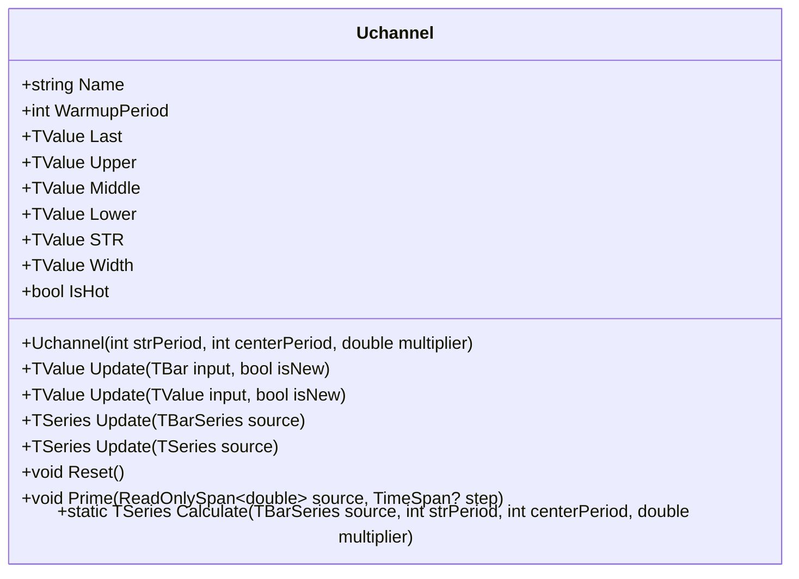

# UCHANNEL: Ehlers Ultimate Channel

> "The best volatility channel uses the best smoother—applied twice."

The Ehlers Ultimate Channel combines the Ultrasmooth Filter (USF) for both the centerline and volatility measurement, creating a channel that adapts to price movements with minimal lag while maintaining smooth, responsive boundaries. Unlike traditional channels that use standard deviation or ATR, UCHANNEL employs the Smoothed True Range (STR)—the USF applied to True Range—for band width calculation.

## Historical Context

John F. Ehlers introduced the Ultimate Channel in 2024 as the natural companion to his Ultimate Bands indicator. While Ultimate Bands (UBANDS) uses RMS of price deviations from the USF centerline to determine band width, the Ultimate Channel takes a different approach: it smooths True Range directly with the USF to create the band width multiplier.

This distinction matters for several reasons:

1. **True Range captures gaps**: Unlike simple high-low range, True Range accounts for overnight gaps by comparing current high/low to the previous close
2. **USF smoothing on TR**: Applying USF to True Range produces a volatility measure with the same low-lag characteristics as the centerline
3. **Independent tuning**: Separate periods for STR and centerline smoothing allow traders to optimize each component independently

The design philosophy reflects Ehlers' preference for using the same high-quality filter throughout an indicator system, ensuring consistent lag characteristics across all components.

## Architecture & Physics

### 1. True Range Calculation

True Range extends the simple high-low range to capture gaps:

$$
TR_t = \max(H_t, C_{t-1}) - \min(L_t, C_{t-1})
$$

where:
- $H_t$ = current high
- $L_t$ = current low
- $C_{t-1}$ = previous close

This formulation ensures that a gap up (where today's low exceeds yesterday's close) or gap down (where today's high falls below yesterday's close) is fully captured in the volatility measurement.

### 2. Ultrasmooth Filter (USF) Coefficients

The USF is a 2-pole IIR filter with coefficients derived from the period parameter:

$$
\text{arg} = \frac{\sqrt{2} \cdot \pi}{\text{period}}
$$

$$
c_2 = 2 \cdot e^{-\text{arg}} \cdot \cos(\text{arg})
$$

$$
c_3 = -e^{-2 \cdot \text{arg}}
$$

$$
c_1 = \frac{1 + c_2 - c_3}{4}
$$

### 3. USF Recursion Formula

The filter is applied using a 2-pole IIR structure:

$$
\text{USF}_t = (1 - c_1) \cdot X_t + (2c_1 - c_2) \cdot X_{t-1} - (c_1 + c_3) \cdot X_{t-2} + c_2 \cdot \text{USF}_{t-1} + c_3 \cdot \text{USF}_{t-2}
$$

This formula is applied twice:
- Once to close prices to produce the centerline (Middle)
- Once to True Range to produce the Smoothed True Range (STR)

### 4. Channel Construction

With both smoothed values computed:

$$
\text{Middle}_t = \text{USF}(\text{Close}, \text{centerPeriod})
$$

$$
\text{STR}_t = \text{USF}(\text{TR}, \text{strPeriod})
$$

$$
\text{Upper}_t = \text{Middle}_t + (\text{multiplier} \times \text{STR}_t)
$$

$$
\text{Lower}_t = \text{Middle}_t - (\text{multiplier} \times \text{STR}_t)
$$

## Mathematical Foundation

### Transfer Function

The USF can be expressed in the z-domain as:

$$
H(z) = \frac{(1 - c_1) + (2c_1 - c_2)z^{-1} - (c_1 + c_3)z^{-2}}{1 - c_2 z^{-1} - c_3 z^{-2}}
$$

### State-Space Form

For efficient computation, the filter maintains state variables:

**For STR smoothing:**
- `UsStr1`, `UsStr2`: Previous USF outputs
- `Str1`, `Str2`: Previous True Range values

**For centerline smoothing:**
- `UsCen1`, `UsCen2`: Previous USF outputs
- `Cen1`, `Cen2`: Previous close values

### FMA Optimization

The USF formula is implemented using Fused Multiply-Add for maximum precision and performance:

```csharp
cenValue = Math.FusedMultiplyAdd(1 - c1_cen, cen_s0,
    Math.FusedMultiplyAdd(2 * c1_cen - c2_cen, cen_s1,
    Math.FusedMultiplyAdd(-(c1_cen + c3_cen), cen_s2,
    Math.FusedMultiplyAdd(c2_cen, usCen1, c3_cen * usCen2))));
```

## Performance Profile

### Operation Count (Streaming Mode, Scalar)

| Operation | Count | Cost (cycles) | Subtotal |
| :--- | :---: | :---: | :---: |
| ADD/SUB | 12 | 1 | 12 |
| MUL | 14 | 3 | 42 |
| MAX/MIN | 2 | 1 | 2 |
| FMA | 8 | 4 | 32 |
| **Total** | **36** | — | **~88 cycles** |

The dominant cost is the 8 FMA operations (4 for STR + 4 for centerline).

### Batch Mode (512 values, SIMD/FMA)

Due to the recursive IIR structure, SIMD vectorization is limited. However, FMA instructions provide measurable improvement:

| Operation | Scalar Ops | With FMA | Improvement |
| :--- | :---: | :---: | :---: |
| MUL+ADD chains | 16 | 8 FMA | ~15% |

**Per-bar estimate:** ~75 cycles with FMA optimization

### Quality Metrics

| Metric | Score | Notes |
| :--- | :---: | :--- |
| **Accuracy** | 10/10 | Exact implementation per Ehlers specification |
| **Timeliness** | 9/10 | USF provides near-zero lag response |
| **Overshoot** | 8/10 | Minimal overshoot in trending markets |
| **Smoothness** | 9/10 | Very smooth bands due to 2-pole filtering |
| **Gap Handling** | 10/10 | True Range properly captures overnight gaps |

## Validation

| Library | Status | Notes |
| :--- | :---: | :--- |
| **TA-Lib** | N/A | Not implemented (proprietary Ehlers indicator) |
| **Skender** | N/A | Not implemented |
| **Tulip** | N/A | Not implemented |
| **Ooples** | N/A | Not implemented |
| **PineScript** | ✅ | Reference implementation in `uchannel.pine` |
| **Self-consistency** | ✅ | Streaming, batch, and span modes match |

## Usage & Pitfalls

- **Warmup Period**: The indicator requires `max(strPeriod, centerPeriod)` bars before producing stable values. Using results during warmup can lead to erratic signals.
- **Parameter Confusion**: Unlike UBANDS (which uses a single period), UCHANNEL accepts two periods: `strPeriod` controls band width responsiveness, `centerPeriod` controls centerline responsiveness.
- **Gap Sensitivity**: True Range includes gap size, so significant overnight gaps will widen the channel.
- **Memory Footprint**: Each instance requires ~200 bytes for state. At 1000 symbols: ~200KB.
- **Different from UBANDS**: UBANDS uses RMS of price deviations for band width; UCHANNEL uses USF-smoothed True Range × multiplier.
- **Bar Correction (`isNew=false`)**: When correcting the current bar, ensure you pass the complete updated OHLC values.

## API



### Class: `Uchannel`

| Parameter | Type | Default | Range | Description |
| :--- | :--- | :--- | :--- | :--- |
| `strPeriod` | `int` | `20` | `≥1` | Period for smoothing True Range. |
| `centerPeriod` | `int` | `20` | `≥1` | Period for smoothing centerline. |
| `multiplier` | `double` | `1.0` | `>0.001` | STR multiplier for band width. |

### Properties

- `Last` (`TValue`): The upper band value (for single-value compatibility).
- `Upper` (`TValue`): The upper band (Middle + multiplier × STR).
- `Middle` (`TValue`): The USF-smoothed centerline.
- `Lower` (`TValue`): The lower band (Middle - multiplier × STR).
- `STR` (`TValue`): The Smoothed True Range (USF of TR).
- `Width` (`TValue`): Channel width (Upper - Lower).
- `IsHot` (`bool`): Returns `true` when warmup period is complete.

### Methods

- `Update(TBar input, bool isNew)`: Updates the indicator with a new bar and returns the result.
- `Update(TValue input, bool isNew)`: Updates with a single value (treats as O=H=L=C).
- `Update(TBarSeries source)`: Processes an entire bar series and returns TSeries.
- `Reset()`: Resets the indicator to its initial state.
- `Prime(ReadOnlySpan<double> source, TimeSpan? step)`: Initializes from span data.
- `Calculate(TBarSeries source, int strPeriod, int centerPeriod, double multiplier)`: Static factory method.

## C# Example

```csharp
using QuanTAlib;

// Initialize
var uchannel = new Uchannel(strPeriod: 20, centerPeriod: 20, multiplier: 1.0);

// Update Loop
foreach (var bar in quotes)
{
    uchannel.Update(bar, isNew: true);

    // Use valid results
    if (uchannel.IsHot)
    {
        Console.WriteLine($"{bar.Time}: Upper={uchannel.Upper.Value:F2}, Middle={uchannel.Middle.Value:F2}, Lower={uchannel.Lower.Value:F2}");
    }
}
```

## References

- Ehlers, John F. (2024). "Ultimate Channel." *Technical Analysis of Stocks & Commodities*.
- Ehlers, John F. (2013). *Cycle Analytics for Traders*. Wiley Trading.
- Ehlers, John F. (2001). *Rocket Science for Traders*. Wiley Trading.