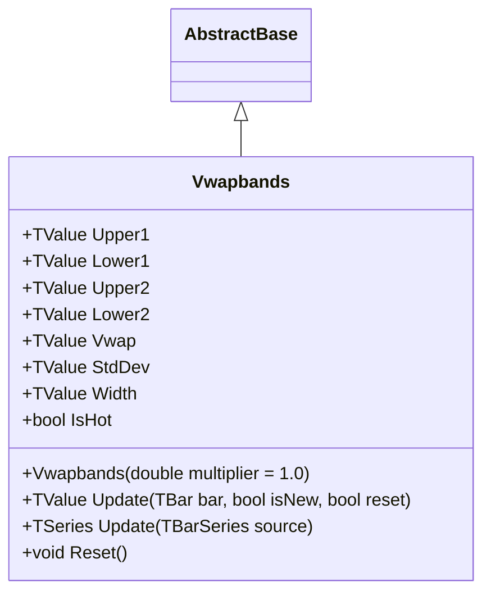

# VWAPBANDS: Volume Weighted Average Price with Dual Standard Deviation Bands

> "Where volume speaks, VWAP listens—and the bands show how far the market dares to stray."

Volume Weighted Average Price Bands (VWAPBANDS) extends the standard VWAP indicator by adding two levels of standard deviation bands: ±1σ and ±2σ. This dual-band approach provides traders with a complete volatility framework, distinguishing between normal price fluctuations (within 1σ bands, ~68% of price action) and statistically significant moves (beyond 2σ bands, ~95% confidence level). Volume weighting ensures that prices where significant trading activity occurred contribute proportionally more to both the average and the deviation calculations, making VWAPBANDS particularly valuable for institutional traders benchmarking execution quality.

## Historical Context

The Volume Weighted Average Price (VWAP) emerged in the 1980s as institutional traders sought a benchmark that reflected actual market participation rather than simple price averages. The concept gained prominence following the work of Berkowitz, Logue, and Noser (1988) on transaction costs, establishing VWAP as the gold standard for measuring execution quality against a fair market price.

The extension to standard deviation bands followed the same statistical reasoning as John Bollinger's work in the early 1980s—using standard deviation to quantify price dispersion around a central tendency. By combining volume weighting with dual-band construction, VWAPBANDS creates a statistically rigorous framework where the 1σ bands capture approximately 68% of price action and the 2σ bands capture approximately 95%, following normal distribution properties.

Unlike simple VWAP with single bands, VWAPBANDS creates distinct trading zones. The region between VWAP and ±1σ represents the "normal trading zone" where institutional algorithms typically execute. The area between ±1σ and ±2σ serves as an "alert zone" indicating elevated but not extreme deviation. Price beyond ±2σ signals statistically significant moves that often precede reversals or continuation breakouts.

## Architecture & Physics

VWAPBANDS calculates a volume-weighted average price with dual standard deviation bands using running sums for O(1) streaming updates.

### 1. Typical Price Calculation

$$
P_{typical} = \frac{High + Low + Close}{3}
$$

The HLC3 typical price provides a balanced measure considering the full trading range of each bar.

### 2. Running Sum Accumulation

$$
\sum_{pv} = \sum_{i=1}^{n} P_i \times V_i
$$

$$
\sum_{vol} = \sum_{i=1}^{n} V_i
$$

$$
\sum_{pv^2} = \sum_{i=1}^{n} P_i^2 \times V_i
$$

Three running sums enable O(1) updates: cumulative price×volume, cumulative volume, and cumulative price²×volume.

### 3. VWAP Calculation

$$
VWAP = \frac{\sum_{pv}}{\sum_{vol}}
$$

The volume-weighted average divides cumulative price×volume by cumulative volume.

### 4. Variance and Standard Deviation

$$
\sigma^2 = \frac{\sum_{pv^2}}{\sum_{vol}} - VWAP^2
$$

$$
\sigma = \sqrt{\max(0, \sigma^2)}
$$

Variance uses the algebraic identity E[X²] - E[X]², with a guard against negative values from floating-point precision.

### 5. Dual Band Construction

$$
Upper_1 = VWAP + (1 \times k \times \sigma)
$$

$$
Lower_1 = VWAP - (1 \times k \times \sigma)
$$

$$
Upper_2 = VWAP + (2 \times k \times \sigma)
$$

$$
Lower_2 = VWAP - (2 \times k \times \sigma)
$$

Where $k$ is the multiplier (default 1.0). The 1σ bands capture ~68% of price action, while 2σ bands capture ~95%.

### 6. Channel Width

$$
Width = Upper_2 - Lower_2 = 4 \times k \times \sigma
$$

The full channel width provides a single volatility metric for cross-session comparison.

## Performance Profile

### Operation Count (Streaming Mode, per Bar)

| Operation | Count | Cost (cycles) | Subtotal |
| :--- | :---: | :---: | :---: |
| ADD/SUB | 9 | 1 | 9 |
| MUL | 6 | 3 | 18 |
| DIV | 3 | 15 | 45 |
| SQRT | 1 | 15 | 15 |
| **Total** | **19** | — | **~87 cycles** |

**Breakdown:**

* Typical price (HLC3): 2 ADD + 1 DIV = 17 cycles
* Running sums (pv, vol, pv²): 3 ADD + 3 MUL = 12 cycles
* VWAP + variance: 2 DIV + 1 MUL + 1 SUB = 35 cycles
* StdDev: 1 SQRT = 15 cycles
* Dual bands + width: 4 ADD + 2 MUL = 10 cycles (with FMA optimization)

### Complexity Analysis

| Mode | Complexity | Notes |
| :--- | :---: | :--- |
| Streaming | O(1) | Running sums, constant per bar |
| Batch | O(n) | Linear scan required |

**Memory:** ~80 bytes per instance (state struct with running sums, last valid values, and output properties)

### Quality Metrics

| Metric | Score | Notes |
| :--- | :---: | :--- |
| **Accuracy** | 10/10 | Mathematically exact volume-weighted statistics |
| **Timeliness** | 7/10 | Incorporates all session data, becomes stable over time |
| **Overshoot** | 9/10 | Bands adapt to actual volume-weighted volatility |
| **Smoothness** | 9/10 | Running sums provide inherent smoothing |

## Validation

| Library | Status | Notes |
| :--- | :---: | :--- |
| **TA-Lib** | N/A | No VWAP bands implementation |
| **Skender** | N/A | Has VWAP but not with dual bands |
| **Tulip** | N/A | No VWAP implementation |
| **Ooples** | N/A | No dual-band VWAP |
| **TradingView** | ✅ | Reference: vwapbands.pine |

## Usage & Pitfalls

* **Session Reset Timing:** Failing to reset VWAP at session boundaries causes stale historical data to dominate. Use the `reset` parameter for intraday strategies.
* **Multiplier Confusion:** Multiplier = 2.0 gives 2σ and 4σ bands, not 1σ and 2σ. Keep multiplier = 1.0 for standard statistical interpretation.
* **Early Session Instability:** VWAP bands are volatile in the first 15-30 minutes. Avoid trading band touches until sufficient volume accumulates.
* **Zero Volume Handling:** Extended periods of zero volume degrade indicator quality despite fallback to last valid values.
* **Bar Correction:** Use `isNew=false` when updating the current bar's value (same timestamp), `isNew=true` for new bars.
* **Intraday Focus:** Without session resets, cumulative calculations become less responsive as early data dominates.
* **Volume Dependency:** Requires reliable volume data; forex and index CFDs may not provide accurate signals.

## API



### Class: `Vwapbands`

| Parameter | Type | Default | Range | Description |
| :--- | :--- | :--- | :--- | :--- |
| `multiplier` | `double` | `1.0` | `≥0.001` | Scales the standard deviation for band width. |

### Properties

* `Upper1` (`TValue`): Upper band at 1σ (VWAP + mult × StdDev).
* `Lower1` (`TValue`): Lower band at 1σ (VWAP - mult × StdDev).
* `Upper2` (`TValue`): Upper band at 2σ (VWAP + 2 × mult × StdDev).
* `Lower2` (`TValue`): Lower band at 2σ (VWAP - 2 × mult × StdDev).
* `Vwap` (`TValue`): Volume-weighted average price (center line).
* `StdDev` (`TValue`): Standard deviation of volume-weighted prices.
* `Width` (`TValue`): Band width (Upper1 - Lower1 = 2 × mult × StdDev).
* `IsHot` (`bool`): Returns `true` when warmup is complete (≥2 bars).

### Methods

* `Update(TBar bar, bool isNew = true, bool reset = false)`: Updates with new OHLCV bar. Use `reset=true` at session boundaries.
* `Update(TBarSeries source)`: Batch update from bar series.
* `Reset()`: Clears state and restarts calculations.

## C# Example

```csharp
using QuanTAlib;

// Initialize with default multiplier (1.0 = standard 1σ and 2σ bands)
var vwapbands = new Vwapbands(multiplier: 1.0);

// Streaming update - intraday with session reset
bool isSessionStart = true;
foreach (var bar in intradayBars)
{
    bool isNewBar = bar.Time > lastBarTime;
    vwapbands.Update(bar, isNew: isNewBar, reset: isSessionStart);
    isSessionStart = false;
    lastBarTime = bar.Time;

    if (vwapbands.IsHot)
    {
        Console.WriteLine($"{bar.Time}: VWAP={vwapbands.Vwap.Value:F2}");
        Console.WriteLine($"  1σ Bands: [{vwapbands.Lower1.Value:F2}, {vwapbands.Upper1.Value:F2}]");
        Console.WriteLine($"  2σ Bands: [{vwapbands.Lower2.Value:F2}, {vwapbands.Upper2.Value:F2}]");

        // Zone-based trading signals
        double price = bar.Close;
        if (price > vwapbands.Upper2.Value)
            Console.WriteLine("  ⚠️ Price in extreme overbought zone (>2σ)");
        else if (price < vwapbands.Lower2.Value)
            Console.WriteLine("  ⚠️ Price in extreme oversold zone (<-2σ)");
    }
}

// Batch processing
var (upper1, lower1, upper2, lower2, vwap, stdDev) = Vwapbands.Calculate(barSeries, multiplier: 1.0);
```

## References

* Berkowitz, S. A., Logue, D. E., & Noser, E. A. (1988). The Total Cost of Transactions on the NYSE. *The Journal of Finance*, 43(1), 97-112.
* Kissell, R. (2013). *The Science of Algorithmic Trading and Portfolio Management*. Academic Press.
* TradingView (2024). VWAP Standard Deviation Bands. Pine Script Reference.
