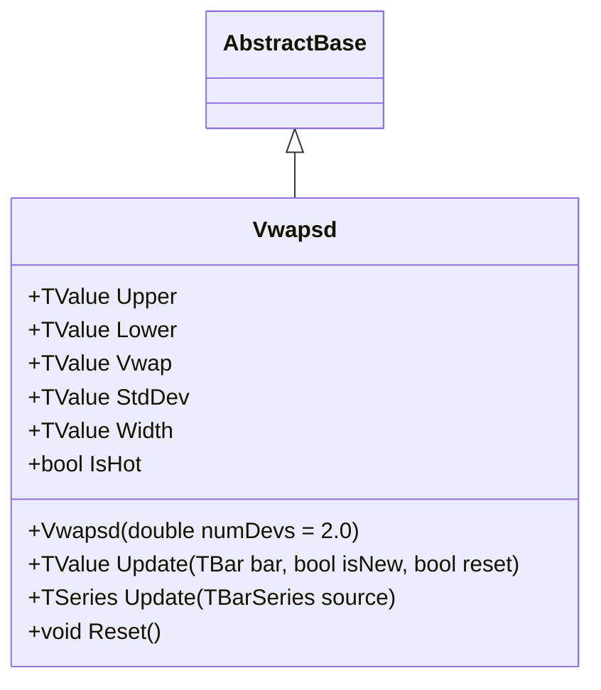

# VWAPSD: VWAP with Standard Deviation Bands

> "The market's true average is weighted by conviction—and the bands reveal when conviction wavers."

The Volume Weighted Average Price with Standard Deviation Bands (VWAPSD) combines VWAP with statistical volatility bands. VWAP represents the true average price weighted by volume, making it the institutional benchmark for execution quality. The addition of configurable standard deviation bands transforms VWAP from a simple reference line into a complete channel system that measures both central tendency and price dispersion. VWAPSD is primarily used as an intraday indicator with session resets, ensuring the indicator remains relevant to current market conditions.

## Historical Context

The Volume Weighted Average Price emerged in the 1980s as institutional traders sought a benchmark that reflected actual market participation rather than simple price averages. The seminal work by Berkowitz, Logue, and Noser (1988) on transaction costs established VWAP as the gold standard for measuring execution quality—buying below VWAP or selling above it indicates favorable execution relative to the market's true average.

The extension to standard deviation bands follows the statistical reasoning popularized by John Bollinger in the early 1980s. By applying standard deviation to volume-weighted prices, VWAPSD creates bands that adapt to actual market volatility while respecting the volume-weighted nature of the central tendency. The configurable deviation parameter (1σ, 2σ, or 3σ) allows traders to select their desired confidence level.

Unlike simple moving average bands, VWAPSD anchors to session boundaries, resetting calculations at configurable intervals (daily, weekly, hourly). This anchored approach prevents the accumulation of stale historical data and keeps the indicator focused on current market structure—a critical feature for intraday traders who need actionable levels for the current session.

## Architecture & Physics

VWAPSD calculates a volume-weighted average price with configurable standard deviation bands using running sums for O(1) streaming updates.

### 1. Typical Price Calculation

$$
P_{typical} = \frac{High + Low + Close}{3}
$$

The HLC3 typical price provides a balanced measure considering the full trading range of each bar.

### 2. Running Sum Accumulation

$$
\sum_{pv} = \sum_{i=1}^{n} P_i \times V_i
$$

$$
\sum_{vol} = \sum_{i=1}^{n} V_i
$$

$$
\sum_{pv^2} = \sum_{i=1}^{n} P_i^2 \times V_i
$$

Three running sums enable O(1) updates: cumulative price×volume, cumulative volume, and cumulative price²×volume.

### 3. VWAP Calculation

$$
VWAP = \frac{\sum_{pv}}{\sum_{vol}}
$$

The volume-weighted average divides cumulative price×volume by cumulative volume.

### 4. Variance and Standard Deviation

$$
\sigma^2 = \frac{\sum_{pv^2}}{\sum_{vol}} - VWAP^2
$$

$$
\sigma = \sqrt{\max(0, \sigma^2)}
$$

Variance uses the algebraic identity E[X²] - E[X]², with a guard against negative values from floating-point precision.

### 5. Band Construction

$$
Upper = VWAP + (n \times \sigma)
$$

$$
Lower = VWAP - (n \times \sigma)
$$

Where $n$ is the number of standard deviations (default 2.0). Common settings: 1σ (~68%), 2σ (~95%), 3σ (~99.7%).

### 6. Channel Width

$$
Width = Upper - Lower = 2 \times n \times \sigma
$$

The channel width provides a single volatility metric for position sizing and risk assessment.

## Performance Profile

### Operation Count (Streaming Mode, per Bar)

| Operation | Count | Cost (cycles) | Subtotal |
| :--- | :---: | :---: | :---: |
| ADD/SUB | 7 | 1 | 7 |
| MUL | 4 | 3 | 12 |
| DIV | 3 | 15 | 45 |
| SQRT | 1 | 15 | 15 |
| **Total** | **15** | — | **~79 cycles** |

**Breakdown:**

- Typical price (HLC3): 2 ADD + 1 DIV = 17 cycles
- Running sums (pv, vol, pv²): 3 ADD + 3 MUL = 12 cycles
- VWAP + variance: 2 DIV + 1 MUL + 1 SUB = 35 cycles
- StdDev + bands: 1 SQRT + 2 ADD = 17 cycles

### Complexity Analysis

| Mode | Complexity | Notes |
| :--- | :---: | :--- |
| Streaming | O(1) | Running sums, no buffer iteration |
| Batch | O(n) | Linear scan per session |

**Memory:** ~64 bytes per instance (3 running sums × 8 bytes + state variables)

### Quality Metrics

| Metric | Score | Notes |
| :--- | :---: | :--- |
| **Accuracy** | 10/10 | Volume-weighted mean is mathematically exact |
| **Timeliness** | 7/10 | Incorporates all data since session start |
| **Overshoot** | 9/10 | Bands based on actual volatility |
| **Smoothness** | 9/10 | Running average smooths noise progressively |

## Validation

| Library | Status | Notes |
| :--- | :---: | :--- |
| **TA-Lib** | N/A | No VWAP bands implementation |
| **Skender** | N/A | Has VWAP but not with StdDev bands |
| **Tulip** | N/A | No VWAP implementation |
| **TradingView** | ✅ | Reference: vwapsd.pine |

## Usage & Pitfalls

- **Session Reset Timing:** Failing to reset VWAP at session boundaries causes stale data to dominate. Use the `reset` parameter at session start.
- **NumDevs Selection:** Use 1σ for active trading (more signals), 2σ for standard analysis (~95% confidence), 3σ for extreme moves only.
- **Early Session Instability:** VWAP is volatile in the first 15-30 minutes. Wait for sufficient volume before trading band signals.
- **Zero Volume Handling:** Extended periods of zero volume degrade indicator quality despite fallback to last valid values.
- **Bar Correction:** Use `isNew=false` when updating the current bar's value (same timestamp), `isNew=true` for new bars.
- **Intraday Focus:** Without session resets, cumulative calculations become less responsive as early data dominates.
- **Volume Dependency:** Requires reliable volume data; forex and index CFDs may not provide accurate signals.
- **Gap Sensitivity:** Large overnight gaps distort morning VWAP until sufficient volume accumulates.

## API



### Class: `Vwapsd`

| Parameter | Type | Default | Range | Description |
| :--- | :--- | :--- | :--- | :--- |
| `numDevs` | `double` | `2.0` | `0.1–5.0` | Number of standard deviations for bands. |

### Properties

- `Upper` (`TValue`): Upper band (VWAP + numDevs × StdDev).
- `Lower` (`TValue`): Lower band (VWAP - numDevs × StdDev).
- `Vwap` (`TValue`): Volume-weighted average price (center line).
- `StdDev` (`TValue`): Standard deviation of volume-weighted prices.
- `Width` (`TValue`): Band width (Upper - Lower = 2 × numDevs × StdDev).
- `IsHot` (`bool`): Returns `true` when warmup is complete (≥2 bars).

### Methods

- `Update(TBar bar, bool isNew = true, bool reset = false)`: Updates with new OHLCV bar. Use `reset=true` at session boundaries.
- `Update(TBarSeries source)`: Batch update from bar series.
- `Reset()`: Clears state and restarts calculations.

## C# Example

```csharp
using QuanTAlib;

// Initialize with 2 standard deviations (~95% confidence)
var vwapsd = new Vwapsd(numDevs: 2.0);

// Streaming update - intraday with session reset
bool isSessionStart = true;
foreach (var bar in intradayBars)
{
    bool isNewBar = bar.Time > lastBarTime;
    vwapsd.Update(bar, isNew: isNewBar, reset: isSessionStart);
    isSessionStart = false;
    lastBarTime = bar.Time;

    if (vwapsd.IsHot)
    {
        Console.WriteLine($"{bar.Time}: VWAP={vwapsd.Vwap.Value:F2}");
        Console.WriteLine($"  Bands: [{vwapsd.Lower.Value:F2}, {vwapsd.Upper.Value:F2}]");
        Console.WriteLine($"  Width: {vwapsd.Width.Value:F2}");

        // Mean reversion signals
        double price = bar.Close;
        if (price > vwapsd.Upper.Value)
            Console.WriteLine("  ⚠️ Overbought - potential short");
        else if (price < vwapsd.Lower.Value)
            Console.WriteLine("  ⚠️ Oversold - potential long");
    }
}

// Batch processing
var (upper, lower, vwap, stdDev) = Vwapsd.Calculate(barSeries, numDevs: 2.0);
```

## References

- Berkowitz, S. A., Logue, D. E., & Noser, E. A. (1988). The Total Cost of Transactions on the NYSE. *The Journal of Finance*, 43(1), 97-112.
- Kissell, R. (2013). *The Science of Algorithmic Trading and Portfolio Management*. Academic Press.
- TradingView (2024). Volume Weighted Average Price (VWAP). TradingView Support Documentation.
