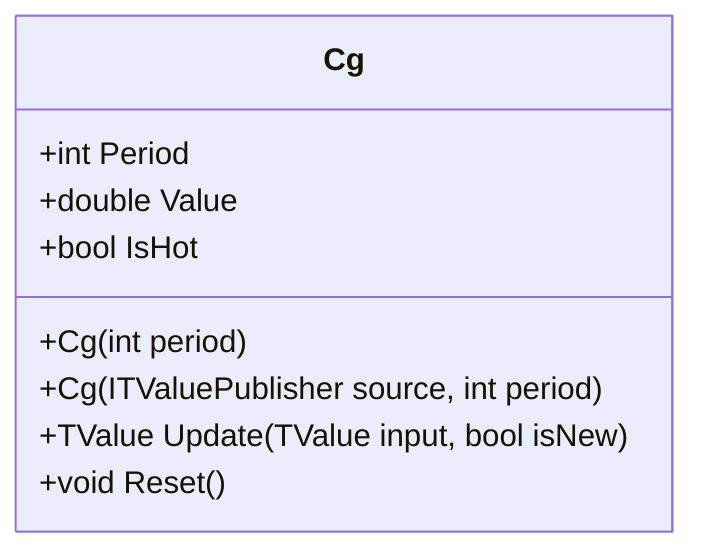

# CG: Center of Gravity

> "The market's center of mass reveals where momentum shifts before price does."

The Center of Gravity (CG) oscillator identifies potential turning points in price action using the physics concept of weighted center of mass. Developed by John Ehlers, it measures where the "weight" of prices is concentrated within a lookback window, providing leading signals for trend reversals with minimal lag.

## Historical Context

John Ehlers introduced the Center of Gravity oscillator in his 2002 book *Cybernetic Analysis for Stocks and Futures*. Ehlers, an electrical engineer turned trader, applied signal processing concepts to financial markets, focusing on creating indicators with minimal lag.

The CG oscillator draws directly from physics: just as the center of gravity of an object determines its balance point, the CG of price determines where momentum is balanced within a window. Ehlers designed it to be a leading indicator, contrasting it with the inherent lag of traditional moving averages.

## Architecture & Physics

The indicator calculates a weighted center of mass that oscillates around zero using a sliding window.

### 1. Weighted Sum (Numerator)

$$
Num = \sum_{i=1}^{n} i \cdot P_{t-n+i}
$$

where $i$ ranges from 1 (oldest) to $n$ (newest), giving more weight to recent data.

### 2. Simple Sum (Denominator)

$$
Den = \sum_{i=1}^{n} P_{t-n+i}
$$

### 3. Center of Gravity

$$
CG_t = \frac{Num}{Den} - \frac{n + 1}{2}
$$

The term $\frac{n + 1}{2}$ represents the geometric center of the window, centering the indicator around zero.

## Performance Profile

### Operation Count (Streaming Mode, per Bar)

| Operation | Count | Cost (cycles) | Subtotal |
| :--- | :---: | :---: | :---: |
| ADD (running sum update) | 2 | 1 | 2 |
| SUB (oldest value removal) | 2 | 1 | 2 |
| MUL (weight × price) | 1 | 3 | 3 |
| DIV (Num / Den) | 1 | 15 | 15 |
| **Total** | **6** | — | **~22 cycles** |

### Complexity Analysis

- **Streaming:** O(1) per bar using running sums
- **Memory:** O(n) for RingBuffer storage
- **Warmup:** n bars required

## Validation

| Library | Status | Notes |
| :--- | :---: | :--- |
| TA-Lib | N/A | Not standard in TA-Lib |
| Skender | N/A | Not standard in Skender.Stock.Indicators |
| PineScript | ✅ | Validated against `ta.cg()` |

## Usage & Pitfalls

- **Zero crossing** signals shift in momentum balance—bullish when crossing up, bearish when crossing down
- **Positive values** indicate weight concentrated in recent prices (uptrend)
- **Negative values** indicate weight concentrated in older prices (downtrend)
- **Period of 10** is standard—smaller periods increase noise, larger periods add lag
- **Strong trends** cause CG to hang at extremes; wait for zero crossing for reversal confirmation
- **Pair with trigger line** (1-bar delay or small SMA) to reduce whipsaws

## API



### Class: `Cg`

| Parameter | Type | Default | Range | Description |
| :--- | :--- | :--- | :--- | :--- |
| `period` | `int` | `10` | `>0` | Lookback window for CG calculation |

### Properties

- `Value` (`double`): The current CG value (oscillates around 0)
- `IsHot` (`bool`): Returns `true` when warmup period is complete

### Methods

- `Update(TValue input, bool isNew)`: Updates the indicator with a new data point

## C# Example

```csharp
using QuanTAlib;

// Create a 10-period CG indicator
var cg = new Cg(period: 10);

// Update with streaming data
foreach (var bar in quotes)
{
    var result = cg.Update(new TValue(bar.Date, bar.Close));
    
    if (cg.IsHot)
    {
        Console.WriteLine($"{bar.Date}: CG = {result.Value:F4}");
        
        // Signal detection
        if (result.Value > 0 && cg.Previous.Value <= 0)
            Console.WriteLine("  → Bullish crossover");
    }
}

// Batch calculation
var output = Cg.Calculate(sourceSeries, period: 10);
```
