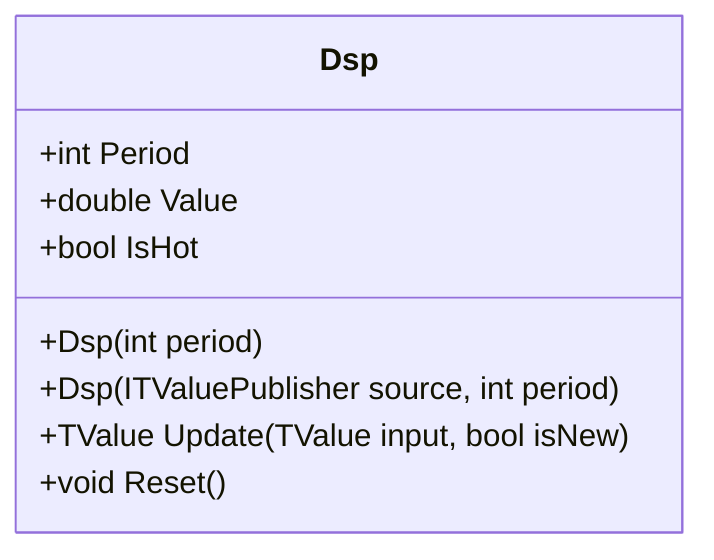

# DSP: Ehlers Detrended Synthetic Price

> "Remove the trend, reveal the cycles."

The Detrended Synthetic Price (DSP) indicator creates a zero-centered oscillator by subtracting a half-cycle EMA from a quarter-cycle EMA. Developed by John Ehlers, this "synthetic" price highlights underlying cyclical movement, identifying momentum shifts when the faster EMA crosses the slower one.

## Historical Context

John Ehlers introduced the DSP as part of his research into cycle analytics for traders. While many indicators (like MACD) use arbitrary periods (12/26), DSP is grounded in cycle theory. Ehlers posits that to effectively isolate a cycle, one should filter data based on the dominant cycle period.

The use of period/4 and period/2 roughly corresponds to extracting the cycle's momentum while cancelling out longer-term trends. This makes DSP particularly effective for cycle-based trading strategies.

## Architecture & Physics

DSP utilizes a dual EMA architecture, calibrated to specific fractions of the cycle period.

### 1. Component Periods

$$
P_{fast} = \max(2, \text{round}(P / 4))
$$

$$
P_{slow} = \max(3, \text{round}(P / 2))
$$

### 2. Alpha Coefficients

$$
\alpha_{fast} = \frac{2}{P_{fast} + 1}
$$

$$
\alpha_{slow} = \frac{2}{P_{slow} + 1}
$$

### 3. EMA Updates (with Bias Correction)

$$
EMA_{raw} = \alpha \cdot Price + (1 - \alpha) \cdot EMA_{raw\_prev}
$$

$$
EMA_{corrected} = \frac{EMA_{raw}}{1 - (1-\alpha)^n}
$$

### 4. DSP Calculation

$$
DSP = EMA_{fast} - EMA_{slow}
$$

## Performance Profile

### Operation Count (Streaming Mode, per Bar)

| Operation | Count | Cost (cycles) | Subtotal |
| :--- | :---: | :---: | :---: |
| FMA (EMA updates) | 2 | 4 | 8 |
| MUL (decay factors) | 2 | 3 | 6 |
| DIV (bias correction) | 2 | 15 | 30 |
| SUB (DSP = fast - slow) | 1 | 1 | 1 |
| **Total** | **7** | — | **~45 cycles** |

### Complexity Analysis

- **Streaming:** O(1) per bar—fixed calculation depth
- **Memory:** O(1)—only EMA state variables
- **Warmup:** ~2 × slow period for convergence

## Validation

| Library | Status | Notes |
| :--- | :---: | :--- |
| TA-Lib | N/A | Not standard |
| Skender | N/A | Not standard |
| PineScript | ✅ | Matches Ehlers' reference logic |

## Usage & Pitfalls

- **Zero crossing** indicates cycle phase change—above zero is bullish, below zero is bearish
- **Period should match market cycle**—if market cycle is 20 bars, use period 20 not 40
- **Not normalized**—amplitude reflects absolute price difference, varies by asset
- **Whipsaws** occur in ranging markets with cycles shorter than the setting
- **Divergence** (higher price highs with lower DSP highs) suggests cycle energy loss
- **Use FusedMultiplyAdd** for optimal precision in EMA recursion

## API



### Class: `Dsp`

| Parameter | Type | Default | Range | Description |
| :--- | :--- | :--- | :--- | :--- |
| `period` | `int` | `40` | `≥4` | Dominant cycle period |

### Properties

- `Value` (`double`): The current DSP value (oscillates around 0)
- `IsHot` (`bool`): Returns `true` when warmup is complete

### Methods

- `Update(TValue input, bool isNew)`: Updates the indicator with a new data point

## C# Example

```csharp
using QuanTAlib;

// Create DSP for a 40-bar cycle
var dsp = new Dsp(period: 40);

// Update with streaming data
foreach (var bar in quotes)
{
    var result = dsp.Update(new TValue(bar.Date, bar.Close));
    
    if (dsp.IsHot)
    {
        Console.WriteLine($"{bar.Date}: DSP = {result.Value:F4}");
        
        // Cycle phase detection
        if (result.Value > 0)
            Console.WriteLine("  → Bullish cycle phase");
        else
            Console.WriteLine("  → Bearish cycle phase");
    }
}

// Batch calculation
var output = Dsp.Calculate(sourceSeries, period: 40);
```
