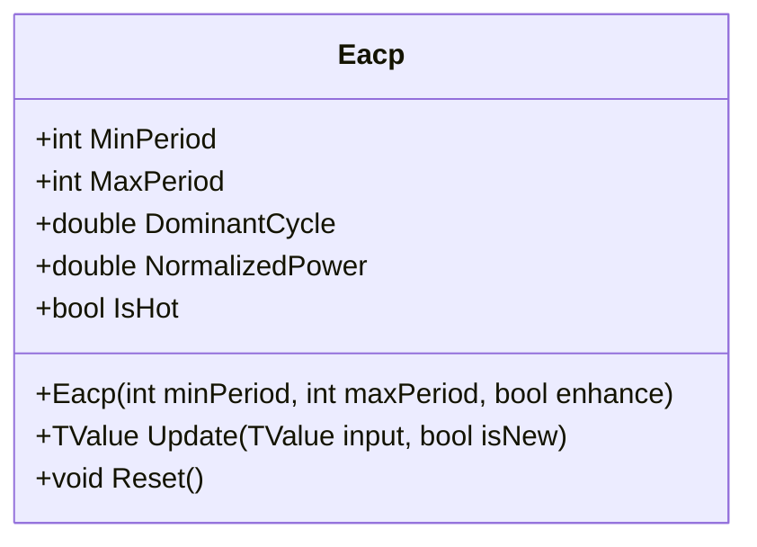

# EACP: Ehlers Autocorrelation Periodogram

> "The autocorrelation periodogram uses the Wiener-Khinchin theorem to transform autocorrelation into spectral density, revealing the dominant cycle hidden within price noise."

The Ehlers Autocorrelation Periodogram (EACP) is an advanced spectral analysis tool that estimates the dominant cycle period of a financial time series. It computes autocorrelation across various lags and transforms this into a power spectrum to identify the most potent frequency, enabling adaptive indicator tuning.

## Historical Context

John Ehlers introduced the Autocorrelation Periodogram to the trading community as a solution for measuring market cycles. He leveraged the **Wiener-Khinchin theorem**, which links the time domain (autocorrelation) to the frequency domain (power spectral density).

This allows traders to detect the current "heartbeat" of the market—the dominant cycle—which can then tune other indicators (like RSI or Stochastic) to the current market speed, creating truly adaptive trading systems.

## Architecture & Physics

The algorithm proceeds in three major stages: Pre-filtering, Correlation, and Spectral Analysis.

### 1. Signal Pre-processing

High-pass filter removes DC component and trends; Super-smoother attenuates aliasing noise.

$$
HP_t = (1 - \alpha_{HP}/2)^2 \cdot (P_t - 2P_{t-1} + P_{t-2}) + 2(1-\alpha_{HP}) \cdot HP_{t-1} - (1-\alpha_{HP})^2 \cdot HP_{t-2}
$$

### 2. Autocorrelation

For every lag $k$ from 0 to MaxPeriod:

$$
R_k = \frac{\sum (x_i - \bar{x})(x_{i-k} - \bar{x})}{\sqrt{\sum (x_i - \bar{x})^2 \sum (x_{i-k} - \bar{x})^2}}
$$

A high correlation at lag 20 implies a 20-bar cycle.

### 3. Dominant Cycle Extraction

Power spectrum via DFT, smoothed with exponential decay:

$$
S_p = 0.2 \cdot P_p^2 + 0.8 \cdot S_{p-1}
$$

Dominant cycle as center of gravity of spectral peaks:

$$
DC = \frac{\sum Power_i \cdot Period_i}{\sum Power_i}
$$

## Performance Profile

### Operation Count (Streaming Mode, per Bar)

| Operation | Count | Cost (cycles) | Subtotal |
| :--- | :---: | :---: | :---: |
| Correlation loop | N×M | 5 | 5NM |
| DFT inner loop | N×N | 8 | 8N² |
| Power smoothing | N | 4 | 4N |
| AGC normalization | N | 3 | 3N |
| **Total** | — | — | **O(N²)** |

### Complexity Analysis

- **Streaming:** O(N × M) where N=period range, M=averaging length
- **Memory:** O(N) for correlation and power arrays
- **Warmup:** ~2 × MaxPeriod bars

**Note:** This is one of the most computationally expensive indicators due to nested loops.

## Validation

| Library | Status | Notes |
| :--- | :---: | :--- |
| TA-Lib | N/A | Not implemented |
| Skender | N/A | Not implemented |
| PineScript | ✅ | Validated against Ehlers' reference code |

## Usage & Pitfalls

- **Primary use is tuning**—provides `period` parameter for other indicators (RSI, Stochastic)
- **Requires substantial warmup** (~2 × MaxPeriod) to stabilize spectrum
- **Struggles with rapid cycle changes**—period jumping from 10 to 40 in few bars
- **Compute on bar close only**—avoid running on every tick for many symbols
- **Enhance mode** (`enhance=true`) sharpens peaks but can cause jumpiness
- **Pure sine wave** of period 20 correctly converges to ~20.0

## API



### Class: `Eacp`

| Parameter | Type | Default | Range | Description |
| :--- | :--- | :--- | :--- | :--- |
| `minPeriod` | `int` | `8` | `≥3` | Minimum period to evaluate |
| `maxPeriod` | `int` | `48` | `>minPeriod` | Maximum period to evaluate |
| `enhance` | `bool` | `true` | — | Apply cubic emphasis to peaks |

### Properties

- `DominantCycle` (`double`): Estimated dominant cycle period in bars
- `NormalizedPower` (`double`): Power at dominant period (0-1)
- `IsHot` (`bool`): Returns `true` when warmup is complete

### Methods

- `Update(TValue input, bool isNew)`: Updates the indicator with a new data point

## C# Example

```csharp
using QuanTAlib;

// Configure for cycles between 8 and 48 bars
var eacp = new Eacp(minPeriod: 8, maxPeriod: 48, enhance: true);

// Update with streaming data
foreach (var bar in quotes)
{
    var result = eacp.Update(new TValue(bar.Date, bar.Close));
    
    if (eacp.IsHot)
    {
        Console.WriteLine($"{bar.Date}: Dominant Cycle = {eacp.DominantCycle:F1} bars");
        
        // Use cycle to tune RSI
        int adaptivePeriod = (int)(eacp.DominantCycle / 2);
        var adaptiveRsi = new Rsi(adaptivePeriod);
    }
}

// Batch calculation
var output = Eacp.Calculate(sourceSeries, minPeriod: 8, maxPeriod: 48);
```
