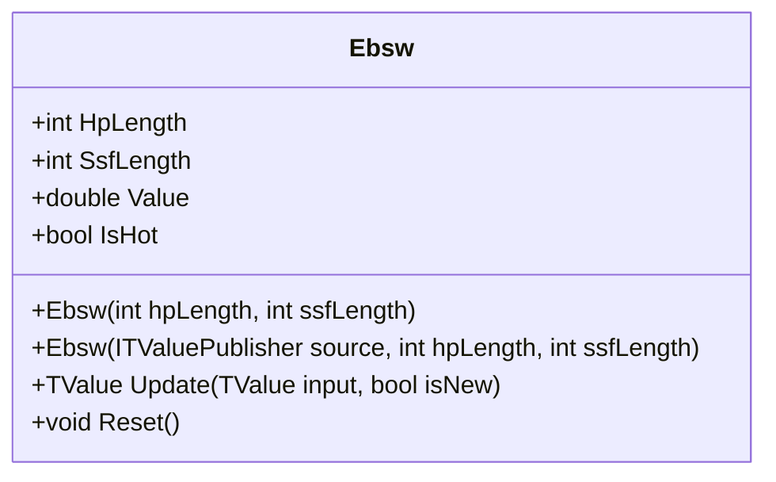

# EBSW: Ehlers Even Better Sinewave

> "When you combine a high-pass filter with a super-smoother, you get cleaner cycles with automatic gain control."

The Even Better Sinewave (EBSW) indicator is a refined cycle oscillator developed by John Ehlers. It combines a high-pass filter (trend removal) with a Super-Smoother filter (noise removal) and Automatic Gain Control to produce an oscillator normalized between -1 and +1 that synthesizes a clean sine wave from price action.

## Historical Context

Ehlers' original "Sinewave" indicator relied on the Hilbert Transform to extract phase. However, he found that direct Hilbert Transforms were often unstable on real market data. The "Even Better" Sinewave simplifies the approach: instead of complex phase math, it uses a tuned bandpass filter (High-Pass + Low-Pass) to isolate the wave, then normalizes it.

This resulted in a more robust tool for identifying turning points in both trending and ranging markets, first published in *Cycle Analytics for Traders*.

## Architecture & Physics

The transformation pipeline consists of four distinct stages.

### 1. High-Pass Filter (Trend Removal)

$$
\alpha_1 = \frac{1 - \sin(2\pi/HP)}{\cos(2\pi/HP)}
$$

$$
HP_t = 0.5 (1 + \alpha_1)(P_t - P_{t-1}) + \alpha_1 \cdot HP_{t-1}
$$

### 2. Super-Smoother Filter (Noise Removal)

$$
\alpha_2 = e^{-\sqrt{2}\pi / SSF}
$$

$$
Filt_t = \frac{1 - 2\alpha_2\cos(\sqrt{2}\pi/SSF) + \alpha_2^2}{2}(HP_t + HP_{t-1}) + 2\alpha_2\cos(\sqrt{2}\pi/SSF) \cdot Filt_{t-1} - \alpha_2^2 \cdot Filt_{t-2}
$$

### 3. Wave & Power Calculation

$$
Wave = \frac{Filt_t + Filt_{t-1} + Filt_{t-2}}{3}
$$

$$
Power = \frac{Filt_t^2 + Filt_{t-1}^2 + Filt_{t-2}^2}{3}
$$

### 4. Normalization (AGC)

$$
EBSW = \frac{Wave}{\sqrt{Power}}
$$

Result is clamped to $\pm 1$.

## Performance Profile

### Operation Count (Streaming Mode, per Bar)

| Operation | Count | Cost (cycles) | Subtotal |
| :--- | :---: | :---: | :---: |
| FMA (filter updates) | 4 | 4 | 16 |
| MUL (power calc) | 3 | 3 | 9 |
| ADD/SUB | 6 | 1 | 6 |
| DIV | 1 | 15 | 15 |
| SQRT | 1 | 12 | 12 |
| **Total** | **15** | — | **~58 cycles** |

### Complexity Analysis

- **Streaming:** O(1) per bar—fixed cascaded IIR filters
- **Memory:** O(1)—only filter state variables
- **Warmup:** ~hpLength bars for HP filter convergence

## Validation

| Library | Status | Notes |
| :--- | :---: | :--- |
| TA-Lib | N/A | Not standard |
| Skender | N/A | Not standard |
| PineScript | ✅ | Matches `ebsw` script |
| Reference | ✅ | Matches *Cycle Analytics for Traders* logic |

## Usage & Pitfalls

- **Range is -1 to +1**—zero crossings signal cycle phase changes
- **HP Length is critical**—should match expected market cycle (e.g., 40 bars)
- **Too short HP Length** filters out everything as "trend"
- **AGC amplifies noise** in low volatility—verify with price action
- **Strong step moves** cause railing at ±1 for extended periods
- **Buy at valley** (EBSW turning up from -0.8), **sell at peak** (turning down from +0.8)

## API



### Class: `Ebsw`

| Parameter | Type | Default | Range | Description |
| :--- | :--- | :--- | :--- | :--- |
| `hpLength` | `int` | `40` | `≥1, ≠4` | High-pass filter period (detrending) |
| `ssfLength` | `int` | `10` | `≥1` | Super-smoother filter period |

### Properties

- `Value` (`double`): The current EBSW value (bounded -1 to +1)
- `IsHot` (`bool`): Returns `true` when warmup is complete

### Methods

- `Update(TValue input, bool isNew)`: Updates the indicator with a new data point

## C# Example

```csharp
using QuanTAlib;

// Create EBSW for 40-bar cycle with 10-bar smoothing
var ebsw = new Ebsw(hpLength: 40, ssfLength: 10);

// Update with streaming data
foreach (var bar in quotes)
{
    var result = ebsw.Update(new TValue(bar.Date, bar.Close));
    
    if (ebsw.IsHot)
    {
        Console.WriteLine($"{bar.Date}: EBSW = {result.Value:F4}");
        
        // Cycle turning point detection
        if (result.Value < -0.8 && result.Value > ebsw.Previous.Value)
            Console.WriteLine("  → Potential cycle bottom");
        else if (result.Value > 0.8 && result.Value < ebsw.Previous.Value)
            Console.WriteLine("  → Potential cycle top");
    }
}

// Batch calculation
var output = Ebsw.Calculate(sourceSeries, hpLength: 40, ssfLength: 10);
```
