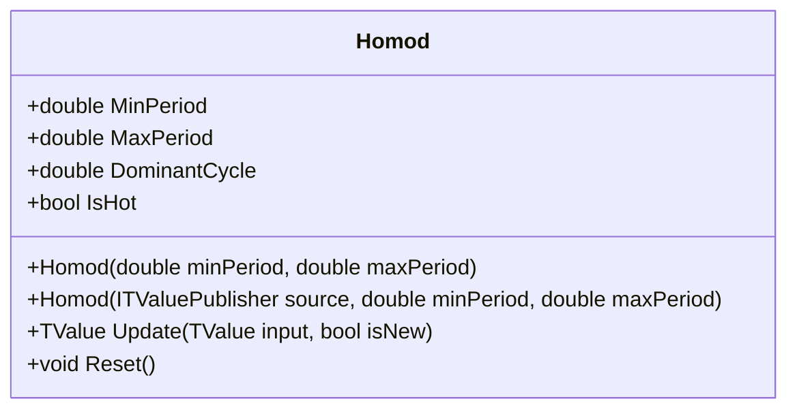

# HOMOD: Ehlers Homodyne Discriminator

> "The homodyne discriminator reveals instantaneous frequency by multiplying a signal with its delayed self — the phase rotation between samples directly encodes the cycle period."

The Homodyne Discriminator (HOMOD) estimates the dominant cycle period of a market using homodyne mixing—multiplying the signal by a delayed version of itself. This technique exposes the angular phase change between bars, allowing calculation of the instantaneous period at every time step.

## Historical Context

In *Rocket Science for Traders* and *Cybernetic Analysis for Stocks and Futures*, John Ehlers introduced signal processing concepts novel to technical analysis. The Homodyne Discriminator was presented as a superior alternative to the Hilbert Transform Discriminator for cycle measurement.

It offers better noise rejection and stability while maintaining reasonable responsiveness, making it practical for real-time trading applications.

## Architecture & Physics

The algorithm is a complex pipeline of filters and transformations designed to isolate the analytic signal.

### 1. Pre-Processing (4-Bar WMA)

$$
Smooth = \frac{4P_t + 3P_{t-1} + 2P_{t-2} + P_{t-3}}{10}
$$

### 2. Analytic Signal Generation

In-Phase (I) and Quadrature (Q) components via Hilbert Transform:

$$
I_2 = I_1 - JQ
$$

$$
Q_2 = Q_1 + JI
$$

Smoothed with EMA (α = 0.2).

### 3. Homodyne Mixing

Multiplying complex signal $z_t$ by its conjugate delayed by one bar:

$$
Real = (I_2 \cdot I_{2,prev}) + (Q_2 \cdot Q_{2,prev})
$$

$$
Imag = (I_2 \cdot Q_{2,prev}) - (Q_2 \cdot I_{2,prev})
$$

### 4. Period Extraction

$$
\theta = \operatorname{atan2}(Imag, Real)
$$

$$
Period = \frac{2\pi}{\theta}
$$

Clamped to [MinPeriod, MaxPeriod] and smoothed.

## Performance Profile

### Operation Count (Streaming Mode, per Bar)

| Operation | Count | Cost (cycles) | Subtotal |
| :--- | :---: | :---: | :---: |
| MUL (Hilbert taps) | 14 | 3 | 42 |
| MUL (homodyne mix) | 4 | 3 | 12 |
| ADD/SUB | 20 | 1 | 20 |
| ATAN2 | 1 | 25 | 25 |
| DIV | 2 | 15 | 30 |
| **Total** | **41** | — | **~129 cycles** |

### Complexity Analysis

- **Streaming:** O(1) per bar—fixed filter depth
- **Memory:** O(1)—state struct with history variables
- **Warmup:** ~2 × MaxPeriod bars for convergence

## Validation

| Library | Status | Notes |
| :--- | :---: | :--- |
| TA-Lib | N/A | Not implemented |
| Skender | N/A | Not implemented |
| PineScript | ✅ | Matches Ehlers' reference code |

## Usage & Pitfalls

- **Output is period in bars**—not an oscillator like RSI, but a measurement like ATR
- **Long settling time** (~2 × MaxPeriod)—early values unreliable
- **Trending markets** make "cycle" ill-defined—period drifts to MaxPeriod
- **Check for cycling** (ADX or trend filter) before trusting period values
- **High noise causes jitter**—pre-smooth extremely noisy data
- **Use for adaptive tuning**: `Stochastic(length: homod.DominantCycle)`

## API



### Class: `Homod`

| Parameter | Type | Default | Range | Description |
| :--- | :--- | :--- | :--- | :--- |
| `minPeriod` | `double` | `6.0` | `>0` | Minimum period to detect |
| `maxPeriod` | `double` | `50.0` | `>minPeriod` | Maximum period to detect |

### Properties

- `DominantCycle` (`double`): Current dominant cycle period in bars
- `IsHot` (`bool`): Returns `true` when warmup is complete

### Methods

- `Update(TValue input, bool isNew)`: Updates the indicator with a new data point

## C# Example

```csharp
using QuanTAlib;

// Configure for cycles between 6 and 50 bars
var homod = new Homod(minPeriod: 6, maxPeriod: 50);

// Update with streaming data
foreach (var bar in quotes)
{
    var result = homod.Update(new TValue(bar.Date, bar.Close));
    
    if (homod.IsHot)
    {
        double period = homod.DominantCycle;
        Console.WriteLine($"{bar.Date}: Dominant Cycle = {period:F1} bars");
        
        // Use cycle to tune Stochastic
        int adaptiveLength = (int)Math.Round(period);
        var adaptiveStoch = new Stochastic(adaptiveLength);
    }
}

// Batch calculation
var output = Homod.Calculate(sourceSeries, minPeriod: 6, maxPeriod: 50);
```
