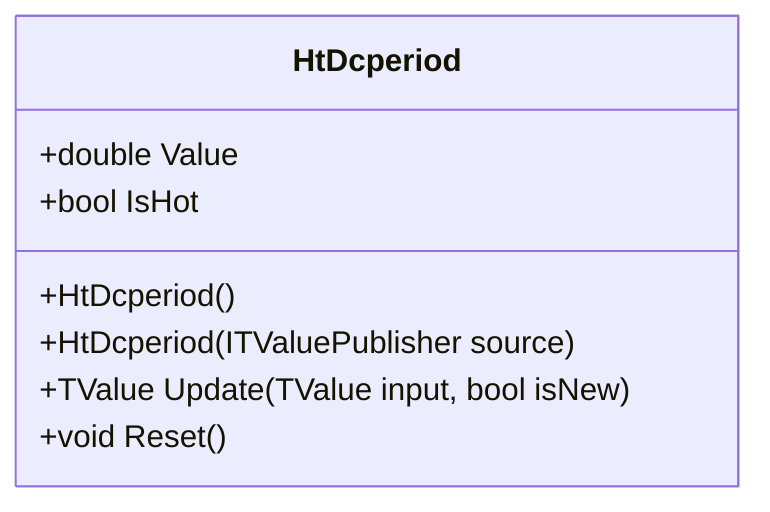

# HT_DCPERIOD: Ehlers Hilbert Transform Dominant Cycle Period

> "Knowing the cycle period is the master key—it calibrates other indicators to the market's current rhythm."

HT_DCPERIOD estimates the period of the dominant market cycle using Ehlers' Hilbert Transform cascade. The indicator measures the instantaneous period based on the rate of change of the phase angle, providing a variable period length (typically 6-50 bars) that dynamically tunes other indicators.

## Historical Context

John Ehlers introduced the Hilbert Transform Dominant Cycle Period in *Rocket Science for Traders* (2001). The goal was to overcome the limitations of fixed-period indicators by measuring the actual cycle length present in the data.

TA-Lib implements HT_DCPERIOD using Ehlers' specific coefficients (A = 0.0962, B = 0.5769) and smoothing algorithms. QuanTAlib matches the TA-Lib implementation within floating-point tolerance.

## Architecture & Physics

The algorithm follows a complex pipeline to extract cycle period from phase information.

### 1. WMA Price Smoothing

$$
SmoothPrice_t = \frac{4P_t + 3P_{t-1} + 2P_{t-2} + P_{t-3}}{10}
$$

### 2. Hilbert Transform Components

The Hilbert Transform generates In-Phase (I) and Quadrature (Q) components:

- **Detrender**: Removes DC component and trend
- **Q1**: Quadrature component of detrender
- **I1**: In-Phase component (delayed detrender)
- **jI, jQ**: Hilbert transforms of I1 and Q1

### 3. Phasor Components

$$
I2_t = I1_t - jQ_t
$$

$$
Q2_t = Q1_t + jI_t
$$

Smoothed with EMA (α = 0.2).

### 4. Period Extraction

$$
Period_t = \frac{2\pi}{\arctan(Im_t / Re_t)}
$$

Clamped to [6, 50] and smoothed with EMA (α = 0.33).

## Performance Profile

### Operation Count (Streaming Mode, per Bar)

| Operation | Count | Cost (cycles) | Subtotal |
| :--- | :---: | :---: | :---: |
| MUL (Hilbert taps) | 28 | 3 | 84 |
| MUL (homodyne mix) | 4 | 3 | 12 |
| ADD/SUB | 40 | 1 | 40 |
| ATAN2 | 1 | 25 | 25 |
| DIV | 3 | 15 | 45 |
| **Total** | **76** | — | **~206 cycles** |

### Complexity Analysis

- **Streaming:** O(1) per bar—fixed Hilbert cascade
- **Memory:** ~1.2 KB per instance (circular buffers + state)
- **Warmup:** 32 bars (TA-Lib lookback)

## Validation

| Library | Status | Notes |
| :--- | :---: | :--- |
| TA-Lib | ✅ | Matches `TALib.Functions.HtDcPeriod()` |
| Skender | N/A | Not implemented |
| PineScript | ✅ | Matches `ht_dcperiod.pine` reference |

## Usage & Pitfalls

- **Output is period in bars** (6-50 range)—not an oscillator
- **32-bar warmup required**—ignore early values
- **Trending markets** cause period to drift to upper limit (50)
- **High noise** causes jitter—internal smoothing helps
- **Use for adaptive tuning**: `RSI(period: htDcperiod.Value / 2)`
- **Stable periods** indicate rhythmic market suitable for oscillators

## API



### Class: `HtDcperiod`

| Parameter | Type | Default | Range | Description |
| :--- | :--- | :--- | :--- | :--- |
| (none) | — | — | — | No constructor parameters |

### Properties

- `Value` (`double`): Dominant cycle period in bars (6-50)
- `IsHot` (`bool`): Returns `true` when warmup (32 bars) is complete

### Methods

- `Update(TValue input, bool isNew)`: Updates the indicator with a new data point

## C# Example

```csharp
using QuanTAlib;

// Create HT_DCPERIOD
var htPeriod = new HtDcperiod();

// Update with streaming data
foreach (var bar in quotes)
{
    var result = htPeriod.Update(new TValue(bar.Date, bar.Close));
    
    if (htPeriod.IsHot)
    {
        double period = result.Value;
        Console.WriteLine($"{bar.Date}: Dominant Cycle = {period:F2} bars");
        
        // Use cycle to tune RSI adaptively
        int adaptivePeriod = (int)(period / 2);
        var adaptiveRsi = new Rsi(adaptivePeriod);
    }
}

// Batch calculation
var output = HtDcperiod.Calculate(sourceSeries);
```
