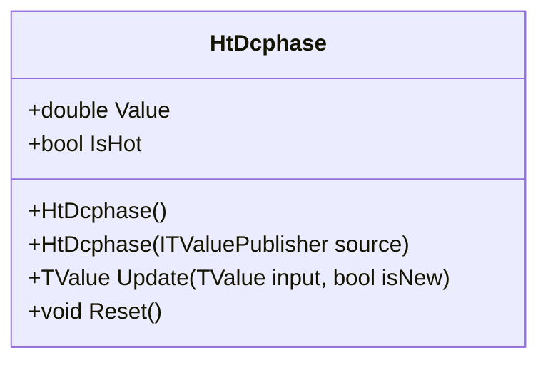

# HT_DCPHASE: Ehlers Hilbert Transform Dominant Cycle Phase

> "The phase advances through a full 360-degree cycle as the dominant cycle completes; rapid phase changes indicate turning points."

HT_DCPHASE measures the instantaneous phase angle of the dominant market cycle using Ehlers' Hilbert Transform cascade. The output ranges from -45° to 315°, with phase discontinuities marking cycle completions. This indicator times entries/exits based on cycle position.

## Historical Context

John Ehlers developed the Hilbert Transform cycle indicators in *Rocket Science for Traders* (2001). TA-Lib implements HT_DCPHASE directly from Ehlers' coefficients (A = 0.0962, B = 0.5769) with a 4-bar WMA prefilter and DC phase extraction from smoothed price history.

QuanTAlib matches TA-Lib HT_DCPHASE output within floating-point tolerance.

## Architecture & Physics

The algorithm extracts phase from the complex analytic signal.

### 1. WMA Price Smoothing

$$
SmoothPrice_t = \frac{4P_t + 3P_{t-1} + 2P_{t-2} + P_{t-3}}{10}
$$

### 2. Hilbert Transform Cascade

- **Detrender (D)**: Removes DC component
- **Quadrature (Q1)**: 90° phase-shifted version of D
- **In-Phase (I1)**: D delayed by 3 bars
- **jI, jQ**: Hilbert transforms of I1, Q1

### 3. Phasor Components

$$
I2_t = I1_t - jQ_t
$$

$$
Q2_t = Q1_t + jI_t
$$

Smoothed with EMA (α = 0.2).

### 4. DC Phase Calculation

Via DFT-like accumulation over smoothed period:

$$
DCPhase = \arctan\left(\frac{RealPart}{ImagPart}\right) \cdot \frac{180°}{\pi}
$$

Wrapped to range [-45°, 315°].

## Performance Profile

### Operation Count (Streaming Mode, per Bar)

| Operation | Count | Cost (cycles) | Subtotal |
| :--- | :---: | :---: | :---: |
| MUL (Hilbert + DFT) | 45 | 3 | 135 |
| SIN/COS (DFT loop) | 100 | 15 | 1500 |
| ADD/SUB | 60 | 1 | 60 |
| ATAN2 | 2 | 25 | 50 |
| **Total** | **~207** | — | **~1745 cycles** |

### Complexity Analysis

- **Streaming:** O(P) per bar where P is smoothed period (~6-50)
- **Memory:** ~1.2 KB per instance
- **Warmup:** 63 bars (TA-Lib lookback)

## Validation

| Library | Status | Notes |
| :--- | :---: | :--- |
| TA-Lib | ✅ | Matches `TALib.Functions.HtDcPhase()` |
| Skender | N/A | Not implemented |
| PineScript | ✅ | Matches `ht_dcphase.pine` |

## Usage & Pitfalls

- **Phase range is -45° to 315°**—discontinuity at wrap is expected
- **63-bar warmup required**—ignore early values
- **Phase interpretation**:
  - -45° to 45°: Bottom / Start of uptrend
  - 45° to 135°: Rising / Mid-uptrend
  - 135° to 225°: Top / Start of downtrend
  - 225° to 315°: Falling / Mid-downtrend
- **Do not smooth across discontinuity**—315° to -45° jump is cycle completion
- **Strong trends** cause phase to advance slowly or get stuck
- **Rapid phase change** often precedes price reversals

## API



### Class: `HtDcphase`

| Parameter | Type | Default | Range | Description |
| :--- | :--- | :--- | :--- | :--- |
| (none) | — | — | — | No constructor parameters |

### Properties

- `Value` (`double`): DC phase in degrees (-45° to 315°)
- `IsHot` (`bool`): Returns `true` when warmup (63 bars) is complete

### Methods

- `Update(TValue input, bool isNew)`: Updates the indicator with a new data point

## C# Example

```csharp
using QuanTAlib;

// Create HT_DCPHASE
var htPhase = new HtDcphase();

// Update with streaming data
foreach (var bar in quotes)
{
    var result = htPhase.Update(new TValue(bar.Date, bar.Close));
    
    if (htPhase.IsHot)
    {
        double phase = result.Value;
        Console.WriteLine($"{bar.Date}: Phase = {phase:F1}°");
        
        // Cycle position detection
        if (phase >= -45 && phase < 45)
            Console.WriteLine("  → Cycle bottom zone");
        else if (phase >= 45 && phase < 135)
            Console.WriteLine("  → Rising phase");
        else if (phase >= 135 && phase < 225)
            Console.WriteLine("  → Cycle top zone");
        else
            Console.WriteLine("  → Falling phase");
    }
}

// Batch calculation
var output = HtDcphase.Calculate(sourceSeries);
```
