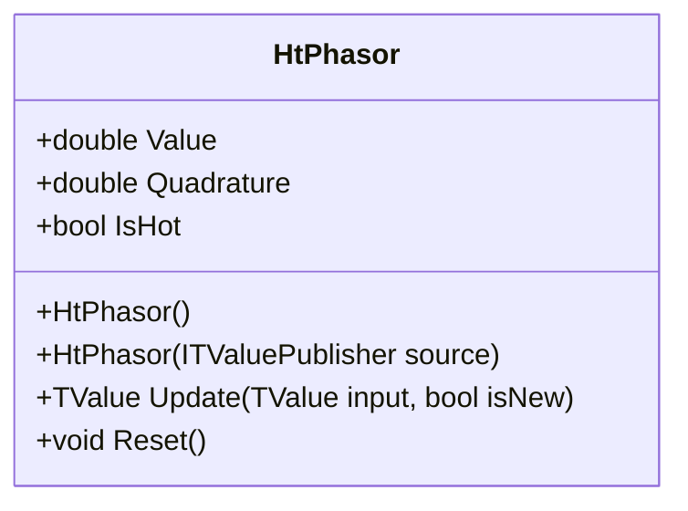

# HT_PHASOR: Ehlers Hilbert Transform Phasor Components

> "Phasors let us measure a cycle's position and strength; trading becomes geometry over time."

HT_PHASOR decomposes the price signal into two orthogonal components: **InPhase** (I) and **Quadrature** (Q) using the Hilbert Transform. These components form a complex phasor (Z = I + jQ) that describes the instantaneous amplitude and phase of the market cycle.

## Historical Context

John Ehlers introduced the decomposition of market data into phasor components in *Rocket Science for Traders* (2001). This decomposition is fundamental to his entire suite of cycle indicators (SineWave, Homodyne, etc.).

TA-Lib implements HT_PHASOR to expose these intermediate components directly for advanced analysis. QuanTAlib matches the TA-Lib implementation.

## Architecture & Physics

The calculation pipeline extracts the analytic signal's real and imaginary components.

### 1. WMA Smoothing

$$
SmoothPrice_t = \frac{4P_t + 3P_{t-1} + 2P_{t-2} + P_{t-3}}{10}
$$

### 2. Hilbert Transform

Applied to smoothed price with adaptive bandwidth to generate fundamental components.

### 3. Phasor Components

$$
I2_t = I1_t - jQ_t
$$

$$
Q2_t = Q1_t + jI_t
$$

Where:

- **InPhase (I)**: Smoothed I2—cycle signal aligned with price
- **Quadrature (Q)**: Smoothed Q2—rate of change (velocity) of cycle

*Note: InPhase output is delayed by 3 bars to align with Quadrature's effective lag.*

### 4. Phase Relationship

- Q leads I by 90°
- When I peaks, Q crosses zero (downward)
- When I crosses zero (upward), Q peaks

## Performance Profile

### Operation Count (Streaming Mode, per Bar)

| Operation | Count | Cost (cycles) | Subtotal |
| :--- | :---: | :---: | :---: |
| MUL (Hilbert taps) | 28 | 3 | 84 |
| MUL (phasor calc) | 8 | 3 | 24 |
| ADD/SUB | 35 | 1 | 35 |
| EMA smoothing | 4 | 4 | 16 |
| **Total** | **75** | — | **~159 cycles** |

### Complexity Analysis

- **Streaming:** O(1) per bar—fixed Hilbert cascade
- **Memory:** ~1.2 KB per instance (circular buffers)
- **Warmup:** 32 bars (TA-Lib lookback)

## Validation

| Library | Status | Notes |
| :--- | :---: | :--- |
| TA-Lib | ✅ | Matches `TALib.Functions.HtPhasor()` |
| Skender | N/A | Not implemented |
| PineScript | ✅ | Matches `phasor.pine` |

## Usage & Pitfalls

- **Dual output**—InPhase (Value) and Quadrature (property)
- **32-bar warmup required**—ignore early values
- **Capture Quadrature immediately after Update()**—property updated on each call
- **Trending markets** break orthogonality—use HT_TRENDMODE to filter
- **Phasor crossover**:
  - Buy: Q crosses I from below (anticipates cycle trough)
  - Sell: Q crosses I from above (anticipates cycle peak)
- **For sine input** sin(ωt): InPhase ≈ sin(ωt), Quadrature ≈ cos(ωt)

## API



### Class: `HtPhasor`

| Parameter | Type | Default | Range | Description |
| :--- | :--- | :--- | :--- | :--- |
| (none) | — | — | — | No constructor parameters |

### Properties

- `Value` (`double`): InPhase component of phasor
- `Quadrature` (`double`): Quadrature component (90° shifted)
- `IsHot` (`bool`): Returns `true` when warmup (32 bars) is complete

### Methods

- `Update(TValue input, bool isNew)`: Updates the indicator with a new data point

## C# Example

```csharp
using QuanTAlib;

// Create HT_PHASOR
var htPhasor = new HtPhasor();
double prevInPhase = 0, prevQuadrature = 0;

// Update with streaming data
foreach (var bar in quotes)
{
    var result = htPhasor.Update(new TValue(bar.Date, bar.Close));
    double inPhase = result.Value;
    double quadrature = htPhasor.Quadrature;  // Capture immediately!
    
    if (htPhasor.IsHot)
    {
        Console.WriteLine($"{bar.Date}: I = {inPhase:F4}, Q = {quadrature:F4}");
        
        // Phasor crossover detection
        if (inPhase > quadrature && prevInPhase <= prevQuadrature)
            Console.WriteLine("  → Bullish crossover (anticipate trough)");
        else if (inPhase < quadrature && prevInPhase >= prevQuadrature)
            Console.WriteLine("  → Bearish crossover (anticipate peak)");
    }
    
    prevInPhase = inPhase;
    prevQuadrature = quadrature;
}

// Batch calculation
var output = HtPhasor.Calculate(sourceSeries);
```
