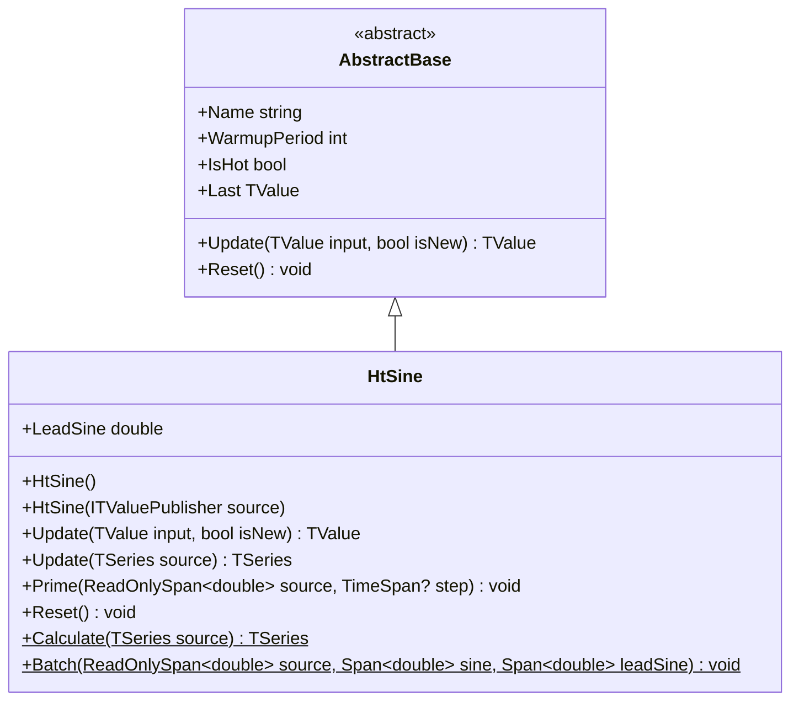

# HT_SINE: Ehlers Hilbert Transform SineWave

> "The Hilbert Transform gives us the phase of the dominant cycle—knowing when to buy and sell becomes a matter of trigonometry."

The Hilbert Transform SineWave extracts the dominant market cycle phase and outputs both sine and lead sine (45° phase advance) for cycle timing. The crossover of these two waves identifies turning points in ranging markets up to 1/8th of a cycle early.

## Historical Context

John Ehlers introduced the Hilbert Transform SineWave in *Rocket Science for Traders* (2001) as part of his comprehensive signal processing framework for financial markets. The indicator addresses a fundamental limitation of traditional oscillators—they respond to price amplitude rather than cycle phase.

The HT_SINE builds upon David Hilbert's 1905 mathematical transform, which creates a 90° phase-shifted (quadrature) version of a signal. In signal processing, this enables instantaneous frequency and phase extraction. Ehlers recognized that market cycles, though noisy and variable, could be analyzed using these same techniques.

Unlike momentum oscillators that lag price action, the HT_SINE theoretically provides zero-lag cycle detection by measuring phase directly. This makes it particularly valuable in ranging markets where cycles are well-defined. The dual output (Sine and LeadSine) creates a built-in early warning system for cycle reversals.

## Architecture & Physics

The algorithm implements a discrete approximation of the Hilbert Transform optimized for financial time series with adaptive period estimation.

**Step 1: WMA Smoothing**

A 4-bar weighted moving average removes Nyquist-frequency noise:

$$\bar{P}_t = \frac{4P_t + 3P_{t-1} + 2P_{t-2} + P_{t-3}}{10}$$

**Step 2: Hilbert Transform FIR**

The discrete Hilbert approximation generates quadrature components:

$$\text{Detrender}_t = 0.0962\bar{P}_t + 0.5769\bar{P}_{t-2} - 0.5769\bar{P}_{t-4} - 0.0962\bar{P}_{t-6}$$

**Step 3: I/Q Component Smoothing**

In-phase and quadrature components undergo exponential smoothing:

$$Q_t = 0.2(Q1_t + JI_t) + 0.8 Q_{t-1}$$
$$I_t = 0.2(I1_t - JQ_t) + 0.8 I_{t-1}$$

**Step 4: Homodyne Discriminator**

Period estimation uses phase rate of change:

$$Re_t = 0.2(I_t \cdot I_{t-1} + Q_t \cdot Q_{t-1}) + 0.8 Re_{t-1}$$
$$Im_t = 0.2(I_t \cdot Q_{t-1} - Q_t \cdot I_{t-1}) + 0.8 Im_{t-1}$$
$$\text{Period}_t = \frac{2\pi}{\arctan(Im_t / Re_t)}$$

**Step 5: DC Phase Calculation**

The dominant cycle phase sums weighted contributions:

$$\phi_t = \arctan\left(\frac{\sum_{i=0}^{P-1} \sin(2\pi i/P) \cdot \bar{P}_{t-i}}{\sum_{i=0}^{P-1} \cos(2\pi i/P) \cdot \bar{P}_{t-i}}\right)$$

**Step 6: Output Generation**

$$\text{Sine}_t = \sin(\phi_t)$$
$$\text{LeadSine}_t = \sin(\phi_t + 45°)$$

## Performance Profile

### Operation Count (Streaming Mode, per Bar)

| Operation | Count | Cost (cycles) | Subtotal |
|-----------|------:|------:|------:|
| FMA | 12 | 5 | 60 |
| MUL | 18 | 4 | 72 |
| ADD/SUB | 25 | 1 | 25 |
| DIV | 2 | 15 | 30 |
| sin/cos | 2P | 40 | ~80P |
| atan | 2 | 50 | 100 |
| Buffer access | 15 | 3 | 45 |
| **Total** | — | — | **~370** |

### Complexity Analysis

- **Time:** $O(P)$ per bar where P is smoothed period (typically 6-50)
- **Space:** $O(1)$ — fixed-size circular buffers (50 + 44 + 64 elements)
- **Latency:** 63 bars warmup (31 + 32 for TA-Lib compatibility)

## Validation

| Library | Status | Notes |
|---------|--------|-------|
| TA-Lib | ✅ Match | `TA_HT_SINE()` reference implementation |
| PineScript | ✅ Match | Custom `ht_sine.pine` validation script |
| Quantower | ✅ Match | `HtSine.Quantower.Tests.cs` adapter tests |

## Usage & Pitfalls

- **Trend Failure:** Crossover signals whipsaw in strong trends; parallel "snake" pattern indicates trending mode
- **Warmup Period:** Requires 63 bars before outputs stabilize
- **Phase Lag:** Despite "zero-lag" theory, smoothing introduces 4-6 bars practical lag
- **Range-Only:** Most effective in sideways/ranging markets with clear cyclical behavior
- **LeadSine First:** LeadSine turns before Sine at reversals—watch for divergence

## API



### Class: `HtSine`

Hilbert Transform SineWave indicator with dual output.

### Properties

| Name | Type | Description |
|------|------|-------------|
| `LeadSine` | `double` | Current LeadSine value (45° phase lead) |
| `IsHot` | `bool` | True after 63 bars warmup |
| `Last` | `TValue` | Most recent Sine output |

### Methods

| Name | Returns | Description |
|------|---------|-------------|
| `Update(TValue, bool)` | `TValue` | Updates state with new price value |
| `Batch(source, sine, leadSine)` | `void` | Processes span with dual output spans |
| `Calculate(TSeries)` | `TSeries` | Static factory returning Sine series |

## C# Example

```csharp
using QuanTAlib;

// Create HT_SINE indicator
var htSine = new HtSine();

// Process price data
foreach (var bar in bars)
{
    var result = htSine.Update(new TValue(bar.Time, bar.Close));
    
    if (htSine.IsHot)
    {
        double sine = result.Value;
        double leadSine = htSine.LeadSine;
        
        // Crossover detection
        // Buy: Sine crosses above LeadSine
        // Sell: Sine crosses below LeadSine
        Console.WriteLine($"Sine: {sine:F4}, LeadSine: {leadSine:F4}");
    }
}

// Batch processing with dual outputs
Span<double> sineOut = stackalloc double[prices.Length];
Span<double> leadOut = stackalloc double[prices.Length];
HtSine.Batch(prices, sineOut, leadOut);
```
