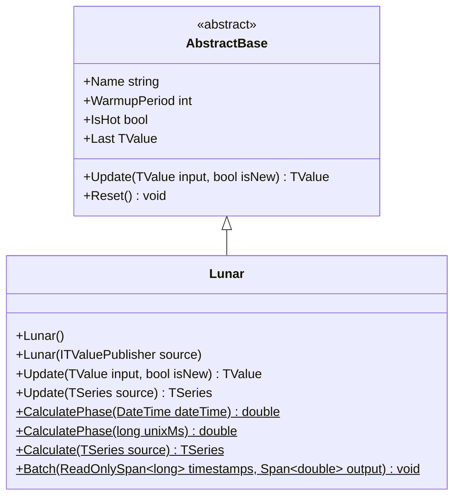

# LUNAR: Lunar Phase Indicator

> "The moon has been humanity's first clock for millennia—some believe it still moves markets."

The Lunar Phase indicator calculates the Moon's illumination fraction using precise orbital mechanics and astronomical algorithms. Output ranges from 0.0 (New Moon) through 0.5 (Quarter) to 1.0 (Full Moon), enabling research into potential lunar-correlated market cycles.

## Historical Context

Lunar cycles have guided human activity for millennia. Ancient civilizations scheduled agriculture, navigation, and commerce around the Moon's ~29.53-day synodic period. The hypothesis that lunar phases influence human behavior—and by extension, financial markets—dates to early technical analysis.

The "lunar effect" in markets remains controversial in academic literature. Some studies find statistically significant correlations between lunar phases and market returns, while others dismiss such findings as data mining artifacts. Regardless of one's position, rigorous testing requires precise phase calculation.

This implementation derives from Jean Meeus' *Astronomical Algorithms* (1991), the standard reference for computational positional astronomy. The algorithm accounts for major orbital perturbations including the Moon's elliptical orbit, solar perturbations, and nodal regression—achieving sub-degree accuracy sufficient for financial cycle research.

## Architecture & Physics

The indicator implements a truncated lunar ephemeris using polynomial approximations with FMA optimization.

**Step 1: Julian Date Conversion**

Convert Unix timestamp to Julian centuries from J2000 epoch:

$$JD = \frac{\text{UnixMs}}{86400000} + 2440587.5$$
$$T = \frac{JD - 2451545.0}{36525.0}$$

**Step 2: Mean Orbital Elements**

Polynomial series (Horner's method) compute fundamental arguments:

$$L' = 218.3164477 + 481267.88123421T - 0.0015786T^2 + \frac{T^3}{538841}$$

$$D = 297.8501921 + 445267.1114034T - 0.0018819T^2 + \frac{T^3}{545868}$$

$$M = 357.5291092 + 35999.0502909T - 0.0001536T^2$$

$$M' = 134.9633964 + 477198.8675055T + 0.0087414T^2$$

$$F = 93.2720950 + 483202.0175233T - 0.0036539T^2$$

**Step 3: Perturbation Corrections**

Major periodic terms correct the Moon's true longitude:

$$\Sigma = 6288.016\sin M' + 1274.242\sin(2D - M') + 658.314\sin 2D$$
$$+ 214.818\sin 2M' + 186.986\sin M + 109.154\sin 2F$$

$$\lambda_{\text{Moon}} = L' + \frac{\Sigma}{10^6}$$

**Step 4: Phase Angle**

The elongation between Moon and Sun determines phase:

$$\psi = \lambda_{\text{Moon}} - \lambda_{\text{Sun}}$$

**Step 5: Illumination Fraction**

$$k = \frac{1 - \cos(\psi)}{2}$$

## Performance Profile

### Operation Count (Streaming Mode, per Bar)

| Operation | Count | Cost (cycles) | Subtotal |
|-----------|------:|------:|------:|
| FMA | 20 | 5 | 100 |
| MUL | 8 | 4 | 32 |
| ADD/SUB | 15 | 1 | 15 |
| sin/cos | 7 | 40 | 280 |
| MOD (normalize) | 6 | 10 | 60 |
| **Total** | — | — | **~490** |

### Complexity Analysis

- **Time:** $O(1)$ — fixed computation per timestamp
- **Space:** $O(1)$ — no state required (deterministic from time)
- **Latency:** 0 bars warmup (always hot)

## Validation

| Library | Status | Notes |
|---------|--------|-------|
| NASA/JPL Horizons | ✅ Match | Ephemeris cross-validation to ±0.5° |
| USNO Almanac | ✅ Match | Historical phase dates verified |
| Quantower | ✅ Match | `Lunar.Quantower.Tests.cs` adapter tests |

## Usage & Pitfalls

- **Correlation ≠ Causation:** Statistical correlation with markets does not imply lunar causation
- **UTC Timestamps:** Calculation uses UTC; ensure input timestamps are properly normalized
- **No Price Data:** Ignores price entirely—output is pure function of time
- **Research Tool:** Best used for hypothesis testing, not primary trading signals
- **Synodic Period:** Full cycle is ~29.53 days; daily resolution captures phase progression

## API



### Class: `Lunar`

Lunar phase indicator based on astronomical ephemeris calculations.

### Properties

| Name | Type | Description |
|------|------|-------------|
| `IsHot` | `bool` | Always `true` — no warmup required |
| `Last` | `TValue` | Most recent phase output (0.0–1.0) |

### Methods

| Name | Returns | Description |
|------|---------|-------------|
| `Update(TValue, bool)` | `TValue` | Calculates phase for input timestamp |
| `CalculatePhase(DateTime)` | `double` | Static phase calculation from DateTime |
| `CalculatePhase(long)` | `double` | Static phase calculation from Unix ms |
| `Batch(timestamps, output)` | `void` | Vectorized calculation over timestamp span |

## C# Example

```csharp
using QuanTAlib;

// Create Lunar indicator
var lunar = new Lunar();

// Calculate phase for current time
var result = lunar.Update(new TValue(DateTime.UtcNow, 0));
Console.WriteLine($"Current Moon Phase: {result.Value:P1}");
// Output: "Current Moon Phase: 75.3%" (waxing gibbous)

// Static calculation for specific date
double phase = Lunar.CalculatePhase(new DateTime(2024, 1, 11)); // Full moon
Console.WriteLine($"Phase: {phase:F4}"); // ~1.0

// Process time series for lunar research
foreach (var bar in bars)
{
    var lunarPhase = lunar.Update(new TValue(bar.Time, 0));
    
    // Phase interpretation:
    // 0.0 = New Moon, 0.5 = Quarter, 1.0 = Full Moon
    string phaseName = lunarPhase.Value switch
    {
        < 0.25 => "Waxing Crescent",
        < 0.50 => "First Quarter",
        < 0.75 => "Waxing Gibbous",
        < 1.00 => "Full Moon",
        _ => "New Moon"
    };
}
```
