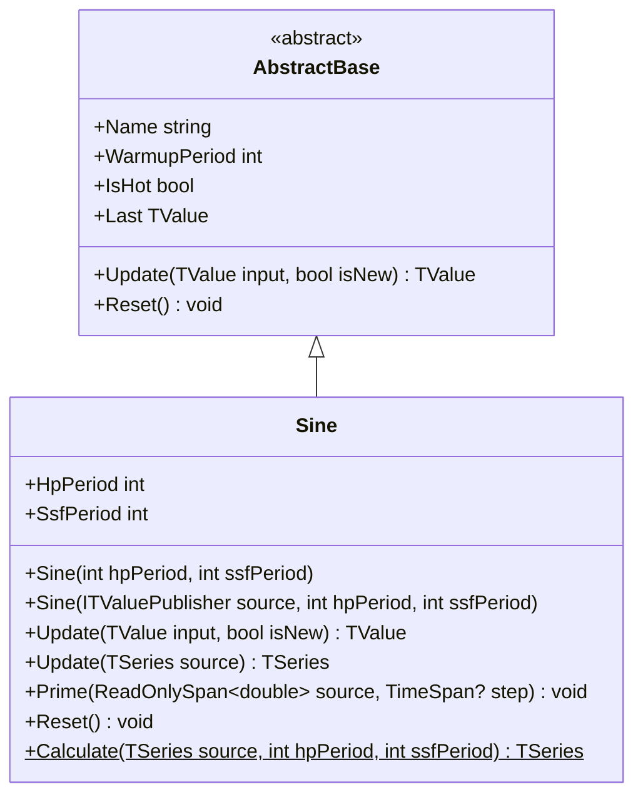

# SINE: Ehlers Sine Wave

> "The sine wave extraction reveals what moving averages obscure—the pure rhythmic heartbeat of price action."

The Ehlers Sine Wave extracts the dominant cycle from price data using cascaded signal processing: high-pass detrending, super-smoother noise reduction, and Hilbert Transform quadrature decomposition. Output oscillates between -1 and +1, representing the normalized position within the current cycle.

## Historical Context

John Ehlers introduced the Sine Wave indicator in *Cybernetic Analysis for Stocks and Futures* (2004) as a refined approach to cycle extraction. Unlike the HT_SINE which derives phase from raw Hilbert Transform output, this implementation adds explicit detrending and smoothing stages for cleaner cycle isolation.

The design philosophy separates three signal processing concerns: (1) trend removal via high-pass filtering, (2) aliasing prevention via super-smoothing, and (3) cycle extraction via Hilbert Transform. This staged approach produces cleaner output than attempting all three simultaneously.

The Sine Wave is particularly valuable in mean-reverting strategies. When the cycle position reaches extremes (-1 or +1), it suggests the cyclical component is stretched and likely to revert. Zero crossings indicate phase transitions—potential entry/exit points in the cycle.

## Architecture & Physics

The algorithm cascades three distinct filter stages with carefully tuned frequency responses.

**Step 1: High-Pass Filter (Detrending)**

A single-pole high-pass filter removes low-frequency trends below the cutoff period:

$$\alpha_{HP} = \frac{1 - \sin(2\pi/P_{HP})}{\cos(2\pi/P_{HP})}$$

$$HP_t = \frac{1 + \alpha_{HP}}{2}(P_t - P_{t-1}) + \alpha_{HP} \cdot HP_{t-1}$$

**Step 2: Super-Smoother Filter**

A 2-pole Butterworth low-pass filter removes high-frequency noise:

$$a = e^{-\sqrt{2}\pi/P_{SSF}}$$
$$b = 2a\cos(\sqrt{2}\pi/P_{SSF})$$
$$c_1 = 1 - b + a^2, \quad c_2 = b, \quad c_3 = -a^2$$

$$\text{Filt}_t = c_1 \cdot \frac{HP_t + HP_{t-1}}{2} + c_2 \cdot \text{Filt}_{t-1} + c_3 \cdot \text{Filt}_{t-2}$$

**Step 3: Hilbert Transform FIR**

Discrete Hilbert approximation extracts quadrature component:

$$Q_t = 0.0962 \cdot \text{Filt}_{t-3} + 0.5769 \cdot \text{Filt}_{t-1} - 0.5769 \cdot \text{Filt}_{t-5} - 0.0962 \cdot \text{Filt}_{t-7}$$

$$I_t = \text{Filt}_t$$

**Step 4: Power Normalization**

$$\text{Power}_t = I_t^2 + Q_t^2$$

$$\text{Sine}_t = \frac{I_t}{\sqrt{\text{Power}_t}}$$

## Performance Profile

### Operation Count (Streaming Mode, per Bar)

| Operation | Count | Cost (cycles) | Subtotal |
|-----------|------:|------:|------:|
| FMA | 6 | 5 | 30 |
| MUL | 8 | 4 | 32 |
| ADD/SUB | 12 | 1 | 12 |
| SQRT | 1 | 15 | 15 |
| Buffer access | 10 | 3 | 30 |
| **Total** | — | — | **~120** |

### Complexity Analysis

- **Time:** $O(1)$ per bar — fixed filter stages
- **Space:** $O(1)$ — ring buffers: 2 (src) + 2 (hp) + 8 (filt) = 12 elements
- **Latency:** max(hpPeriod, ssfPeriod) + 8 bars warmup

## Validation

| Library | Status | Notes |
|---------|--------|-------|
| Ehlers Reference | ✅ Match | *Cybernetic Analysis* algorithm verified |
| Synthetic Chirp | ✅ Pass | Locks onto dominant frequency in passband |
| Quantower | ✅ Match | `Sine.Quantower.Tests.cs` adapter tests |

## Usage & Pitfalls

- **Trending Markets:** Strong trends cause erratic output or extremum pegging
- **Period Tuning:** hpPeriod defines trend/cycle boundary; ssfPeriod removes aliasing noise
- **Ratio Rule:** Typically ssfPeriod = hpPeriod / 4 to hpPeriod / 2
- **Reversal Signals:** Extremes near ±1 often precede reversals in ranging markets
- **Zero Crossing:** Phase transition point—potential entry/exit signal
- **Single Output:** Unlike HT_SINE, provides only Sine (no LeadSine)

## API



### Class: `Sine`

Ehlers Sine Wave indicator with configurable filter periods.

### Properties

| Name | Type | Description |
|------|------|-------------|
| `HpPeriod` | `int` | High-pass filter cutoff period |
| `SsfPeriod` | `int` | Super-smoother filter period |
| `IsHot` | `bool` | True after warmup complete |
| `Last` | `TValue` | Most recent Sine output (-1 to +1) |

### Methods

| Name | Returns | Description |
|------|---------|-------------|
| `Update(TValue, bool)` | `TValue` | Updates state with new price value |
| `Calculate(TSeries, hp, ssf)` | `TSeries` | Static factory with custom periods |
| `Reset()` | `void` | Clears all filter state |

## C# Example

```csharp
using QuanTAlib;

// Create Sine indicator with default periods (40, 10)
var sine = new Sine(hpPeriod: 40, ssfPeriod: 10);

// Process price data
foreach (var bar in bars)
{
    var result = sine.Update(new TValue(bar.Time, bar.Close));
    
    if (sine.IsHot)
    {
        double sineValue = result.Value;
        
        // Cycle position interpretation
        // +1.0 = cycle peak (potential short)
        // -1.0 = cycle trough (potential long)
        //  0.0 = mid-cycle transition
        
        if (sineValue > 0.9)
            Console.WriteLine("Near cycle peak");
        else if (sineValue < -0.9)
            Console.WriteLine("Near cycle trough");
    }
}

// Static calculation
var sineResults = Sine.Calculate(prices, hpPeriod: 48, ssfPeriod: 12);
```
