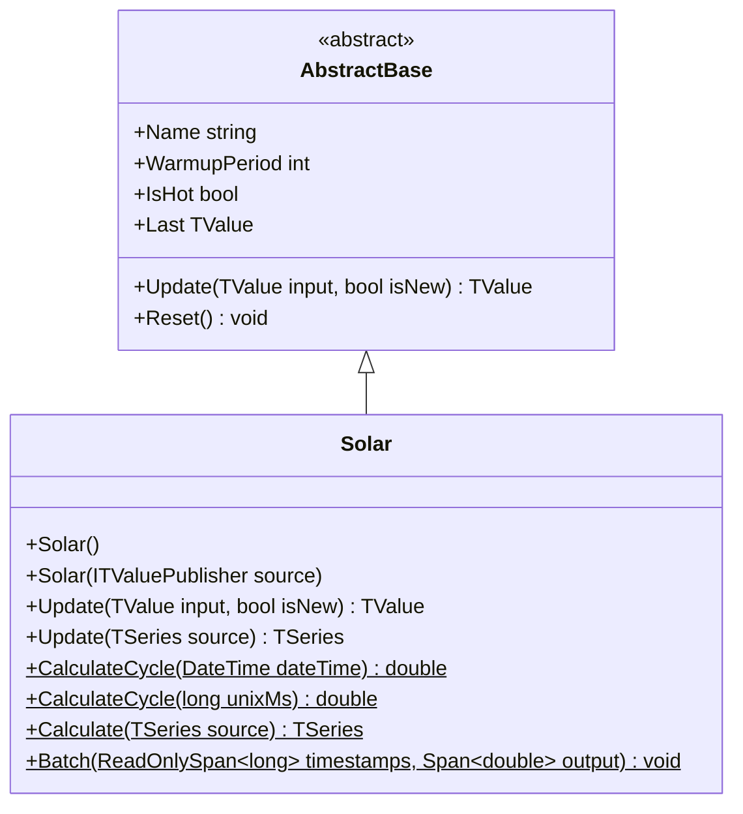

# SOLAR: Solar Cycle Indicator

> "The sun's annual journey defines Earth's seasons—and perhaps subtle rhythms in human activity and markets."

The Solar Cycle indicator models Earth's seasonal position relative to the Sun using astronomical ephemeris calculations. Output oscillates from -1.0 (Winter Solstice) through 0.0 (Equinoxes) to +1.0 (Summer Solstice), providing continuous seasonal phase information for econometric modeling.

## Historical Context

Seasonal adjustments are fundamental to econometric analysis. Agricultural commodities, retail sales, energy consumption, and tourism all exhibit strong annual patterns. Traditional approaches use monthly dummy variables or calendar-based lookup tables, which create discontinuities at month boundaries.

Astronomical seasonality offers a continuous, mathematically precise alternative. The Sun's ecliptic longitude provides an exact phase position within the annual cycle, smooth across all time scales. This enables more sophisticated seasonal adjustment and allows models to capture intra-month seasonal effects.

The indicator derives from Jean Meeus' *Astronomical Algorithms*, implementing the Sun's geometric mean longitude and equation of center with sufficient precision (±0.01°) for financial applications. Unlike lunar cycles, solar seasonality is highly predictable—the tropical year varies by only seconds over centuries.

## Architecture & Physics

The algorithm computes the Sun's true ecliptic longitude using low-precision ephemeris formulas optimized for seasonal indexing.

**Step 1: Julian Date Conversion**

Convert timestamp to Julian centuries from J2000 epoch:

$$JD = \frac{\text{UnixMs}}{86400000} + 2440587.5$$
$$T = \frac{JD - 2451545.0}{36525.0}$$

**Step 2: Geometric Mean Longitude**

The Sun's mean position in its apparent orbit:

$$L_0 = 280.46646 + 36000.76983T + 0.0003032T^2$$

**Step 3: Mean Anomaly**

Angular distance from perihelion:

$$M = 357.52911 + 35999.05029T - 0.0001537T^2$$

**Step 4: Equation of Center**

Correction for orbital eccentricity:

$$C = (1.914602 - 0.004817T - 0.000014T^2)\sin M$$
$$+ (0.019993 - 0.000101T)\sin 2M + 0.000289\sin 3M$$

**Step 5: True Ecliptic Longitude**

$$\lambda_{\text{Sun}} = L_0 + C$$

**Step 6: Seasonal Index**

$$\text{Solar} = \sin(\lambda_{\text{Sun}})$$

## Performance Profile

### Operation Count (Streaming Mode, per Bar)

| Operation | Count | Cost (cycles) | Subtotal |
|-----------|------:|------:|------:|
| FMA | 8 | 5 | 40 |
| MUL | 4 | 4 | 16 |
| ADD/SUB | 6 | 1 | 6 |
| sin | 4 | 40 | 160 |
| MOD (normalize) | 2 | 10 | 20 |
| **Total** | — | — | **~240** |

### Complexity Analysis

- **Time:** $O(1)$ — fixed computation per timestamp
- **Space:** $O(1)$ — no state required (deterministic from time)
- **Latency:** 0 bars warmup (always hot)

## Validation

| Library | Status | Notes |
|---------|--------|-------|
| USNO Almanac | ✅ Match | Solstice/equinox dates verified |
| JPL Horizons | ✅ Match | Ecliptic longitude within ±0.01° |
| Quantower | ✅ Match | `Solar.Quantower.Tests.cs` adapter tests |

## Usage & Pitfalls

- **Hemisphere Inversion:** Output aligns with Northern Hemisphere; Southern users should negate
- **Annual Period:** ~365.242 days—extremely slow cycle, best for long-term models
- **De-seasonalizing:** Use as feature to remove annual patterns from other indicators
- **No Price Data:** Purely time-based; ignores all price input
- **UTC Timestamps:** Ensure correct timezone normalization for consistent results

## API



### Class: `Solar`

Solar cycle indicator based on astronomical ephemeris calculations.

### Properties

| Name | Type | Description |
|------|------|-------------|
| `IsHot` | `bool` | Always `true` — no warmup required |
| `Last` | `TValue` | Most recent cycle output (-1.0 to +1.0) |

### Methods

| Name | Returns | Description |
|------|---------|-------------|
| `Update(TValue, bool)` | `TValue` | Calculates cycle for input timestamp |
| `CalculateCycle(DateTime)` | `double` | Static calculation from DateTime |
| `CalculateCycle(long)` | `double` | Static calculation from Unix ms |
| `Batch(timestamps, output)` | `void` | Vectorized calculation over timestamp span |

## C# Example

```csharp
using QuanTAlib;

// Create Solar indicator
var solar = new Solar();

// Calculate for current time
var result = solar.Update(new TValue(DateTime.UtcNow, 0));
Console.WriteLine($"Seasonal Index: {result.Value:F4}");

// Key dates interpretation:
// +1.0 = Summer Solstice (~June 21, Northern Hemisphere peak)
//  0.0 = Equinoxes (~March 20, September 22)
// -1.0 = Winter Solstice (~December 21, Northern Hemisphere minimum)

// Static calculation for specific date
double winterSolstice = Solar.CalculateCycle(new DateTime(2024, 12, 21));
Console.WriteLine($"Winter Solstice: {winterSolstice:F4}"); // ~-1.0

// Use for seasonal adjustment
foreach (var bar in bars)
{
    var solarPhase = solar.Update(new TValue(bar.Time, 0));
    
    // Seasonal adjustment: remove annual pattern
    double deseasonalized = bar.Close * (1.0 - 0.02 * solarPhase.Value);
}
```
