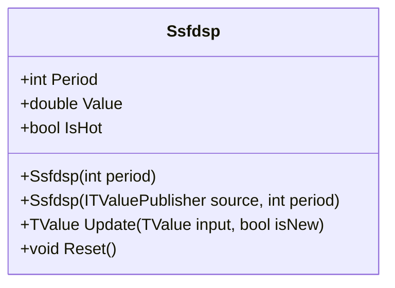

# SSFDSP: SSF-Based Detrended Synthetic Price

> "The Super-Smoother filter provides Butterworth-quality noise rejection—combine two of them and you isolate cycles with surgical precision."

The SSF-Based Detrended Synthetic Price (SSFDSP) is an advanced oscillator by John Ehlers. It creates a synthetic, detrended price series by subtracting a half-cycle Super-Smoother from a quarter-cycle Super-Smoother, providing superior noise rejection and reduced lag compared to EMA-based DSP.

## Historical Context

Ehlers introduced the concept of "Synthetic Price" to remove the DC (trend) component from market data, isolating cyclic energy. While earlier versions used EMAs, the SSF variant exploits the 2-pole Butterworth characteristics of the Super-Smoother Filter to achieve cleaner separation between trend and cycle.

The SSF provides zero phase lag at the cutoff frequency, making it ideal for cycle isolation in noisy market data.

## Architecture & Physics

The indicator computes the difference between two Super-Smoother filters tuned to fractions of the dominant cycle period.

### 1. Filter Periods

$$
P_{fast} = \max(2, \text{round}(P / 4))
$$

$$
P_{slow} = \max(3, \text{round}(P / 2))
$$

### 2. Super-Smoother Coefficients

$$
\alpha = \frac{\pi\sqrt{2}}{period}
$$

$$
c_2 = 2e^{-\alpha}\cos(\alpha)
$$

$$
c_3 = -e^{-2\alpha}
$$

$$
c_1 = 1 - c_2 - c_3
$$

### 3. SSF Recursion

$$
SSF_t = c_1 \cdot \frac{P_t + P_{t-1}}{2} + c_2 \cdot SSF_{t-1} + c_3 \cdot SSF_{t-2}
$$

### 4. SSFDSP Output

$$
SSFDSP = SSF_{fast} - SSF_{slow}
$$

## Performance Profile

### Operation Count (Streaming Mode, per Bar)

| Operation | Count | Cost (cycles) | Subtotal |
| :--- | :---: | :---: | :---: |
| FMA (SSF updates) | 4 | 4 | 16 |
| MUL (coefficients) | 2 | 3 | 6 |
| ADD/SUB (input avg, output) | 3 | 1 | 3 |
| **Total** | **9** | — | **~25 cycles** |

### Complexity Analysis

- **Streaming:** O(1) per bar—fixed 2-pole IIR filters
- **Memory:** O(1)—only filter state variables
- **Warmup:** ~2 × slow period for convergence
- **Note:** Recursive dependencies prevent SIMD vectorization

## Validation

| Library | Status | Notes |
| :--- | :---: | :--- |
| TA-Lib | N/A | Not standard |
| Skender | N/A | Not standard |
| PineScript | ✅ | Matches Ehlers' reference logic |

## Usage & Pitfalls

- **Oscillates around zero**—positive values indicate bullish cycle phase
- **Zero crossings** signal cycle phase changes—entry points in direction of cross
- **Period mismatch** degrades amplitude and phase accuracy
- **Smoother than EMA-DSP** with sharper turning points
- **Divergence** (price highs vs DSP highs) indicates trend exhaustion
- **Pre-smooth input** for extremely noisy data

## API



### Class: `Ssfdsp`

| Parameter | Type | Default | Range | Description |
| :--- | :--- | :--- | :--- | :--- |
| `period` | `int` | `40` | `≥4` | Expected dominant cycle period |

### Properties

- `Value` (`double`): The current SSFDSP value (oscillates around 0)
- `IsHot` (`bool`): Returns `true` when warmup is complete

### Methods

- `Update(TValue input, bool isNew)`: Updates the indicator with a new data point

## C# Example

```csharp
using QuanTAlib;

// Initialize with a 40-bar dominant cycle assumption
var ssfdsp = new Ssfdsp(period: 40);

// Update with streaming data
foreach (var bar in quotes)
{
    var result = ssfdsp.Update(new TValue(bar.Date, bar.Close));
    
    if (ssfdsp.IsHot)
    {
        Console.WriteLine($"{bar.Date}: SSF-DSP = {result.Value:F4}");
        
        // Zero crossing detection
        if (result.Value > 0 && ssfdsp.Previous.Value <= 0)
            Console.WriteLine("  → Bullish cycle phase");
        else if (result.Value < 0 && ssfdsp.Previous.Value >= 0)
            Console.WriteLine("  → Bearish cycle phase");
    }
}

// Batch calculation
var output = Ssfdsp.Calculate(sourceSeries, period: 40);
```
