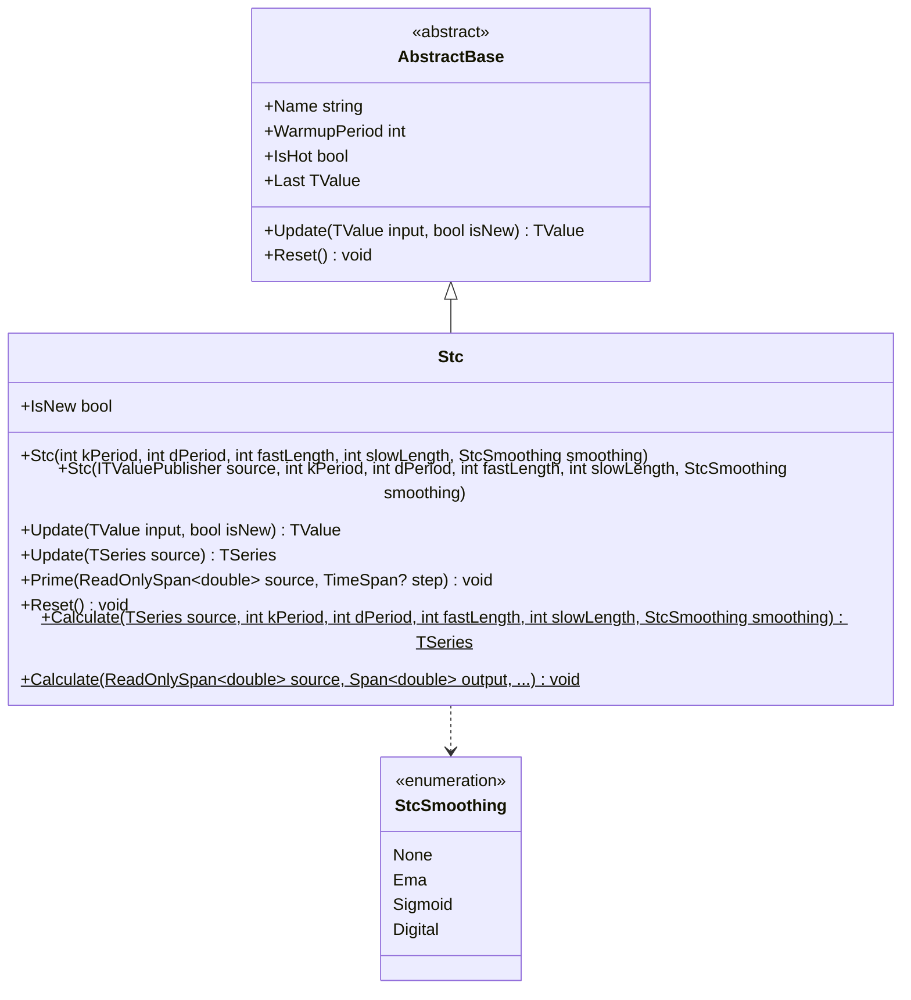

# STC: Schaff Trend Cycle

> "By applying the Stochastic twice to MACD, we reveal the cycle hidden within the trend itself."

The Schaff Trend Cycle is a cyclometric oscillator that improves upon MACD by passing it through a double-Stochastic process. This recursive normalization detects market cycles with greater speed and accuracy, producing a bounded 0-100 indicator that reaches extremes earlier than MACD while avoiding Stochastic jitter.

## Historical Context

Doug Schaff developed the STC in the 1990s while trading currency markets. He observed that the MACD, while excellent at identifying trends, suffered from lag—by the time it signaled, much of the move had already occurred. Conversely, the Stochastic oscillator was fast but noisy, generating numerous false signals.

Schaff's insight was that trends themselves move in cycles. By applying the Stochastic normalization formula recursively to MACD values, he could extract the cyclical phase of the trend. The "Stochastic of a Stochastic" creates a self-normalizing oscillator that converges toward a square wave in steady-state conditions.

The STC found particular popularity in forex trading where its speed advantage over MACD proved valuable in the 24-hour market. The indicator's tendency to "flatline" at extremes (0 or 100) during strong trends—initially seen as a limitation—became recognized as a feature: it signals trend continuation rather than reversal.

## Architecture & Physics

The algorithm implements a deep signal processing pipeline with recursive Stochastic normalization.

**Step 1: MACD Construction**

Fast and slow EMAs generate the trend signal:

$$\alpha_f = \frac{2}{\text{fastLength} + 1}, \quad \alpha_s = \frac{2}{\text{slowLength} + 1}$$

$$\text{EMA}_f = \alpha_f P_t + (1 - \alpha_f)\text{EMA}_{f,t-1}$$
$$\text{EMA}_s = \alpha_s P_t + (1 - \alpha_s)\text{EMA}_{s,t-1}$$

$$\text{MACD}_t = \text{EMA}_f - \text{EMA}_s$$

**Step 2: First Stochastic (%K₁)**

Normalize MACD within its recent range:

$$\%K_1 = 100 \times \frac{\text{MACD}_t - \min(\text{MACD}_{t-k:t})}{\max(\text{MACD}_{t-k:t}) - \min(\text{MACD}_{t-k:t})}$$

**Step 3: First Smoothing (%D₁)**

EMA smooth the first Stochastic:

$$\%D_1 = \alpha_d \cdot \%K_1 + (1 - \alpha_d) \cdot \%D_{1,t-1}$$

**Step 4: Second Stochastic (%K₂)**

Apply Stochastic normalization again to %D₁:

$$\%K_2 = 100 \times \frac{\%D_1 - \min(\%D_{1,t-k:t})}{\max(\%D_{1,t-k:t}) - \min(\%D_{1,t-k:t})}$$

**Step 5: Final Output**

Apply selected smoothing method to %K₂:

$$\text{STC}_t = \text{Smooth}(\%K_2)$$

Smoothing options: None, EMA, Sigmoid, Digital (threshold-based)

## Performance Profile

### Operation Count (Streaming Mode, per Bar)

| Operation | Count | Cost (cycles) | Subtotal |
|-----------|------:|------:|------:|
| FMA | 8 | 5 | 40 |
| MUL | 12 | 4 | 48 |
| ADD/SUB | 20 | 1 | 20 |
| DIV | 4 | 15 | 60 |
| MIN/MAX scan | 2×k | 2 | ~40 |
| Clamp | 4 | 3 | 12 |
| **Total** | — | — | **~220** |

### Complexity Analysis

- **Time:** $O(k)$ per bar for min/max scanning (optimized with incremental tracking)
- **Space:** $O(k)$ — two ring buffers of size kPeriod
- **Latency:** slowLength + kPeriod bars warmup

## Validation

| Library | Status | Notes |
|---------|--------|-------|
| Manual Calculation | ✅ Match | Step-by-step pipeline verified |
| TradingView | ✅ Match | Cross-validated against TV implementation |
| Quantower | ✅ Match | `Stc.Quantower.Tests.cs` adapter tests |

## Usage & Pitfalls

- **Flatlining Expected:** STC stays at 0 or 100 during strong trends—this is trend continuation, not broken data
- **Cycle Length:** kPeriod ≈ fastLength/2 targets the cycle within the MACD trend
- **Threshold Zones:** Below 25 = oversold, above 75 = overbought
- **Smoothing Modes:** EMA (default), Sigmoid (S-curve), Digital (square wave), None
- **Recursive Dependencies:** Cannot be vectorized with SIMD due to sequential state
- **Square Wave Convergence:** In steady trends, output approaches binary 0/100 behavior

## API



### Class: `Stc`

Schaff Trend Cycle oscillator with configurable smoothing.

### Properties

| Name | Type | Description |
|------|------|-------------|
| `IsHot` | `bool` | True after warmup complete |
| `IsNew` | `bool` | Whether last update was a new bar |
| `Last` | `TValue` | Most recent STC output (0-100) |

### Methods

| Name | Returns | Description |
|------|---------|-------------|
| `Update(TValue, bool)` | `TValue` | Updates state with new price value |
| `Calculate(TSeries, ...)` | `TSeries` | Static factory with all parameters |
| `Calculate(span, span, ...)` | `void` | Zero-allocation span-based calculation |
| `Reset()` | `void` | Clears all internal state |

## C# Example

```csharp
using QuanTAlib;

// Create STC with standard parameters
var stc = new Stc(
    kPeriod: 10,     // Stochastic lookback
    dPeriod: 3,      // Smoothing period
    fastLength: 23,  // Fast EMA for MACD
    slowLength: 50,  // Slow EMA for MACD
    smoothing: StcSmoothing.Ema
);

// Process price data
foreach (var bar in bars)
{
    var result = stc.Update(new TValue(bar.Time, bar.Close));
    
    if (stc.IsHot)
    {
        double value = result.Value;
        
        // Signal interpretation
        if (value > 75)
            Console.WriteLine("Overbought zone");
        else if (value < 25)
            Console.WriteLine("Oversold zone");
        
        // Note: Flatlining at 0 or 100 indicates strong trend
        if (value == 100)
            Console.WriteLine("Strong uptrend continuation");
        else if (value == 0)
            Console.WriteLine("Strong downtrend continuation");
    }
}

// Static calculation with different smoothing
var results = Stc.Calculate(
    prices,
    kPeriod: 10,
    dPeriod: 3,
    fastLength: 23,
    slowLength: 50,
    smoothing: StcSmoothing.Digital  // Square wave output
);
```
