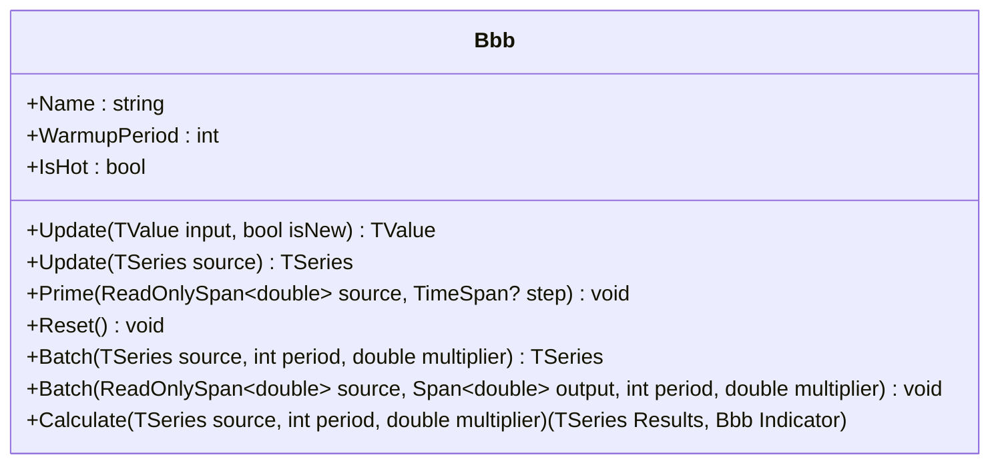

# BBB: Bollinger %B

> "Price oscillates, but %B tells you where it lives inside the band."

Bollinger %B quantifies where the current price sits within Bollinger Bands. A value of `0` is at the lower band, `1` is at the upper band, and `0.5` is centered at the middle band. The value can overshoot outside `[0, 1]` when price pierces the bands.

## Calculation

1. Compute the SMA and standard deviation over the lookback period.
2. Construct upper/lower bands using the standard deviation multiplier.
3. Normalize the price position within the bands.

Formula:

```
Basis = SMA(source, period)
StdDev = sqrt(E[x^2] - E[x]^2)
Upper = Basis + multiplier * StdDev
Lower = Basis - multiplier * StdDev
BBB = (Price - Lower) / (Upper - Lower)
```

If the band width is zero, BBB returns `0.5` (neutral).

## Interpretation

- `BBB = 1.0` → price at upper band (overbought risk)
- `BBB = 0.0` → price at lower band (oversold risk)
- `BBB > 1.0` → price above upper band (breakout)
- `BBB < 0.0` → price below lower band (breakdown)

## Parameters

| Name | Type | Default | Range | Description |
| :--- | :--- | :------ | :---- | :---------- |
| `period` | `int` | `20` | `>0` | Lookback period for SMA and StdDev. |
| `multiplier` | `double` | `2.0` | `>0` | Standard deviation multiplier for band width. |

## API



## Usage Example

```csharp
using QuanTAlib;

// Initialize
var bbb = new Bbb(period: 20, multiplier: 2.0);

foreach (var bar in bars)
{
    var value = bbb.Update(bar.Close);

    if (bbb.IsHot)
    {
        Console.WriteLine($"{bar.Time}: %B={value.Value:F3}");
    }
}
```

## Performance Profile

| Metric | Score | Notes |
| :--- | :--- | :--- |
| **Throughput** | 9 | O(1) rolling sums and variance. |
| **Allocations** | 0 | Zero allocations in hot path. |
| **Complexity** | O(1) | Constant time per update. |
| **Accuracy** | 10 | Matches Pine reference and standard formula. |
| **Timeliness** | 7 | Period-length lag similar to SMA. |
| **Overshoot** | 8 | Can exceed [0, 1] on strong moves. |
| **Smoothness** | 6 | Moderate smoothing via SMA and StdDev. |

## Validation

No direct TA-Lib/Tulip/Skender equivalent exists for Bollinger %B. Validation is performed against the PineScript reference and internal consistency checks (batch vs streaming vs span).

## Sources

- John Bollinger, *Bollinger on Bollinger Bands*
- [PineScript reference](bbb.pine)
