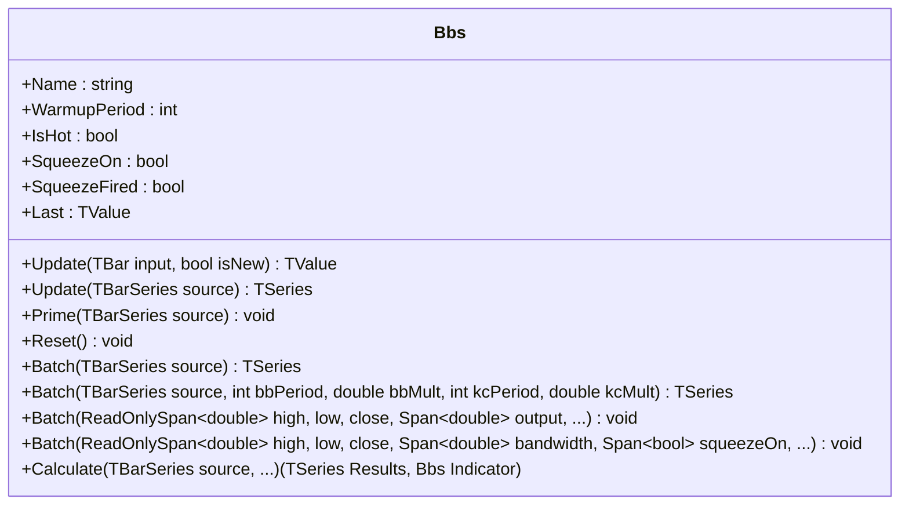

# BBS: Bollinger Band Squeeze

> "Volatility contraction precedes expansion. The squeeze tells you when to watch."

Bollinger Band Squeeze detects when Bollinger Bands contract inside Keltner Channels — a condition signaling low volatility consolidation that typically precedes explosive price moves.

## Calculation

1. Compute Bollinger Bands using SMA and population standard deviation.
2. Compute Keltner Channels using SMA and EMA-smoothed ATR.
3. Detect squeeze: BB bands inside KC bands.
4. Output bandwidth as a percentage.

Formula:

```
BB_Middle = SMA(close, bbPeriod)
BB_StdDev = sqrt(E[x^2] - E[x]^2)
BB_Upper = BB_Middle + bbMult * BB_StdDev
BB_Lower = BB_Middle - bbMult * BB_StdDev

KC_Middle = SMA(close, kcPeriod)
ATR = EMA-smoothed True Range (with warmup compensation)
KC_Upper = KC_Middle + kcMult * ATR
KC_Lower = KC_Middle - kcMult * ATR

SqueezeOn = BB_Upper < KC_Upper AND BB_Lower > KC_Lower
Bandwidth = ((BB_Upper - BB_Lower) / BB_Middle) * 100
```

## Interpretation

- **Squeeze On** (red dot) → low volatility, consolidation phase. Bands are tightening.
- **Squeeze Off** (green dot) → volatility expansion, potential breakout.
- **Squeeze Fired** → first bar after squeeze ends — the breakout moment.
- **Bandwidth** → measures BB width as a percentage of the middle band.

## Parameters

| Name | Type | Default | Range | Description |
| :--- | :--- | :------ | :---- | :---------- |
| `bbPeriod` | `int` | `20` | `>0` | Bollinger Band lookback period. |
| `bbMult` | `double` | `2.0` | `>0` | BB standard deviation multiplier. |
| `kcPeriod` | `int` | `20` | `>0` | Keltner Channel lookback period. |
| `kcMult` | `double` | `1.5` | `>0` | KC ATR multiplier. |

## API



## Usage Example

```csharp
using QuanTAlib;

// Initialize
var bbs = new Bbs(bbPeriod: 20, bbMult: 2.0, kcPeriod: 20, kcMult: 1.5);

foreach (var bar in bars)
{
    bbs.Update(bar);

    if (bbs.IsHot)
    {
        string state = bbs.SqueezeOn ? "SQUEEZE" : "EXPANSION";
        Console.WriteLine($"{bar.Time}: Bandwidth={bbs.Last.Value:F2}% [{state}]");

        if (bbs.SqueezeFired)
        {
            Console.WriteLine("  *** BREAKOUT DETECTED ***");
        }
    }
}
```

## Performance Profile

| Metric | Score | Notes |
| :--- | :--- | :--- |
| **Throughput** | 9 | O(1) rolling sums for BB and KC. |
| **Allocations** | 0 | Zero allocations in hot path. |
| **Complexity** | O(1) | Constant time per update. |
| **Accuracy** | 10 | Matches Pine reference formula. |
| **Timeliness** | 7 | Period-length lag from SMA components. |
| **Overshoot** | N/A | Boolean squeeze output, bandwidth >= 0. |
| **Smoothness** | 6 | Moderate smoothing via SMA and ATR EMA. |

## Validation

Bandwidth component validated against Skender `GetBollingerBands().Width`. Internal consistency verified across streaming, batch, and span modes. Squeeze logic cross-validated against TtmSqueeze (which uses the same BB-inside-KC condition).

## Sources

- John Bollinger, *Bollinger on Bollinger Bands*
- John Carter, *Mastering the Trade* — squeeze concept
- [PineScript reference](bbs.pine)
