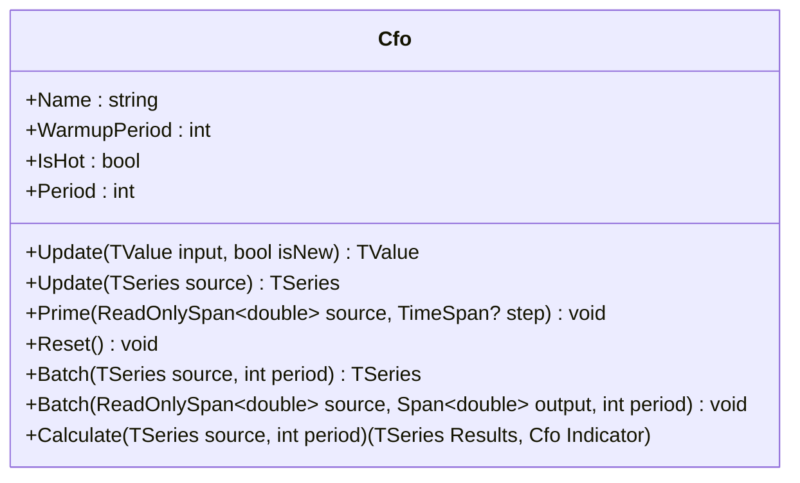

# CFO: Chande Forecast Oscillator

> "The distance between where you are and where regression says you should be tells you everything about momentum."

The Chande Forecast Oscillator measures the percentage difference between the current price and its linear regression forecast (Time Series Forecast). Positive values mean price is above the forecast line; negative values mean price has fallen below where the trend predicted it would be.

## Historical Context

Tushar Chande introduced the Forecast Oscillator in *The New Technical Trader* (1994) as a way to quantify how far price deviates from its own trend. The core insight: linear regression gives you the best-fit line through recent data, and the forecast endpoint (TSF) gives you where that line says the next bar *should* be. The percentage difference between actual and forecast is the oscillator.

Most implementations recalculate a full least-squares regression each bar, costing O(n) per update. This implementation uses an incremental sumXY maintenance trick from the PineScript reference that achieves O(1) per bar after warmup.

## Architecture

### Linear Regression (O(1) Incremental)

The standard least-squares regression requires sumX, sumX2, sumY, and sumXY. Since x-indices are fixed (0..period-1), sumX and sumX2 are constants. The trick is maintaining sumY and sumXY incrementally:

**When buffer is full (steady state):**

1. Remove oldest value from sumY
2. Subtract sumY from sumXY (shifts all x-indices down by 1)
3. Add (period-1) * newValue to sumXY (new value enters at highest x-index)
4. Add newValue to sumY

**When buffer is filling (warmup):**

1. Add count * newValue to sumXY
2. Increment count
3. Add newValue to sumY

### Resync

Floating-point drift accumulates over long runs. Every 1000 ticks, the running sums are recalculated from the buffer to reset drift.

## Mathematical Foundation

Given a window of n values indexed x = 0, 1, ..., n-1:

```
sumX  = n(n-1) / 2
sumX2 = n(n-1)(2n-1) / 6
denomX = n * sumX2 - sumX^2

slope     = (n * sumXY - sumX * sumY) / denomX
intercept = (sumY - slope * sumX) / n
TSF       = slope * (n-1) + intercept

CFO = 100 * (source - TSF) / source
```

When source equals zero, CFO returns NaN.

## Interpretation

- **CFO > 0**: Price is above the regression forecast (bullish momentum)
- **CFO < 0**: Price is below the regression forecast (bearish momentum)
- **CFO = 0**: Price is exactly at the forecast (trend continuation)
- **CFO crossing zero**: Potential momentum shift
- **Divergence**: Price making new highs while CFO makes lower highs suggests weakening trend

## Parameters

| Name | Type | Default | Range | Description |
| :--- | :--- | :------ | :---- | :---------- |
| `period` | `int` | `14` | `>0` | Lookback period for linear regression. |

## API



## Usage Example

```csharp
using QuanTAlib;

// Streaming
var cfo = new Cfo(period: 14);

foreach (var bar in bars)
{
    var value = cfo.Update(bar.Close);

    if (cfo.IsHot)
    {
        Console.WriteLine($"{bar.Time}: CFO={value.Value:F2}%");
    }
}

// Batch
TSeries results = Cfo.Batch(closePrices, period: 14);
```

## Performance Profile

| Metric | Score | Notes |
| :--- | :--- | :--- |
| **Throughput** | 9 | O(1) incremental sumXY maintenance. |
| **Allocations** | 0 | Zero allocations in hot path. |
| **Complexity** | O(1) | Constant time per update via incremental regression. |
| **Accuracy** | 9 | Matches PineScript reference; periodic resync limits drift. |
| **Timeliness** | 7 | Period-length lag inherent to regression window. |
| **Overshoot** | 7 | Unbounded oscillator; extremes during sharp moves. |
| **Smoothness** | 6 | Moderate; regression line provides some smoothing. |

## Validation

| Library | Status | Notes |
| :--- | :---: | :--- |
| **Skender GetSlope** | ✅ | Cross-validated: TSF from GetSlope used to construct CFO independently |
| **PineScript** | ✅ | Algorithm matches cfo.pine O(1) incremental approach |
| **Internal Consistency** | ✅ | Batch, streaming, span, and event modes agree |
| **Known Values** | ✅ | Linear trend produces CFO=0; constant input produces CFO=0 |

## Common Pitfalls

1. **Division by zero**: When source price is exactly zero, CFO returns NaN. Filter these in downstream logic.
2. **Unbounded range**: CFO is not bounded to [-100, +100]. During volatile periods, values can be extreme.
3. **Warmup period**: CFO requires `period` bars before producing valid output. Before warmup, returns 0.
4. **Drift accumulation**: Without periodic resync, incremental sums accumulate floating-point error. This implementation resyncs every 1000 ticks.
5. **Short periods**: Very short periods (1-3) produce noisy, erratic oscillator values. Period 14 is a reasonable default.
6. **NaN propagation**: NaN/Infinity inputs are substituted with the last valid value. Extended sequences of invalid data produce stale readings.

## Sources

- Tushar Chande, *The New Technical Trader*, 1994
- [PineScript reference](cfo.pine)
