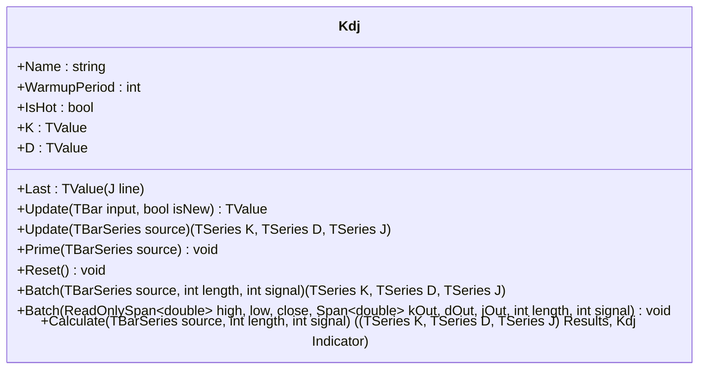

# KDJ: Enhanced Stochastic Oscillator

> "K leads, D confirms, J exaggerates — three perspectives on momentum."

KDJ is an enhanced Stochastic Oscillator popular in Asian markets. It extends the classic Stochastic by adding a J line that amplifies divergence between K and D, providing earlier reversal signals. Uses Wilder's RMA (Exponential Moving Average with `α = 1/signal`) instead of SMA for smoother K and D lines.

## Calculation

1. Compute highest high and lowest low over the lookback period using monotonic deques.
2. Calculate the Raw Stochastic Value (RSV).
3. Smooth RSV with RMA to get K; smooth K with RMA to get D.
4. Compute J as the amplified divergence.

Formula:

```
RSV = 100 × (Close - LowestLow) / (HighestHigh - LowestLow)
K = RMA(RSV, signal)    // α = 1/signal
D = RMA(K, signal)      // α = 1/signal
J = 3K - 2D
```

If the price range is zero, RSV defaults to `50.0` (neutral). K and D are clamped to `[0, 100]`. J is unbounded and can exceed 100 or go below 0.

Exponential warmup compensators ensure accurate K and D values from the first bar, avoiding the typical initialization bias of recursive filters.

## Interpretation

- **K > D** → bullish momentum (K crosses above D = buy signal)
- **K < D** → bearish momentum (K crosses below D = sell signal)
- **J > 100** → strongly overbought, potential reversal down
- **J < 0** → strongly oversold, potential reversal up
- **K > 80** → overbought zone
- **K < 20** → oversold zone

## Parameters

| Name | Type | Default | Range | Description |
| :--- | :--- | :------ | :---- | :---------- |
| `length` | `int` | `9` | `>0` | Lookback period for highest high / lowest low. |
| `signal` | `int` | `3` | `>0` | RMA smoothing period for K and D lines. |

## API



## Usage Example

```csharp
using QuanTAlib;

// Initialize
var kdj = new Kdj(length: 9, signal: 3);

foreach (var bar in bars)
{
    kdj.Update(bar, isNew: true);

    if (kdj.IsHot)
    {
        Console.WriteLine($"{bar.Time}: K={kdj.K.Value:F2} D={kdj.D.Value:F2} J={kdj.Last.Value:F2}");
    }
}
```

## Performance Profile

| Metric | Score | Notes |
| :--- | :--- | :--- |
| **Throughput** | 9 | O(1) amortized via monotonic deques. |
| **Allocations** | 0 | Zero allocations in hot path. |
| **Complexity** | O(1) | Amortized constant time per update. |
| **Accuracy** | 10 | Exact match with PineScript reference. Exponential warmup compensators. |
| **Timeliness** | 8 | RMA smoothing provides faster response than SMA-based Stochastic. |
| **Overshoot** | 7 | J line intentionally unbounded for early signals. |
| **Smoothness** | 8 | Double RMA smoothing eliminates noise. |

## Validation

No direct TA-Lib/Tulip/Skender equivalent exists for KDJ with Wilder's RMA smoothing. Validation is performed against the PineScript reference and internal consistency checks:
- Streaming vs Batch vs Span cross-mode consistency
- Mathematical identity: J = 3K − 2D
- K/D bounded in [0, 100]
- Parameter sensitivity across multiple configurations

## Sources

- Chinese securities analysis (KDJ is a standard indicator on Chinese exchanges)
- [PineScript reference](kdj.pine)
