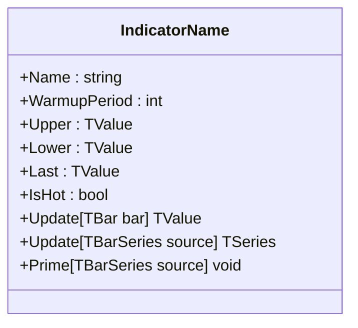

# Channel Indicators Documentation Remediation Plan

## Template Reference

Template: [`.github/DOCS_TPL.md`](.github/DOCS_TPL.md)

### Required Sections per DOCS_TPL.md

1. **Title**: `# [CODE: Full name of the indicator]`
2. **Quote**: `> short witty quote or insight about the indicator`
3. **Description**: One paragraph describing the indicator and its purpose to a trader
4. **Historical Context**: 2-3 paragraphs about origin, creator, relevant history
5. **Architecture & Physics**: High-level calculation description with optional Mermaid diagram
6. **Calculation Steps**: Mathematical formulas in LaTeX format with explanations
7. **Performance Profile**:
   - Operation Count table (streaming): `Operation | Count | Cost (cycles) | Subtotal`
   - Operation Count table (batch): `Scalar Ops | SIMD Ops | Acceleration`
8. **Validation**: Library comparison table with status and notes
9. **Usage & Pitfalls**: List of practical tips
10. **API**: Mermaid class diagram + parameter table + properties + methods
11. **C# Example**: Standard boilerplate code example

---

## Gap Analysis Matrix

| File | Title | Quote | Desc | History | Arch | Perf Tables | Validation | Pitfalls | API Mermaid | C# Example | Status |
|------|:-----:|:-----:|:----:|:-------:|:----:|:-----------:|:----------:|:--------:|:-----------:|:----------:|:------:|
| abber | ✅ | ✅ | ✅ | ✅ | ✅ | ✅ | ✅ | ✅ | ✅ | ✅ | ✅ COMPLIANT |
| accbands | ✅ | ✅ | ✅ | ✅ | ✅ | ✅ | ✅ | ✅ | ✅ | ✅ | ✅ COMPLIANT |
| apchannel | ✅ | ✅ | ✅ | ✅ | ✅ | ✅ | ✅ | ✅ | ✅ | ✅ | ✅ COMPLIANT |
| apz | ✅ | ✅ | ✅ | ✅ | ✅ | ✅ | ✅ | ✅ | ✅ | ✅ | ✅ COMPLIANT |
| atrbands | ✅ | ✅ | ✅ | ✅ | ✅ | ✅ | ✅ | ✅ | ✅ | ✅ | ✅ COMPLIANT |
| bbands | ✅ | ❌ | ✅ | ❌ | ✅ | 🟡 | 🟡 | ❌ | ❌ | ✅ | 🔴 NEEDS WORK |
| dchannel | ✅ | ❌ | ✅ | ✅ | ✅ | 🟡 | 🟡 | ❌ | ❌ | ✅ | 🔴 NEEDS WORK |
| decaychannel | ✅ | ❌ | ✅ | ❌ | ✅ | 🟡 | 🟡 | ❌ | ❌ | ✅ | 🔴 NEEDS WORK |
| fcb | ✅ | ❌ | ✅ | ❌ | ✅ | 🟡 | 🟡 | ❌ | ❌ | ✅ | 🔴 NEEDS WORK |
| jbands | ✅ | ❌ | ✅ | ❌ | ✅ | 🟡 | 🟡 | ❌ | ❌ | ✅ | 🔴 NEEDS WORK |
| kchannel | ✅ | ❌ | ✅ | ❌ | ✅ | 🟡 | 🟡 | ❌ | ❌ | ✅ | 🔴 NEEDS WORK |
| maenv | ✅ | ❌ | ✅ | ❌ | ✅ | 🟡 | 🟡 | ❌ | ❌ | ✅ | 🔴 NEEDS WORK |
| mmchannel | ✅ | ✅ | ✅ | ✅ | ✅ | ✅ | ✅ | ✅ | ❌ | ❌ | 🟡 MINOR |
| pchannel | ✅ | ✅ | ✅ | ✅ | ✅ | ✅ | ✅ | ✅ | ✅ | ✅ | ✅ COMPLIANT |
| regchannel | ✅ | ✅ | ✅ | ✅ | ✅ | ✅ | ✅ | ✅ | ❌ | ❌ | 🟡 MINOR |
| sdchannel | ✅ | ✅ | ✅ | ✅ | ✅ | ✅ | ✅ | ✅ | ❌ | ❌ | 🟡 MINOR |
| starchannel | ✅ | ❌ | ✅ | ❌ | ✅ | ✅ | ❌ | ✅ | ❌ | ❌ | 🔴 NEEDS WORK |
| stbands | ✅ | ✅ | ✅ | ✅ | ✅ | ✅ | ✅ | ✅ | ❌ | ✅ | 🟡 MINOR |
| ubands | ✅ | ✅ | ✅ | ✅ | ✅ | ✅ | ✅ | ✅ | ❌ | ❌ | 🟡 MINOR |
| uchannel | ✅ | ✅ | ✅ | ✅ | ✅ | ✅ | ✅ | ✅ | ❌ | ❌ | 🟡 MINOR |
| vwapbands | ✅ | ❌ | ✅ | ❌ | ✅ | ✅ | ✅ | ✅ | ❌ | ❌ | 🟡 MINOR |
| vwapsd | ✅ | ❌ | ✅ | ❌ | ✅ | ✅ | ✅ | ✅ | ❌ | ❌ | 🟡 MINOR |

**Legend:**
- ✅ = Present and compliant
- 🟡 = Partially present (not in template format)
- ❌ = Missing
- 🔴 = Needs significant work
- 🟡 = Minor fixes needed

---

## Detailed Remediation Per File

### 🔴 HIGH PRIORITY (Major Template Gaps)

#### 1. bbands.md

**Missing Sections:**
- Quote after title
- Historical Context section
- Usage & Pitfalls section
- API Mermaid class diagram

**Current Issues:**
- Performance Profile exists but not in standard table format
- Validation exists but in prose, not table format

**Actions Required:**
1. Add quote: `> "Two standard deviations contain 95% of price action—until they don't."`
2. Add Historical Context: John Bollinger developed in early 1980s, registered trademark
3. Reformat Performance Profile with Operation Count tables
4. Add Usage & Pitfalls bullet list
5. Add API Mermaid class diagram

---

#### 2. dchannel.md

**Missing Sections:**
- Quote after title
- Usage & Pitfalls section
- API Mermaid class diagram

**Current Issues:**
- Performance Profile in prose, not table format
- Validation in prose, not table format

**Actions Required:**
1. Add quote: `> "The Turtles made millions with a simple rule: buy the 20-day high, sell the 20-day low."`
2. Reformat Performance Profile with Operation Count tables
3. Reformat Validation as table
4. Add Usage & Pitfalls section
5. Add API Mermaid class diagram

---

#### 3. decaychannel.md

**Missing Sections:**
- Quote after title
- Historical Context section
- Usage & Pitfalls section
- API Mermaid class diagram

**Current Issues:**
- Performance Profile in prose, not table format
- Validation in prose, not table format

**Actions Required:**
1. Add quote: `> "Support and resistance have half-lives—the question is when they decay into irrelevance."`
2. Add Historical Context: QuanTAlib innovation combining Donchian with radioactive decay modeling
3. Reformat Performance Profile with Operation Count tables
4. Reformat Validation as table
5. Add Usage & Pitfalls section
6. Add API Mermaid class diagram

---

#### 4. fcb.md

**Missing Sections:**
- Quote after title
- Historical Context section
- Usage & Pitfalls section
- API Mermaid class diagram

**Current Issues:**
- Performance Profile in prose, not table format
- Validation in prose, not table format

**Actions Required:**
1. Add quote: `> "Not all highs are created equal. Fractals filter the noise from the structure."`
2. Add Historical Context: Bill Williams Chaos Theory, published in Trading Chaos
3. Reformat Performance Profile with Operation Count tables
4. Reformat Validation as table
5. Add Usage & Pitfalls section
6. Add API Mermaid class diagram

---

#### 5. jbands.md

**Missing Sections:**
- Quote after title
- Historical Context section
- Usage & Pitfalls section
- API Mermaid class diagram

**Current Issues:**
- Performance Profile in prose, not table format
- Validation in prose, not table format

**Actions Required:**
1. Add quote: `> "Snap to extremes, decay to the mean—markets have plasticity."`
2. Add Historical Context: Mark Jurik proprietary research, MESA Software
3. Reformat Performance Profile with Operation Count tables
4. Reformat Validation as table
5. Add Usage & Pitfalls section
6. Add API Mermaid class diagram

---

#### 6. kchannel.md

**Missing Sections:**
- Quote after title
- Historical Context section
- Usage & Pitfalls section
- API Mermaid class diagram

**Current Issues:**
- Performance Profile in prose, not table format
- Validation in prose, not table format

**Actions Required:**
1. Add quote: `> "True Range reveals what close-to-close volatility hides—the overnight gaps."`
2. Add Historical Context: Chester Keltner 1960, Linda Bradford Raschke modernized with ATR
3. Reformat Performance Profile with Operation Count tables
4. Reformat Validation as table
5. Add Usage & Pitfalls section
6. Add API Mermaid class diagram

---

#### 7. maenv.md

**Missing Sections:**
- Quote after title
- Historical Context section
- Usage & Pitfalls section
- API Mermaid class diagram

**Current Issues:**
- Performance Profile in prose, not table format
- Validation in prose, not table format

**Actions Required:**
1. Add quote: `> "Fixed envelopes assume volatility is constant. Markets disagree."`
2. Add Historical Context: One of the earliest technical analysis tools, predates computers
3. Reformat Performance Profile with Operation Count tables
4. Reformat Validation as table
5. Add Usage & Pitfalls section
6. Add API Mermaid class diagram

---

#### 8. starchannel.md

**Missing Sections:**
- Quote after title
- Historical Context section (has Overview but not Historical Context format)
- Validation table (only references but no actual validation)
- API Mermaid class diagram
- C# Example

**Actions Required:**
1. Add quote: `> "ATR knows how far price can travel—STARC channels show where."`
2. Convert Overview and Purpose to single paragraph Description
3. Add Historical Context: Manning Stoller development
4. Add Validation table
5. Add API Mermaid class diagram
6. Add C# Example

---

### 🟡 MINOR PRIORITY (API/Example Gaps Only)

These files are mostly compliant but missing the API Mermaid diagram and/or C# Example:

#### 9. mmchannel.md
- Add API Mermaid class diagram
- Add C# Example section

#### 10. regchannel.md
- Add API Mermaid class diagram
- Add C# Example section

#### 11. sdchannel.md
- Add API Mermaid class diagram
- Add C# Example section

#### 12. stbands.md
- Add API Mermaid class diagram (has usage example but not in formal format)

#### 13. ubands.md
- Add API Mermaid class diagram
- Add C# Example section (has API usage notes but not formal example)

#### 14. uchannel.md
- Add API Mermaid class diagram
- Add C# Example section

#### 15. vwapbands.md
- Add Quote after title
- Convert Overview and Purpose to single paragraph
- Add Historical Context section
- Add API Mermaid class diagram
- Add C# Example section

#### 16. vwapsd.md
- Add Quote after title
- Convert Overview and Purpose to single paragraph
- Add Historical Context section
- Add API Mermaid class diagram
- Add C# Example section

---

## Summary Statistics

| Category | Count | Files |
|----------|:-----:|-------|
| ✅ Fully Compliant | 6 | abber, accbands, apchannel, apz, atrbands, pchannel |
| 🟡 Minor Gaps | 10 | mmchannel, regchannel, sdchannel, stbands, ubands, uchannel, vwapbands, vwapsd |
| 🔴 Major Gaps | 8 | bbands, dchannel, decaychannel, fcb, jbands, kchannel, maenv, starchannel |

**Total Files:** 22 (including _index.md)
**Files Needing Updates:** 16

---

## Implementation Priority

### Phase 1: High Priority (Most Visible Indicators)
1. **bbands.md** - Bollinger Bands is extremely popular
2. **kchannel.md** - Keltner Channels frequently used
3. **dchannel.md** - Donchian Channels (Turtle Trading fame)

### Phase 2: Medium Priority
4. **decaychannel.md**
5. **fcb.md**
6. **jbands.md**
7. **maenv.md**
8. **starchannel.md**

### Phase 3: Minor Updates
9-16. Add API Mermaid diagrams and C# Examples to remaining files

---

## Mermaid Class Diagram Template

Use this template for all API sections:



---

## C# Example Template

```csharp
using QuanTAlib;

// Initialize
var indicator = new IndicatorName(period: 20);

// Update Loop
foreach (var bar in bars)
{
    var result = indicator.Update(bar);

    if (indicator.IsHot)
    {
        Console.WriteLine($"{bar.Time}: Mid={result.Value:F2} Upper={indicator.Upper.Value:F2} Lower={indicator.Lower.Value:F2}");
    }
}
```
